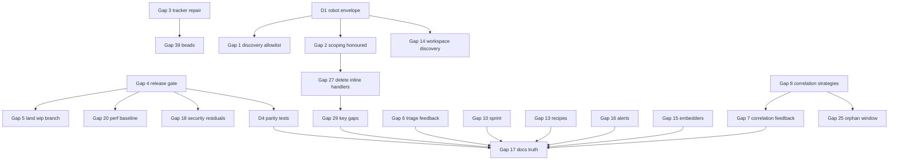

# Bridge Plan: beads_viewer (bv)

## Installer diagnostics and live tracker recheck — 2026-09-10

- [x] Read the complete AGENTS/README, inspect loading, readiness and action
  routing, and review recent Git, Beads and CASS activity.
- [x] Re-run all fourteen real-route cases at `f0133a4a` against the exact
  installed `br 0.5.12` binary through RCH: zero failures or skips. The
  stale-closed claim now fails correctly; three competing-claimant pairs each
  have one winner.
- [x] Reproduce a remaining stale-action failure: defer an issue after capture,
  confirm fresh analysis excludes it, then observe the captured claim succeed.
  Send the actual argv and database readback to the tracker agent.
- [x] Repair installer output loss and inherited-pipe hangs at `80450e34`;
  independently pass four archive controls and eight real-process cases.
  Preserve the ten-second execution deadline and bound diagnostic draining.
  RCH build/vet and first-party formatting pass; scanner limits are recorded.
- [x] Independently check the same function on native Windows PowerShell 5.1:
  accept the retained v0.23.0 executable and reject a wrong requested tag,
  preserving the executable hash. Native timeout/first-start claims stay open.
- [x] Pin both README Windows installer commands to the reviewed repair and
  update Unreleased history and the existing Beads TODOs.
- [ ] Complete original S5 transaction eligibility (`bv-xbvo.9` / `.10`),
  native/source-first-start evidence (`bv-oonu.9` / `.10`), and original P1
  baseline-dependent measurements before final documentation and epic closure.

Evidence: `/data/tmp/bv-s5-br0512-20260910-4ZNyVM` and
`/data/tmp/bv-ps1-timeout-20260910-cQm5qS`. No original acceptance criterion
was relaxed; twelve original tasks remain open or blocked.

## Committed SQLite WAL updates refresh the viewer — 2026-09-09

`bv-oonu.21` connects live refresh to the selected SQLite WAL companion.

- [x] Reproduce stale Pages output while a fresh read sees the committed row;
  retain unchanged main-file metadata and an open writer.
- [x] Run unchanged-runtime regressions through RCH: fsnotify and polling both
  miss the first WAL update; the JSONL sidecar control passes.
- [x] Implement exact companion matching and polling state with the existing
  stop/start generation guard; treat checkpoint removal as a source change.
- [x] Verify real WAL creation, repeated commits, sibling isolation, checkpoint
  removal, Pages publication and foreground/background TUI refresh: five
  focused tests and twelve subcases pass, with no skips.
- [x] Complete affected race tests: 1,143 pass with eight existing UI skips.
  RCH build/vet and first-party formatting pass. UBS exits 0 with zero critical
  findings and 18 reviewed warnings; scanner limitations remain explicit.
- [x] Independent exact-commit replay at `2cd958d6`: five tests and twelve
  subcases pass on RCH with no overlay, failures or skips. The independent
  verifier closes `bv-oonu.21`; original deadlines remain unchanged.

Evidence: `/data/tmp/bv-wal-refresh-20260909-wwqn2zz5`. Native prerequisite
recheck finds OldSurface SSH reachable, but RCH rejects native Go with an OS
admission mismatch. Original native, performance, tracker and final gates stay
open; no source-built Windows first-start pass is claimed.

## Live watchers use the loaded source — 2026-09-09

`bv-oonu.20` repairs startup/watch source drift at `ccc166e9`.

- [x] Reproduce the old binary's missing TUI refresh and wrong watched path.
- [x] Reuse the successful load result for TUI and single-repository Pages
  watchers; reject historical watch mode before writing an export.
- [x] Verify two successive JSONL/SQLite edits, fallback source authority and
  foreground/background TUI refresh. Forty export tests pass; 225 package
  tests pass with four existing `tru`-unavailable skips. RCH build/vet pass.
- [x] Repeat five focused journeys three times: 15 runs and 18 subcases pass,
  zero skips. Preserve the I/O-stalled run and both test-harness failures;
  strengthen terminal sizing and detail-heading synchronization.
- [x] Independent committed-tree replay: RCH on vmi1153651 passes five tests
  and six subcases at `ccc166e9`, with zero failures or skips.
- [x] Independent verifier closed `bv-oonu.20` with the execution receipt;
  all five acceptance items are checked and the Beads export is synchronized.
- [ ] Original performance, tracker, native and final proof gates remain open.

Evidence: `/data/tmp/bv-watch-source-20260909-n5wgm1md`. UBS remains nonzero;
console-output taint false positives and scanner limitations are recorded.

## Capacity path reuse on acyclic backlogs — 2026-09-09

`bv-xbvo.14` replaces repeated DAG path enumeration with shared longest-suffix
calculations at `06cc108f`, preserving path order, estimates and cyclic behavior.

- [x] Profile the real 26-node CLI defect and retain the original five-second
  timeout on the new 64-node regression.
- [x] Preserve all 102 complete JSON goldens; check ties, scopes, empty graphs,
  reachable/unreachable cycles and 200 seeded small-graph comparisons.
- [x] Pass 126 command-package and twelve capacity/forecast/scoping CLI tests,
  zero skips; build/vet and first-party formatting pass. Retain UBS findings.
- [x] Fresh solo committed-revision replay passes; the original still times out.
  Ten timed runs after three warmups give median 3.55 s before and 64 ms after,
  with lower peak RSS. This is bounded fixture evidence, not a tail guarantee.
- [x] Update README/changelog and the granular Beads execution record.
- [ ] Original performance, tracker, native and final proof gates remain open.
  Dense cyclic graphs retain an expensive exhaustive path search.

Evidence: `/data/tmp/bv-capacity-dag-20260909-2redfrz4`; clean Go 1.25.5 binary
SHA-256 `3afae80f…`, revision `06cc108f`, `vcs.modified=false`.

## Forecast selection and filter intersections — 2026-09-09

`bv-xbvo.13` repairs forecast scope at `9de473f4`; `4abf4bec` records the
recovered Beads export after a full-disk failure.

- [x] Retain seven original handler failures and five original CLI failures.
- [x] Apply candidate, label and sprint intersections to all/single outputs;
  retain dependency/closure inputs and forecast selected blocked work.
- [x] Pass 125 command-package and eleven forecast/capacity/scoping CLI tests,
  zero skips; build/vet and first-party formatting pass, UBS findings retained.
- [x] Fresh solo clean-revision replay passes; original negative remains.
  Four complete JSON controls preserve estimates, output and agent scaling.
- [x] Recover and commit Beads export, update user documentation and evidence.
- [ ] Original performance/tracker/native/final proofs remain open. Disk pressure
  remains; reproducible executables moved to runtime storage are volatile.

Evidence: `/data/tmp/bv-forecast-scope-20260909-ps070jwk`; clean Go 1.25.5
binary SHA-256 `efdb1d0c…`, revision `4abf4bec`, `vcs.modified=false`.

## Capacity readiness and selected backlog — 2026-09-09

`bv-xbvo.12` connects capacity to the shared readiness authority and global
candidate scope (`ab144521`). It also removes duplicate and non-blocking edges
from direct bottlenecks and makes result ordering stable.

- [x] Preserve original handler failures and five failing CLI scope cases.
- [x] Verify source authority, lifecycle/deferral boundaries, resolved/missing
  prerequisites, parent gates, label intersections, recipes and empty scope.
- [x] Pass 124 command-package and eight capacity/scoping CLI tests, zero skips;
  build/vet and first-party formatting pass. UBS findings remain unsuppressed.
- [x] Fresh solo committed-revision replay passes; retained original still
  fails. Three simple complete capacity JSON responses remain identical.
- [x] Document the existing duration heuristic and what its selected graph
  includes; update changelog and the granular Beads record.
- [ ] Complete the original performance, tracker, native and final proof gates.
  Capacity readiness does not establish those claims or provide a scheduler.

Evidence: `/data/tmp/bv-capacity-readiness-20260909-9ydryzod`; clean Go 1.25.5
binary SHA-256 `ae2a73f6…`, revision `ab144521`, `vcs.modified=false`.

## Scoped hypothetical rankings — 2026-09-09

`bv-xbvo.11` applies the existing candidate scope before ranking hypothetical
completions and counting top-k candidates (`f24e2df7`).

- [x] Reproduce context-only issues outranking selected work; original analyzer
  fails seven of nine cases and CLI fails one of five cases.
- [x] Preserve selected hypothetical gains, outside dependency gates and graph
  context; cover empty selection, limits, ties and label/recipe intersections.
- [x] Affected packages: 924 top-level passes, twelve existing skips; all six
  CLI scoping tests and 61 subcases pass. Build/vet and first-party format pass.
- [x] Fresh solo committed-revision replay and complete JSON comparison confirm
  the bounded change. UBS findings remain recorded without suppression.
- [ ] Complete the original performance, tracker, native and final proof gates;
  this repair does not replace their missing evidence.

Evidence: `/data/tmp/bv-insights-scope-20260909-gfypkwh8`; clean Go 1.25.5 binary
SHA-256 `a86aa57a…`, revision `f24e2df7`, `vcs.modified=false`.

## Actual-issue graph suggestions — 2026-09-09

`bv-oonu.19` fixes missing prerequisites selected as dashboard work and the
inflated gains caused by assuming their completion (`5efb1daf`).

- [x] Preserve original real-browser suggestion and readiness failures.
- [x] Restrict direct choices before optimization while retaining dependency
  context; use full-source readiness for cascade suggestions/actionable lookup.
- [x] Verify mask/limit boundaries, deterministic choices and unresolved gates.
- [x] Rebuild actual shipped WASM/glue reproducibly; verify five metric fixtures
  and 240 exact unrestricted/all-candidate comparisons with the original engine.
- [x] Fresh solo replay: eleven browser journeys, 231 Rust tests and 452 Go
  passes; two existing Go skips. Original exports still fail new assertions.
- [x] Preserve concurrent browser failures, the incorrect initial fixture path
  and the `/dev/shm` quota error; sequential runtime-directory checks pass with
  unchanged assertions/deadlines. Persist final captures and bundles on disk.
- [x] Build/vet, first-party formatting, JS syntax and vendor hashes pass;
  UBS findings remain unsuppressed. README/changelog and Beads TODO updated.
- [ ] Full final, original-baseline, transactional-claim and native proofs remain
  open. This repair does not close them or establish browser timeout root causes.

Evidence: `/data/tmp/bv-pick-scope-20260909-q49x1l5x`; clean binary SHA-256
`4e791f02…`, Go 1.25.5, `vcs.modified=false`. Shipped WASM SHA-256 `f4038539…`.

## Recipe-scoped graph exports — 2026-09-09

`bv-oonu.18` connects HTML/SVG/PNG graph export to existing recipe selection
at `75be8362`, preserving full-source readiness and repository/label scope.

- [x] Retain original artifacts and 18 failing cases out of 24 format cases.
- [x] Connect recipes, custom files, sorted limits and empty-selection refusal.
- [x] Verify actual HTML nodes, SVG labels and decoded PNG/layout dimensions;
  make PNG subtests independently runnable and visually inspect before/after.
- [x] Fresh solo replay: all 24 graph cases pass remotely; the complete local
  selection passes 490 unit and 34 CLI tests, with two existing unit skips.
- [x] Retain the remote alias timeout, watched-export deadline failure and TUI
  skip. Each affected test passes three local runs with unchanged deadlines;
  post-failure telemetry does not establish a root cause for the remote failures.
- [x] Build/vet, first-party formatting and UBS pass with two inspected warnings.
- [x] Update README/changelog and the granular Beads execution record.
- [ ] Final verification remains open, including a complete passing remote
  suite, original performance baseline, transactional claims and native routes.

Evidence: `/data/tmp/bv-graph-recipe-20260909-1wkluyri`; the clean Go 1.25.5
binary has SHA-256 `e2358542…`, `vcs.modified=false`. No browser was opened.

## Complete visible metric rankings — 2026-09-09

`bv-oonu.17` fixes ranking limits consumed by missing or filtered graph
endpoints. At `3a56b922`, panels select exported issue rows before limiting
their full-graph scores; no graph engine or topology change is needed.

- [x] Preserve original real-browser failure: one authority row instead of six.
- [x] Share visible-row selection across six metric consumers, including slack.
- [x] Verify zero/small/oversized limits, real scores, empty output, positive
  versus zero slack, rendered desktop/mobile cards and navigation.
- [x] Fresh solo replay: nine browser journeys, 452 Go passes, two existing
  skips, build/vet, JS syntax and first-party formatting. UBS findings retained.
- [x] Update README, changelog and granular Beads TODO/acceptance evidence.
- [ ] Original baseline/performance, transactional claim, native-platform and
  final vision gates remain open. This repair does not establish those proofs.

Evidence: `/data/tmp/bv-ranking-scope-20260909-PAYK1U`. The clean Go 1.25.5
binary has SHA-256 `36b8c865…`; the original bundle still fails the final test.

## Filtered dashboard exports — 2026-09-09

`bv-oonu.16` connects recipes to direct exports and preserves repository,
label and recipe selection on every watched reload (`d10d341d`).

- [x] Retain original direct-recipe and watched-repository failures.
- [x] Share selection logic while retaining full-source readiness and ranking.
- [x] Verify sort/limit selection, empty scopes, new candidates, label/repository
  changes, hidden prerequisite changes, JSON/SQLite agreement and coalescing.
- [x] Correct the obsolete custom-status rejection test against the documented
  workflow contract; verify custom selection without granting actionability.
- [x] Fresh solo replay of the clean binary passes both original failure
  scenarios, the three-ready-issue fixture, 160 unit tests and 64 CLI tests.
  Build/vet and first-party formatting pass; UBS has seven inspected warnings.
- [x] Update README/changelog and the granular Beads execution record.
- [ ] Existing P1 baseline, S5 transactional claim, native-platform and final
  acceptance gates remain open; this repair supplies none of those proofs.

Evidence: `/data/tmp/bv-export-scope-20260909-9q38zb`; binary SHA-256
`11af8f5e…`, Go 1.25.5, `vcs.modified=false`. Original failures are retained.

## Dashboard rankings and readiness — 2026-09-09

`bv-oonu.14` connects HITS panels to the scores already computed by the bundled
engine. `bv-oonu.15` connects dashboard readiness to the full-source model index,
including missing/filtered prerequisites, deferral and inherited parent gates.

- [x] Retain original real-browser failures: empty HITS hub panel and six ready
  tasks where only three qualify.
- [x] Repair both HITS result fields; verify rendered rankings and navigation
  on desktop and mobile.
- [x] Export per-issue readiness and its clock; preserve full-source context in
  direct/watch/wizard wiring and derive it for standalone exporter callers.
- [x] Connect ready counts, quick wins and filters, including in-progress work.
  Count unresolved active nodes once, with zero defaults for absent statuses.
- [x] Verify eleven readiness cases, standalone refresh without input mutation,
  filtered CLI source, wizard source resolution and actual watch reload.
- [x] Real desktop/mobile readiness journeys and existing what-if journey pass.
- [x] 451 Go unit tests and 37 selected CLI tests pass. Two existing export-unit
  skips remain; the local CLI run resolves two RCH environment-specific skips.
- [x] Fresh solo acceptance replay at `51d25a80`: clean binary, 451 unit and
  37 CLI passes, desktop/mobile HITS and readiness, and both closed-row variants
  of the original simulation journey. Both original bundles still fail the
  unchanged assertions. Close only `.14`/`.15` on this bounded evidence.
- [ ] P1 original baseline recovery, S5 transactional claim and full native/final
  gates remain unchanged. OldSurface is now online but resets SSH before
  authentication; the Mac connection question is still pending.

Evidence: `/data/tmp/bv-hits-20260909-btyveb`. HITS and graph WASM bytes remain
unchanged. Original failures and corrected test setup runs are retained. The
complete granular TODO and closure evidence belong to the existing Beads tasks.
The binary SHA-256 is `54050d86…`, with Go 1.25.5 and `vcs.modified=false`.
Build/vet and first-party formatting pass; UBS remains nonzero on inspected
heuristics, without suppression. Verification was solo, not independent-agent.

## Dashboard simulation follow-through — 2026-09-09

`bv-oonu.13` repairs a second concrete consumer gap: WASM unblock queries used
the reverse of exported edge direction, while templates read fields the engine
does not return. Export now retains resolved prerequisite identities separately
from visible rows. Simulations use those identities even when closed rows are
excluded. Graph redraw and delayed-callback cancellation are connected too.

- [x] Retain a Rust and real Chromium original-runtime counterexample.
- [x] Correct dependent/prerequisite traversal without reversing generic graph
  adjacency, PageRank, topology or existing metric goldens.
- [x] Wire detail, priority-pick and cascade counts to returned fields.
- [x] Carry full-source closed/tombstone IDs through direct, watch and wizard
  export metadata; consume them in both browser graphs.
- [x] Correct renderer redraw calls and cancel callbacks on reset/load/cleanup.
- [x] Prove root/leaf direction, multiple blockers, informational controls,
  included/excluded closed rows, displayed counts, actual canvas edge colors
  and reset in real Chromium; retain setup failures separately.
- [x] Rebuild the shipped WASM pair using pinned tools and verify two isolated
  physical Rust homes, existing graph goldens and negative controls.
- [x] Run 227 Rust tests, 515 affected Go tests (two existing skips), build/vet
  and formatting. Inspect scanner findings without suppression.
- [x] Freeze and replay acceptance at `40a7cd07`: clean binary, both real
  Chromium simulation variants, existing dependency navigation, 515 Go tests,
  227 Rust tests and the pinned WASM rebuild pass. The original bundle still
  fails direct0 versus expected1. Close only `bv-oonu.13` after this solo proof.
- [x] Push the verified repair to main and the legacy mirror with Actions disabled.
- [ ] P1: recover the original baseline source/binaries. Cass recovered source
  manifest SHA `a947e19a…` and original build paths, but the dirty snapshot and
  both binaries remain absent. Do not substitute another baseline.
- [ ] S5: prove atomic lifecycle eligibility in the installed tracker. Newer
  CLI prechecks and sequential routing tests do not establish that race contract.
- [ ] V5: finish native platform and Windows first-start proof. Windows hosts
  are offline; Macs are online but the configured DSR SSH route is unreachable.
  The SSH connection detail question remains pending.
- [ ] Finish the unchanged final vision/performance cohort gates after their
  prerequisites. This browser repair supplies none of those missing proofs.

Evidence: `/data/tmp/bv-whatif-20260909-5k4UlI`; complete execution TODO and
honesty review are attached to the existing bead. No new report framework.
The final binary records `vcs.modified=false` and SHA-256 `8a7a6186…`. Original
and intermediate failures remain in that directory, including a renderer tick
after cleanup. The final lifecycle check now covers reset, reload and cleanup.
UBS remains nonzero on inspected heuristic findings; no rule was suppressed.

## Dashboard follow-through — 2026-09-09

`bv-oonu.12` repairs a concrete downstream gap after `55ec82b8` expanded valid
workflow vocabulary: SQL overview lists and browser graphs omitted conditional
and wait dependencies despite correct Go-derived counts. At `1c768eac`, both
consumers retain all four blocking forms, active lists exclude either resolved
endpoint, and h/l navigate prerequisite/dependent in the correct direction.

- [x] Reproduce the four-count/two-ID mismatch in the original real Chromium
  bundle; preserve that negative result and the seven-issue JSONL fixture.
- [x] Cover eight dependency types across five endpoint lifecycle pairs through
  actual analyzer results and exported SQLite, including informational controls.
- [x] Connect existing SQL, detail navigation and both browser graph consumers.
- [x] Run build/vet, first-party formatting, 328 full export-package tests and
  all 35 page-export CLI tests. Retain the two existing export-suite skips.
- [x] Review UBS findings without suppression. Its critical findings confuse
  HITS authority/browser session checks with secrets and miss variables declared
  in comma-separated declarations; the complete scanner is not clean.
- [x] Complete the fresh solo acceptance replay at exact `1c768eac`: clean
  binary export, all 40 SQL cases and real Chromium positive pass; the original
  bundle still fails the unchanged ID-list assertion. Close only `bv-oonu.12`.
- [ ] S5: prove transactional lifecycle eligibility, beyond the isolated
  released br 0.5.12 routing suite that now passes. Global br remains 0.5.11;
  no external tracker working tree or installation was changed.
- [ ] P1: recover the original baseline bytes/source, then execute the unchanged
  full alternating matrix. Cass recovered CLI hash `f7b66ad5…` and UI hash
  `8de273b3…`, not the executables or their complete source tree.
- [ ] Finish existing native-platform/Windows first-start and final acceptance
  tasks. The dashboard repair does not establish those results.

Evidence: `/data/tmp/bv-continuation-20260908-o5jLRf`. The first SQL test setup
omitted analyzer metrics and produced zero counts; supplying the real analysis
fixed that setup without weakening any assertion. Its failed runs remain
separate from the valid original-browser counterexample. Beads retain the
granular execution record; no additional reporting framework was introduced.

## Implementation follow-through — 2026-09-08

The assessment below is the pre-fix baseline. P6 now consumes the existing
directed `BlockingPairs`, excludes unrelated label members, deduplicates pairs,
and inspects either endpoint without changing recipe or candidate selection.
Open relationships and details refresh on snapshots and file reloads; surviving
selection follows IDs and obsolete relationships disappear. Goals 27 and 30 now
have repaired Flow consumers, verified at `b6e21d22`; `bv-apal.12`/`.13` are
closed after a fresh solo acceptance replay.

- [x] Reproduce the original relationship and stale-content failures.
- [x] Connect producer pairs to the rendered drilldown and both endpoint details.
- [x] Preserve direction, selection, recipe scope, reload and back navigation.
- [x] Cover multilabel deduplication, missing records, closed/tombstone and
  nonblocking edges, Unicode, long IDs and narrow display widths.
- [x] Run the actual CLI in a PTY through matrix, relationships, both details
  and Escape; run the complete UI and analysis race suites.
- [x] Correct recipe-key prose, cass health/count and separate-modal behavior,
  insight-map defaults, plan envelope, history fields/units, dependency direction,
  Flow documentation and Windows binary/source requirements.
- [x] Check unset/positive/zero/negative/invalid insight limits through the real
  CLI; run existing copied-example and documentation parity tests.
- [x] Freeze the implementation, replay original P6 acceptance on that revision,
  record the solo verification limit and close only verified P6 items.
- [ ] Finish P2's remaining live/native/performance-dependent claims under its
  existing acceptance criteria; these documentation repairs do not close P2.
- [ ] Resume S5 installed-tracker atomic claim proof, P1's unchanged full matrix,
  V5 native/Windows first-start proof and the final cohort gate in that order
  when their concrete prerequisites are available.

Evidence remains under `/data/tmp/bv-reality-20260908-1umcHa`. The first remote
race run used an earlier invalid reload fixture and failed; the corrected local
full race passes (UI 49.312s, analysis 3.400s). PTY setup failures and a missing
test-local environment helper were corrected without relaxing assertions or
timeouts. Build/vet pass. Formatting reports 49 pre-existing vendor files and no
first-party files. UBS is not clean: its 55 secret-comparison hits are issue IDs,
labels, statuses and UI selections, and both stored context cancellations have
explicit lifecycle cleanup. These findings were inspected; no scanner rules were
suppressed. No native-platform, published-release or independent-agent proof is
claimed by this work.

Final replay: 1,838 top-level UI/analysis race tests plus 24 internal/docs/PTY
tests passed, with 19 existing skips explicitly retained; none is a skipped P6
criterion. After claiming the proof, a separate 27-test Flow/PTY replay passed
without skips. Original probe and complete command streams are prefixed
`b6e21d22-` in the same evidence directory. Source inspection of current
`beads_rust` (`97013a75`) finds a newer CLI closed-claim precheck, but the atomic
storage guard and compare-and-set predicate still check assignment only. A
simple installed-tracker upgrade therefore does not settle S5's race contract.
No tracker executable or external repository was changed. P1's original runner
and verifier remain byte-identical (`896d7e25`/`939b66cc`); the earlier baseline
executables and full raw run directory were not found in this host's scratch
storage or the bounded original-worker search. Recover their exact identity
before the next full matrix; do not silently choose a different baseline.

## Post-release reality check — 2026-09-08

This assessment supersedes the status of older dated sections below, while
preserving their original failures and evidence. Baseline: `84c3774e7240a795`,
clean `main`; production Go, vendored dependencies and graph WASM are unchanged
from v0.24.1 (`3e4e61c91a74dafe`, tree `6cc10e3c940e4119`). The later Windows
installer follow-up is separate. Audit owner: `bv-ydlp`.

### The five answers

1. **What works?** The robot-first graph triage engine is real: JSONL/SQLite
   loading, scoped readiness, graph metrics, ranking, recipes, search, history,
   exports and interactive navigation have implemented consumers and substantial
   execution evidence. The installed v0.24.1 binary passes all 58 fresh robot
   smoke cases. Published release metadata, its sealed receipt and all five
   Homebrew/Scoop archive references agree. This is a useful shipped product.
2. **What does not?** A captured claim command can reopen an issue closed after
   recommendation. Flow Matrix drilldown shows unrelated label members instead
   of the actual blocker/dependent pairs already computed by analysis. Public
   documentation still contradicts dispatched keys, cass behavior and defaults.
   Final performance, several native targets and Windows source first-start
   acceptance remain incomplete; cross-compilation does not settle them.
3. **What blocks completion?** S5 needs an installed tracker with atomic stale
   claim rejection, plus the existing positive route tests. Flow needs a small
   consumer integration and actual navigation/reload proof. P2 needs corrections
   to existing prose and meaningful copied-example checks. P1 needs the original
   full comparison at a final runtime freeze with comparable version metadata.
   V5 needs actual native execution on the missing targets and first-start
   diagnosis. Another general audit or release alone resolves none of these.
4. **Would the previous backlog close every gap?** No. It covered S5/P1/P2/V5
   and final delivery, but had no open owner for the Flow Matrix drilldown.
   Several checked P2 acceptance items were contradicted by current code and
   README. Completing tasks by status alone would still miss the user's goal.
5. **Which accepted goal lacked coverage?** Goal 27's promised cross-label
   dependency drilldown. Historical closed `bv-111` describes the matrix;
   `bv-w4l0`/`bv-qcgs` describe test coverage. None proves this rendered journey.
   Add one implementation/proof pair; reuse existing owners for every other
   finding. Earlier brainstorms (LSP, Ghost Beads, embedded chat, Monte Carlo)
   retain their recorded scope dispositions; they are not silently counted as
   implemented or expanded into a new product mandate.

### Current evidence and limits

Fresh artifacts: `/data/tmp/bv-reality-20260908-1umcHa`. Installed `bv` is
v0.24.1, SHA-256 `a469135a0f8a84d4fdeb0052405b91accf80860f9d66cc4332d626bbc67c30ec`;
installed `br` is 0.5.11, SHA-256
`0a10ca91ed2f7f35609291f0192806717be0a818d3ddb7bcdfbf1cb378e435b1`.

- **Live S5 counterexample:** initialize an isolated repo whose path contains
  spaces, quote and dollar characters; import open `same-1` with `br show`;
  capture `bv --robot-next` typed `claim_command`; close the issue; execute the
  captured argv in its stated directory. At 19:23 UTC it exits 0 and changes
  closed to `in_progress`, assignee `ubuntu`. The command uses the verified
  local ID, explicit database and `--no-auto-import`; those correct boundaries
  do not supply atomic eligibility. All command streams/readback are retained
  in `live-claim/`. The initial fixture omitted automatic import and produced
  no route; that setup failure is retained and is not a second product defect.
- **Flow counterexample:** `flow_probe.go` calls real `ComputeCrossLabelFlow`
  and `FlowMatrixModel.Update/View` with database issue `blocker`, unrelated
  database issue `unrelated`, and API issue `dependent` blocked by `blocker`.
  Analysis returns exactly `blocker -> dependent`; pressing Enter renders
  `blocker` and `unrelated`, omitting `dependent`. Probe exits 1 under Go 1.25.5.
  Producer: `pkg/analysis/label_health.go`; unwired consumer:
  `pkg/ui/flow_matrix.go:openDrilldown`. This is rendered-model execution, not
  physical terminal or independent-agent proof. The matrix direction itself is
  correct. Empty `critical_paths` does not establish the illustrated critical
  path claim and should be documented honestly, not filled with invented data.
- **P2 contradictions:** README recipe prose says `R`, dispatched key is `'`;
  cass footer table promises Active/Idle agents although only health/count are
  rendered; history opens a separate scoped cass modal rather than a combined
  searchable commit/session timeline. `BV_INSIGHTS_MAP_LIMIT` defaults to 200
  in `robot_registry.go`, but environment metadata says `(all)`; zero does not
  mean unlimited. Existing parity checks cover a generated key-table row and
  therefore miss the contradictory prose. Audit remaining plan/history JSON
  examples, topological work-order explanation and binary/source requirements
  in the same existing P2 task. Correct checked criteria rather than claiming
  this was already fully verified.
- **Published evidence:** current public v0.24.1 is neither draft nor prerelease,
  with 14 assets. Downloaded sealed receipt SHA-256
  `9d81f7a6cd94f195f060fc42131a7fb90b8136aaaa32c41cf2775b765d70914b`
  matches public metadata and records all ten original source-gate stages
  passed. This is verification of a published record, not a new full-suite run.
  All five public Homebrew/Scoop URLs and hashes match release assets. No new
  release, Actions, dispatch, native Mac/ARM run or Nix build occurred here.
- **Retained earlier evidence:** the release scratch directory cited below is
  unavailable on this host now. Earlier native/performance results are read
  from the committed project record, not claimed as newly inspected raw files.
  In particular the final f719 P1 matrix remains exit 1, with 72 version-field
  mismatches despite otherwise equal exact outputs. Its recorded quantiles and
  passing earlier cohorts do not make the original failed gate pass. Native
  Windows optional source first-start exceeded 10 seconds; the later successful
  second invocation is diagnostic only. Human search judgments, physical-phone
  paint and universal 60fps remain unproven.

### Rescore of all 43 accepted goals

Updated 2026-09-16 against runtime `04a0107b`; dated assessments below remain
historical records. The retained `/tmp/bv-standard-final-tests-20260916.log`
records strict-RCH build/vet, the focused correlation-cache race checks and
`go test ./... -count=1 -timeout=30m` passing. Its nonverbose package results
do not inventory skips or prove live `br` was on PATH. The final binary's
desktop/mobile/offline/update browser journeys also passed, retained in
`/tmp/bv-final-general-browser-20260916.log`. Neither result is the pending
clean-source release gate, sealed package proof, original P1 matrix or missing
native qualification.

`Working` means the bounded implemented behavior has supporting evidence;
it does not mean every platform or input was freshly retested. Prior detailed
goal definitions and scope decisions remain below. Fresh negative evidence
overrides an earlier working classification.

| # | Goal | Current result / remaining owner |
|---|---|---|
| 1 | Current and legacy issue loading | Working; vendored decoder repair shipped; source installs must retain vendor |
| 2 | Robust JSONL parsing | Working; incomplete-source diagnostics retained |
| 3 | Source/DB/worktree selection | Working; canonical JSONL precedence, explicit overrides and selected-source/WAL refresh repaired; V5 covers missing native runs |
| 4 | Namespaced workspace aggregation | Working; partial authority remains explicit |
| 5 | Two-phase graph analysis | Working; size-tiered status, not a universal deadline |
| 6 | Centrality and critical path metrics | Working within exact/approximate status contract |
| 7 | Cycles/core/articulation/slack | Working; representative SCC cycles, not all cycles |
| 8 | Repeatability and computation status | Partial; timeout-boundary/full-cohort proof, P1 |
| 9 | Ranked triage and reasons | Working; heuristic scores |
| 10 | Readiness, tracks and unblock counts | Working; external claim safety is row 11 |
| 11 | Justified next actions | Working with br >=0.6.0; original routes, stale closed/claimed/deferred refusals and native concurrent claims verified in closed S5 pair; final-source live replay remains part of final acceptance |
| 12 | Feedback and reset | Working within existing tested behavior |
| 13 | Shared robot source/scope metadata | Working; shape smoke alone is insufficient proof |
| 14 | Composed scopes | Working within existing positive and empty-intersection controls |
| 15 | Historical analysis and diffs | Working with declared historical exceptions |
| 16 | Help/schema/formats | Working; corrected defaults/examples have executable checks; final documentation proof remains row 42 |
| 17 | TOON | Working when actual encoder available; no universal token saving |
| 18 | Recipe loading/filtering/sort | Working |
| 19 | Recipe presentation/navigation | Working within recorded rendered/PTY checks |
| 20 | Recipe exports/templates | Working |
| 21 | Hash retrieval and graph ranking | Working; not learned semantic embeddings |
| 22 | Search quality at scale | Partial; frozen agent-authored corpus is not human generalization, P5 scope retained |
| 23 | Git correlation | Working; guarded full-to-filtered cache reuse and truncated-cache recovery verified; final standard suite passes the unchanged repository timing assertion, without a universal latency claim |
| 24 | Orphans/file relations/impact | Working within existing tests |
| 25 | Sprint/burndown/risk | Working; exported timeline includes current sprint-definition markers, not reconstructed historical sprint definitions |
| 26 | Forecast/capacity | Working as duration/velocity heuristics, not a scheduler |
| 27 | Label health/flow/attention | Working; actual directed pairs, endpoint detail/navigation and refresh proven by closed bv-apal.12/.13; no invented critical-path annotation |
| 28 | Alerts/baselines/hygiene | Working; advisory suggestions and source-bound actions retain their separate contracts |
| 29 | List/detail/board/tree/graph/insights | Working; rootless hierarchy components and detached snapshot occurrences repaired; responsiveness remains row 41 |
| 30 | Reload/snapshot/stale-result handling | Working within tested consumers; Flow refresh, selected SQLite WAL updates and browser graph/timeline cleanup have regressions; large-load timing remains P1 |
| 31 | Tutorial/help/sidebar/cass | Working; real cass hit/preview/time adapter and separate asynchronous session modal; advisory index health remains visible and external availability is required |
| 32 | Report and graph exports | Working; validated topology-bound layout/complete centrality reuse and fallback retain source authority; bounded browser startup proof is not P1 |
| 33 | SQLite dashboard/assets | Working; SQLite batch rollback and actual lifecycle-event timeline with retained-window baseline, removals/reintroduction and canvas transitions; deleted-only nodes absent from current export are not reconstructed; browser search fallback differs from native FTS5 |
| 34 | Offline/mobile dashboard | Working in recorded Chromium desktop/mobile viewport; other browsers/physical phones unproven |
| 35 | Hooks/browser opt-out | Working |
| 36 | Verified update/download | Working in recorded Linux/Windows journeys |
| 37 | Source-bound release bytes | Working for published v0.25.0; final runtime 04a0107b still needs its own complete clean gate and sealed package verification, bv-oonu.11 |
| 38 | Vendored asset provenance | Working; version-suffixed go install bypasses vendor repairs |
| 39 | Native installs/upgrades | Partial; v0.25.0 Linux amd64/macOS arm64/Windows amd64 archives and Linux Nix build/existing-store profile verified; missing native macOS amd64/Linux arm64 and current Windows source first-start remain V5, with public Nix route/upgrade scope explicit |
| 40 | Local/remote verification | Partial final acceptance; standard full suite/build/vet and focused cache race pass through strict RCH, installed br 0.6.0 has separate S5 proof; current complete release receipt and explicit live/skip inventory remain required |
| 41 | Large-project responsiveness | Partial; original final P1 gate still red; no terminal-paint guarantee |
| 42 | Accurate executable documentation | Corrected README/SKILL prose, copied YAML/jq, duration units and runtime defaults have source/CLI checks; P2 final proof remains open behind original P1/native dependencies |
| 43 | Recorded waits and evidenced causal links | Working within original repaired four-commit producer/CLI acceptance |

### Bridge and granular TODO

S5 and Flow implementation/proof pairs are complete. Remaining acceptance is
the original P1 matrix, missing native qualification, dependent P2 proof and
the final clean-source/package cohort. Existing checked work remains bounded
to its recorded revision and environment.

- [x] Read full root instructions/README and the plan/spec corpus; map goals
  to producer, consumer, tests, previous acceptance and released runtime.
- [x] Inventory all unfinished Beads and distinguish historical records from
  fresh source/rendered/installed/public-release evidence.
- [x] Run 58 installed robot smoke cases and both concrete negative probes.
- [x] Finish focused RCH documentation/live-route run; count executed tests,
  failures and skips separately and identify the tracker actually exercised.
- [x] Phase 3a: use the frozen template below; create only the uncovered Flow
  implementation/proof pair and correct existing P2/S5/V5/final acceptance.
- [x] Ambition round 1: review Flow selection, endpoint direction, deduplication,
  empty/closed/nonblocking cases and open-view reload; revise in place.
- [x] Ambition round 2: reconcile exact final source/dependency/version identity,
  native first-start and documentation consumers; revise the same plan/tasks.
- [x] Phase 5: four or five actual refinement passes with the frozen template;
  record each change and stop only on a pass finding no material improvement.
- [x] Phase 6: validate `br` dependency cycles and `bv --robot-triage`, plan and
  metric status; close only this completed assessment and flush task state.
- [x] S5: preserve positive ready claims and reject stale/closed/deferred/claimed
  actions with installed official br 0.6.0; original route suite, native paired
  claims and authoritative transaction review support closed bv-xbvo.9/.10.
- [x] Flow: consume existing `BlockingPairs`, show actual directed relationships
  and endpoint details, preserve navigation and refresh safely; original
  negative and repaired positive support closed bv-apal.12/.13.
- [ ] P2: correct all identified prose/default/example contradictions in place;
  verify copied examples and actual key/modal/default behavior, then settle
  final capability claims only when their existing dependencies pass.
- [ ] P1: verify comparable version labels plus distinct exact source/binary
  identities before the original complete final matrix; preserve all failures,
  original thresholds, sample counts, parity and slowdown controls.
- [ ] V5: run missing native targets and diagnose Windows first invocation
  without replacing it with warm-start success or raising the original bound.
- [ ] Final: inspect all original and new acceptance on one final source/package
  cohort; preserve unproven populations/platforms and do not force-close.
  Run the unchanged complete release gate with required tools and br >=0.6.0,
  retain explicit live/skip and per-query relevance evidence, then package and
  verify the same clean revision. Exercise the actual extracted archive binary;
  E2E TestMain builds a separate binary and cannot substitute for that check.

### Ambition round 1 — complete the flow journey

```text
That's a decent start but it barely scratches the surface and is light years away from being
OPTIMAL. Please try again and revise your existing plan document in-place to make it MUCH, MUCH,
MUCH better in EVERY WAY.
```

Reviewing the first P6 pair against the actual parent revealed a lifecycle
omission: `SetData` refreshes label statistics but retains an open drilldown's
old issue copies; the parent's only `flowMatrix.SetData` call is on entry.
Expand the same pair (`bv-apal.12`, `bv-apal.13`) to refresh both levels from
the latest authoritative snapshot, preserve a surviving selection by identity,
and clear or safely clamp vanished labels/endpoints. Test the real parent reload
path as well as component refresh; neither a closed endpoint nor an unrelated
same-label item may remain as a blocking relationship after refresh.

Use the existing producer's blocking/lifecycle semantics. Multiple labels must
not fabricate duplicate issue pairs; nonblocking and closed/tombstone cases
must not become blockers. Preserve dependency context when a recipe hides an
endpoint, while distinguishing that context from actionable selected candidates.
Long IDs, Unicode, narrow views and empty results must remain navigable. This
adds acceptance to the same bounded integration, not a new graph framework.

The extended real-producer probe confirms the component refresh failure:
changing the blocker's title to `REFRESHED database migration` and calling
`SetData` while drilldown remains open still renders the old title. Both
original and refresh failures are retained in `flow-lifecycle.stdout/stderr`.
The parent's reload omission is a source finding; its full message-path
reproduction remains an explicit P6 proof requirement.

### Ambition round 2 — verify the delivered combination once

```text
That's a lot better than before but STILL is a far cry from being OPTIMAL. Please try yet again
and revise your existing plan document in-place to make it MUCH, MUCH, MUCH better in EVERY WAY.
I believe in you, you can do this!!! Show me how brilliant you really are.
```

The first revision still risked expensive verification on successive obsolete
freezes. Finish bounded runtime integration first, then verify the exact final
combination. P1 must check comparable version metadata before launching its
unchanged complete matrix, while recording distinct original source commits,
vendor/configuration inputs and executable digests. Never strip version fields
from the comparator after seeing a failure or replace the full gate with a
favorable subset. The prior f719 exit 1 stays exit 1.

V5 must explicitly retain the failed first invocation of the source-built
Windows executable, preserve the 10-second limit and test failure preservation.
Public manifest parity is useful but does not certify native package-manager
execution or a current Nix build. P2 can fix deterministic prose now; remaining
capability guarantees depend on original proofs. The final task now depends
on P6 proof as well as its existing prerequisites and must rescore all 43 goals
and 18 pairs. This is a dependency correction, not a claim that more tracker
rows constitute progress. No new release is needed to finish this assessment.

### Focused execution and refinement

The existing focused RCH suite on worker hz4 finishes exit 1 at 19:31:47 UTC.
Go reports 8.728 seconds of test execution, with compilation/transport outside
that figure. It runs 32 test nodes: 30 pass, two fail (the stale-claim child and
its parent), zero skip. Documentation accounts for 17 passing nodes across 12
top-level tests. Routing accounts for 13 passing children and the failing stale
claim child plus parent. A later remote identity read reports br 0.5.11; the
actual failing argv names `/home/ubuntu/.local/bin/br`. RCH forwards test JSON
into the retained `focused-e2e.stderr`; `focused-e2e.jsonl` is empty. Empty
stdout was not a zero-test pass. This is a focused source suite, not the full
release suite, and its green documentation subset misses the proven prose gaps.
The remote br digest matches the installed local digest above. A subsequent
remote shell reports Go 1.26.0; the exact compiler identity for the completed
focused run was not retained, so it is not credited as Go 1.25.5 release proof.
The local rendered-model probes explicitly used the cached Go 1.25.5 toolchain.

Phase 3a was applied again to synchronize the same pair and existing owners
after both ambition rounds, using the exact frozen template retained below.
Each following pass applies the exact frozen Phase 5 template retained below.

1. **Behavior and scope:** compare each new acceptance criterion against the
   original README journey and producer data. Add explicit source-context and
   missing-endpoint handling: context visibility must not imply eligibility or
   fabricate a relationship. Preserve both endpoint navigation and matrix
   semantics; do not expand empty critical-path metadata into a new algorithm.
2. **Dependency and ownership:** inspect all remaining implementation/proof
   pairs and final dependencies, including P6. Keep proof dependent on its
   implementation and final dependent on proof; do not block independent P2
   corrections on a new administrative task. `br ready` selects P6 implementation
   as the sole currently ready non-epic task. Original P1/S5/V5/P2 prerequisites
   and original acceptance remain; P6 does not replace an unmet old task.
3. **Evidence and test adequacy:** the fresh docs subset proves the existing
   checks pass, not that all prose is correct. Extend P2 proof to dispatched
   key/modal/default behavior, representative JSON values, direction and
   installer requirements; preserve its prior valid examples. Bind S5 to the
   original now-failing installed-tracker test as well as the scratch probe.
4. **Proof identity and scope:** read the actual sealed receipt and remaining
   native/performance checklists again. It is eligible, clean and source-bound;
   all ten stages passed, but stage summaries do not enumerate individual test
   skips. Record the remote compiler-identity limit above. Retain the original
   full P1 gate and Windows first-start failure. Clarify that P6 reuses current
   model/source behavior; it does not need a new authority framework or mutation
   subsystem. Human search generalization and untested browser populations
   remain explicit limits of the previously accepted bounded scope.
5. **Convergence:** reread the current goal mapping, original pending acceptance,
   new pair and dependency graph against the retained probes. No further material
   task or acceptance change was found. All 18 proof dependencies are present;
   the new pair is self-contained and its acceptance remains unchecked. Stop
   refining and preserve the remaining work as work.

Final graph validation: `br dep cycles` reports zero active cycles; insights
also reports zero cycles with cycle analysis computed. All reported metric
states are computed; betweenness is explicitly approximate with sample 100.
`bv --robot-triage` selects `bv-apal.12` as top pick; `br ready` agrees on this
sole ready non-epic task. Plan's highest-impact summary names already-running
P1, which remains a separate prerequisite rather than a reason to redo audits.
Source authority is complete; its `claim_safe` metadata does not override the
fresh external tracker failure. Validation used read-only robot commands.
Before audit closure, the full tracker comparison is 652 -> 655 records:
three additions (audit plus P6 pair), zero removals and no existing status
changes. Original 640 closed tasks remain closed; corrected P2 checkboxes and
all incomplete implementation/proof tasks remain visible. After closing only
the finished audit, 14 tasks/epics remain unfinished.
`bv-ydlp` is now closed and `br sync --flush-only` is current. Only this
existing plan and br-managed JSONL changed. `git diff --check` passes. UBS was
invoked on both changed files and exits 3 because Markdown/JSONL have no
supported scanner; nothing was scanned and no bypass was enabled. No Go build
or race result is claimed for this documentation-only change.

### Anti-ceremony and honesty review

Creation worksheet: consumer is the user requesting this full assessment and
the next implementer of P6/S5/P2. Decision is which real defect to fix next;
concrete defects are the reproduced stale claim and wrong/stale Flow contents.
Reuse this existing plan and Beads; no new repository report or framework.
This assessment stops being the current decision aid when a later implemented
cohort is rescored; it is retained as history, not automatically deleted.

Real-work window is this audit, checked against `git status`, `git diff` and
`bv-ydlp`: one PROCESS work item, zero USER/ENABLER items shipped. No runtime
repair was made in this window. The two-minute demo is the isolated stale claim
and incorrect rendered Flow view; those demonstrate defects, not improvements.
Without the report, shipped behavior would be identical. The useful output is
corrected priorities and acceptance. Verdict: **DRIFTING** if further general
auditing displaces implementation. Correction: finish the requested bounded
phases, then direct the next implementation block to P6 while advancing S5's
existing installed-tracker prerequisite. No new audit infrastructure.

Honesty inventory (current audit; question numbers from the skill worksheet):

- 1–5: No (checked: current diff has only this plan and br-managed issue data;
  no tests, validators, goldens, thresholds, fixtures in production code or
  workflows changed). Scratch fixtures exercise production behavior; their
  failures remain failures. No bypass was introduced.
- 6: No zero-run success claim (checked: RCH JSON events show 32 run nodes,
  30 pass, two fail, zero skip; smoke log records 58 commands). Empty stdout
  was investigated and the actual stderr JSON inspected.
- 7–8: No (checked: claims above distinguish installed binary, real rendered
  model, remote source suite, public receipt and historical recorded results).
  No independent-agent, full fresh-suite, native Mac/ARM or paint claim.
- 9: Yes, existing checked P2 acceptance overstated coverage. Corrected in
  place by unchecking `.3` items 3/5 and `.4` item 3, disclosed to the user,
  and strengthened existing proof around observed behavior. Countermeasure:
  RH-9/RH-10—checked task/plan prose cannot substitute for the positive journey.
- 10: No (checked: both probe streams and RCH stderr are retained; no result is
  inferred from discarded output). The initial non-followed receipt download
  is empty and excluded; the followed download is hashed against public metadata.
- 11–12: No (checked: only the assessment may close; all incomplete original
  tasks and new P6 remain open/blocked. No requirement was weakened to fit code).
- 13–17: Not applicable (solo execution; no subagents or agreement-as-proof).
- 18: No (checked: 58 smoke cases and the existing focused-test filter were
  fixed before execution; failures and parent/child counting remain explicit).
- Older sessions: six bounded cass queries were run. Returned offsets did not
  resolve to matching source text; read-only fallback found four malformed
  records and no matching text messages. This limited check is inconclusive,
  not an assertion that past sessions were free of test weakening.
- 19: The audit consumed substantial reading time without shipping a fix.
  Also, initial fixture import was missing, the first direct SSH probe lacked
  RCH's configured key, and a `br ready` parser expected the wrong envelope.
  These setup failures were corrected without changing acceptance. The RCH
  test result is still red; no successful retry replaced it.
- 20: Strongest evidence is the reproducible installed claim/close/readback
  sequence plus the unchanged existing E2E failure and real rendered Flow probe.

## Authorized v0.24.1 release — 2026-09-07

Release scope and granular completion are tracked in `bv-l76l`. The user
authorized all established publication venues, all five supported targets, and
DSR with no GitHub Actions or repository dispatch.

- [x] Recover the prior release commands with cass. The indexed v0.23.0 session
  used GoReleaser and GitHub publication but skipped Homebrew/Scoop. Preflight
  found both stores on v0.22.0; updating them belongs to this release.
- [x] Read the completed performance runs. 7f finished green at 10:21 UTC.
  f719 completed at 13:03 UTC with exit 1. All 36 exact comparison records
  contain 144 outputs; a recursive readback finds only 72 `/version` differences
  (baseline v0.23.0, current v0.24.0). Preserve that original failure. Final P1
  acceptance remains open; this is not evidence of changed decisions, rankings,
  source authority or metric states. All 144 current UI records and 72 timed
  CLI records/14,400 samples were reviewed: quantiles recompute correctly,
  decision mismatches are zero, worst current UI p99 is 32.348973 ms and worst
  current CLI p99 is 680.103082 ms. This readback does not turn the original
  failed run into a pass or establish a population-tail guarantee.
- [x] Commit release metadata at `3e4e61c9` (tree `6cc10e3c`), then run the
  original complete source gate: ten stages pass without skips in 835.838 s.
  Package and seal all five targets with Go 1.25.5, CGO disabled, exact tagged
  revision and `vcs.modified=false`. Original benchmark thresholds unchanged.
- [x] Run the actual Linux archive through all 58 robot smoke commands and
  execute the actual Windows archive natively. Record unavailable native
  macOS/ARM and Nix build coverage instead of treating cross-builds as execution.
- [x] Publish [v0.24.1](https://github.com/Dicklesworthstone/beads_viewer/releases/tag/v0.24.1)
  through DSR at 00:28:07 UTC on 2026-09-08. Download and hash-check all 14
  assets before publication, then verify public metadata. External-artifact
  mode uses the original sealed gate receipt, not a DSR build manifest.
  Publish the actual binary SPDX SBOM; no signing key was available.
- [x] Publish Homebrew `cae0685` and Scoop `4fddb86`, verify their public bytes
  and all five sealed hashes, and synchronize their existing branch mirrors.
  Verify Go proxy revision and tagged Nix flake identity. No Actions/dispatch.
- [x] Exercise live Linux installation, readiness, update/no-update and six
  archive/preservation scenarios on a separate native host. Installed binary
  SHA-256 `a469135a…` matches the sealed archive.
- [x] Complete native Windows live installation, source build, update/no-update
  and failure-preservation verification, recording each run's limits. An initial
  real Go 1.26.5 source installation passes. The default native suite passes
  against the published archives with installer follow-up `3ca2176f`:
  28 retained command logs, eight capability results and all five specific
  rejection reasons verified. Installed binary SHA-256 `cbd9e13f…` matches
  the sealed archive. User PATH is unchanged. The original obsolete `.id`
  assertion failure is retained; the revised check verifies the ready
  diagnostic, complete authority and metadata-free claim refusal.
- [x] Finish the installer follow-up discovered during native verification.
  The corrected original-installer run stalls on the loopback wrong-version
  ZIP. Its incomplete transfer is retained; only its three bound processes
  are stopped at 00:58:38 UTC. Function-local suppression of Windows PowerShell
  download progress then passes the complete default native suite, including
  actual wrong-version, checksum, extraction and missing-manifest refusals.
  Build/vet and the existing PowerShell archive fixtures pass. Public installer
  bytes match `3ca2176f`, and README pins that commit. A concurrent workspace
  actor committed these exact tested changes; that is not independent proof.
- [x] Record final native results, commit the test/documentation follow-up,
  synchronize source branches and close only the release bead `bv-l76l`.
- [ ] Resolve the optional Windows source first-start failure under the existing
  broader native-platform task `bv-oonu.10`. A later source build completed but
  its first `--version` exceeded the unchanged 10-second guard. A second
  diagnostic invocation of the retained `d58f0330…` executable succeeds in
  1,742 ms. Preserve the original failure; its cause and full V5 remain open.

Release evidence: `/data/tmp/bv-release-v0.24.1-20260908`. Root owns execution
and review; no independent-agent verification is claimed. Broader P1, shared
tracker and unavailable native-platform prerequisites remain open.

## Delivery continuation — 2026-09-07

- [x] Reproduce cache-writer contention using the actual 4a Linux archive on
  the separate 212 worker. Three warmups plus ten samples per condition give
  median 65.293 ms without contention and 1,020.625 ms with a one-second lock
  hold. A separate syscall profile spends 2.915112 s in blocking `flock` during
  a three-second hold. This controlled reproduction does not explain the
  measured host's journal stalls. Evidence: `/data/tmp/bv-cache-contention-7y6udeip`.
- [x] Freeze all 27 original complete fixed-clock outputs before the change;
  they agree after excluding only the original named duration fields, with
  canonical digest `245301c118240f87c6f4d9a0e93000dee2d92559b4330c0b5e3ecd2199b4a7ac`.
  Opportunity score: impact 4 × confidence 5 / effort 1 = 20.
- [x] Prove the new contention regression fails on old code, then reuse the
  existing nonblocking lock for best-effort cache publication. Preserve the
  existing entry under contention and prove later successful publication.
- [x] Run unchanged regression, affected race tests, build/vet/format and the
  same actual CLI comparison. Preserve output/ranking/metric parity and prove
  the busy lock no longer delays the response. Keep full P1 acceptance open.
  The Linux old regression fails at 2.01 s; the repaired code passes. Affected
  race suites pass 3,343 test nodes with 28 existing environment/opt-in skips;
  all 14 original CLI parity-control nodes pass. Build/vet pass on Go 1.25.5,
  and formatting lists only 49 unchanged vendor files. UBS finds zero critical
  and three reviewed heuristics (cache.Get, deferred recover, selected-file
  module detection), with no suppression. With matching version metadata, all
  27 complete CLI outputs retain the frozen digest. Contended median becomes
  64.826 ms, max 65.608 ms, versus 1,020.625 ms before; uncontended median is
  64.855 ms. These ten-sample diagnostics include harness wait overhead and
  fixed-clock analysis, not production p99. The trace now returns EAGAIN from
  nonblocking flock in 27 microseconds.
  Native Windows exercises the same frozen test assertions:
  old publication fails after 2.03 s; the repaired publication passes in 0.03 s.
  The existing replacement-cleanup fixture initially failed because Windows
  os.Stat loads file identity lazily. It now captures identity from an open
  handle, as production does; all assertions remain and pass with both old
  and new production code. Original failures and the initial CLI version-only
  mismatch remain preserved. Root owns all verification; no independent-agent
  or full P1 completion is claimed.
- [x] Freeze the verified repair at `f719c41a` (tree `65a6d40c`) and run the
  original complete source gate once. All ten stages pass without gate skips
  in 801.448 seconds, finishing at 08:06:14 UTC. The source remains clean with
  input digest `ff01c5bf…`; receipt `e602aefe…` binds the exact revision.
  All fourteen original four-round benchmark rows pass the unchanged 20% limit;
  worst regression is FullAnalysis at 13.5%. These results do not establish a
  whole-CLI speedup or replace the full P1 matrix.
- [x] Package that eligible source with the original five-target wrapper.
  Packaging passes in 78.677 seconds at 08:07:52 UTC. All five copied archives
  match sealed receipt `5c66ce55…`, with Go 1.25.5, CGO disabled, exact f719
  revision and `vcs.modified=false`. Retain the deprecation notice and all
  package streams. Evidence: `/data/tmp/bv-delivery-f719c41a-20260907`.
- [x] Execute and review the actual Linux archive: 58 smoke commands, all
  40 scope cases, both partial-source observations and 14 live-route children
  plus parent pass. Original 16 scope/four partial assertions are unchanged.
  All command/output hashes match copied raw evidence; the 4,258-file source
  manifest remains `b318cb82…`. Actual binary SHA-256 is `b4edf5da…`.
- [x] Execute and review the actual native Windows archive once: six commands
  pass in 2.972 seconds, with empty executable stderr and 13 copied raw files
  matching native readback. JSONL readiness remains `ops-1,web-9`; SQLite
  readiness remains `native-sqlite-ready`. Both retain complete source authority
  and withhold metadata-free claims. Binary is `acad540e…`, result `54d6228e…`.
  Linux/Windows evidence: `/data/tmp/bv-archive-f719-root-20260907`.
  Root owns verification; no new installer, shared tracker or native Mac/ARM proof.
- [x] Replace only the unstarted 4a latency queue after the exact f719 source
  gate passed. At 08:09:26 UTC, bound PID 889059/start 101177584 receives SIGTERM
  after ownership, script hashes, absent measurement and live 7f guards pass.
  Preserve its supersession receipt and every measured run. New PID 2375917/
  start 101557733 queues f719 once at 08:09:28 UTC with original controls,
  counts, deadlines and source/binary guards. Queue evidence is retained under
  `hz3:/data/tmp/bv-p1-latency-f719c41a-launch`.
- [ ] Complete queued f719's original full P1 matrix and final acceptance:
  288 UI records (144 current), 72 timed CLI records/14,400 samples, 36 exact
  records/144 outputs and the original slowdown/parity controls. At 08:22:57 UTC
  the measured 7f wrapper has not completed; f719 remains queued without a
  measured start or failed precondition. Keep `bv-apal.1` in progress and final
  proof open. Earlier 4a delivery retains only its original revision scope.
- [x] Review the 20 completed 7f CLI records available at 08:28:34 UTC:
  recompute all 4,000 durations' quantiles/maxima, verify actual fixture hashes,
  bound binary roles and identical host/toolchain/seed, and compare the ten
  baseline/current decision projections. Recheck all 1,600 saved deep-chain
  outputs and their empty stderr: ordered IDs, readiness and metric states
  agree. This is partial timed-cohort evidence, not complete fixed-clock parity.
  Deep-chain 1k cold current p99 is 3.531 s, max 68.491 s; that maximum sample
  reports only 10 ms of triage computation. A separate live baseline observation
  shows `folio_wait_bit_common` and host I/O full avg60 of 44.25%; this does not
  locate or explain the current sample's pause. Retained readback is
  `/data/tmp/bv-cache-contention-7y6udeip/delivery/cli-readback-0830.stdout`
  (SHA-256 `a7727aaa…`). Preserve the original limits and remaining matrix.
- [x] Locate a live long warm-cache pause without attaching to or signaling
  the measured process. At 08:37:57 UTC, 7f PID 3162778/thread 3162880 is 9.16 s
  old and blocked in `renameat`: the kernel stack passes through
  `ext4_evict_inode` to `folio_wait_writeback`, with the 10k deep-chain warm
  analysis-cache lock open. Existing authorized sudo access permits the scoped
  `/proc` read. This identifies an actual cache-replacement wait; it does not
  explain every earlier pause. Kernel evidence digest is `188b8e7f…` under the
  existing delivery scratch directory.
- [x] Check whether the already-queued expiry repair removes that unnecessary
  replacement before adding code. On the separate 212 worker, actual 7f/f719
  archives each execute one cold and three traced warm calls on the same frozen
  10k deep-chain fixture (`72fbb5a1…`). Old warm calls each replace the cache;
  current warm calls perform zero renames and preserve bytes, mtime and inode.
  All eight commands agree on ordered IDs, readiness and metric states with
  empty executable stderr. The repair is already included through `8285b6f6`;
  no additional runtime change is warranted by this observation.
  Result `d5c21189…` and all eight output pairs/six traces are copied and checked
  under `/data/tmp/bv-cache-contention-7y6udeip/delivery/rename-followup`.
  The initial trace classifier matched the directory name in ordinary reads;
  original records are retained, actual syscall names are now parsed, and only
  the two unexecuted calls were completed. No measurement was retried. This
  diagnostic establishes overwrite avoidance, not latency or full P1 acceptance;
  cold/expired cache writes can still wait on the filesystem.

- [x] Reconcile the concurrent 06:39:53 UTC rebase onto the v0.24.0 release
  metadata. `250a8b98` became `6c8a4474`; `main` is now `4a5a564f`, tree
  `bc83f8b0`. Full content comparison confirms unchanged hash-reuse code/tests
  and original gates; release prose, version fallback, Nix version and installer
  default tags changed. Another workspace operation also committed the UI
  readback. Preserve old evidence under its original revision identities.
- [x] Run the original complete source gate on exact clean `4a5a564f` using
  the existing separate worker and unchanged tools/counts/deadlines/assertions.
  The one run under `/data/tmp/bv-delivery-4a5a564f-20260907` finishes at
  07:03:41 UTC in 793.667 seconds: ten passes, no failures/skips, empty stderr,
  clean source before/after with input digest `9ffac977…`. All fourteen original
  four-round benchmark rows pass; worst regression 6.9% is below the unchanged 20%.
- [x] Package the eligible revision through the original five-target wrapper.
  It passes in 76.034 seconds with local-only `v0.24.1-rc.20260907.4a5a564f`.
  All copied archives match sealed receipt `20db2be4…`; each binary binds clean 4a,
  Go 1.25.5 and CGO disabled. Package stderr, including its deprecation notice,
  is retained and hash-verified. Archives are in the delivery directory above.
- [x] Repeat original actual-archive Linux smoke, scope, partial-source and live
  routes: 58 smoke commands, 40 scope cases, two partial observations and 14 route
  children plus parent pass. Original 16 scope/four partial assertions remain;
  all 4,258 source files retain manifest `d28b6cf2…`. Binary is `a8f0bf23…`.
- [x] Repeat original six native Windows archive commands once in 3.022 seconds.
  All exit 0 with empty executable stderr; 13 copied raw files match native
  readback. Binary `57d0c9ce…` preserves JSONL/SQLite ready IDs and source
  authority while withholding metadata-free claims. Native result `d498abdc…`.
  Linux/Windows raw evidence is `/data/tmp/bv-archive-4a5a-root-20260907`.
  Root owns execution/review; no new installer, shared tracker or Mac/ARM proof.
- [x] After confirming it remains unstarted, replace only the waiting 250a
  latency queue with the verified rebased revision. Keep the measured 7f run,
  its original acceptance and every prior artifact intact.
  At 07:06:06 UTC only bound PID 3878341/start 100874186 was terminated, after its
  identity/scripts/absent measurement and the successful source gate were checked.
  Its supersession receipt remains in the old launch directory. New PID 889059/
  start 101177584 queues exact 4a once, with original counts/deadlines/controls.
- [x] Retain the unstarted 4a queue's disposition: superseded by verified f719
  above, with no 4a measurements or performance credit. The final matrix
  requirement remains unchecked on f719; it was not waived by supersession.
- [x] Inspect all eight completed CLI records (four baseline/current pairs,
  200 samples per record) without repeating measured commands. Quantiles
  recompute correctly; fixture, runtime and decision projections agree, with
  zero recorded parity mismatches. Both binaries have long 5k pauses: warm
  current p99 13.299 s/max 24.540 s; baseline p99 53.616 s/max 77.203 s.
  Two live baseline snapshots at 07:23–07:24 UTC show `jbd2_log_wait_commit`.
  Host I/O full pressure averages 77.67% over 60 seconds, with 180 GiB free.
  Reading the waiting thread's syscall is denied, so its exact call/file and
  the cause of current-binary pauses remain unproven. Preserve the original
  run and deadline; this diagnosis gives no full-matrix or latest-4a credit.

- [x] Trace the remaining duplicate CLI dataset hash in the c48 warm 10k CPU
  profile: 50/560 sampled ms in ComputeDataHash, including 30 ms under source
  authority construction and another 20 ms in the subsequent dataset hash.
  The earlier analyzer seed avoids a third hash, but not this second one.
  Reuse opportunity: impact 2 × confidence 5 / effort 1 = 10.
- [x] Freeze source/scope hash contract tests on unchanged c48 code, including
  empty input, tombstones, historical loads, partial parsing, repository/label/
  recipe filters and one/multiple workspace sources.
- [x] Reuse the source hash only for a single live or historical source without
  tombstones or a repository filter. Preserve all subsequent scope invalidation.
- [x] Run the unchanged source/scope tests, affected race suites and required
  build/vet/format checks. Compare actual old/new CLI outputs and diagnostics
  with the original fixture and frozen fixed-clock digest; retain all results.
  Fifteen cases × two CLI commands pass both actual c48 and candidate code;
  360 affected command/datasource race test nodes and 42 existing source/route
  integration nodes pass with no skips. Build/vet pass on actual Go 1.25.5;
  formatting lists only 49 unchanged vendor files. UBS reports zero critical
  and two reviewed heuristics (selected-file module detection and an existing
  timer whose Stop call is present). The paired profile attributes 50 → 30
  sampled CPU ms to hashing. Ten warm CLI samples have median 366.079 →
  368.110 ms, effectively unchanged; no end-to-end speedup is claimed. All
  warm cache bytes remain unchanged, and all four fixed-clock cold/warm outputs
  match the frozen `4da499a6bde94ccf…` digest. Original counts, deadlines and
  assertions are unchanged. Root owns verification; evidence is
  `/data/tmp/bv-source-hash-20260907` locally and on the separate 212 worker.
- [x] Freeze the verified two-file change at `250a8b98` (tree `f711b638`).
- [x] Complete the original ten-stage source gate on that exact clean revision.
  The run began at 05:59:10 UTC under
  `/data/tmp/bv-delivery-250a8b98-20260907`; no selectors or changed gates.
  It finished at 06:13:18 UTC in 848.294 seconds: ten passes, zero failures or
  skips, empty stderr and unchanged clean source. All fourteen original
  four-round benchmark rows pass the unchanged 20% limit. Input digest is
  `d3c863fba291902e…`; raw gate/package logs are copied and hash-verified locally.
- [x] Package all five targets through the original wrapper and verify copied
  archive bytes against its sealed receipt; preserve all previous artifacts.
  Packaging passes in 79.770 seconds with local-only tag
  `v0.23.1-rc.20260907.250a8b98`. All five archives have Go 1.25.5, CGO disabled,
  the exact revision and unmodified VCS state. Copied bytes match sealed receipt
  `bfbb74e81a390115…` in the delivery directory's `archives/`. Nothing is published.
- [x] Execute the original actual-archive Linux smoke, source/scope, partial
  source and live-route checks, retaining their input hashes and assertions.
  All 58 smoke commands, 40 scope cases, two partial-source observations and
  fourteen live-route children plus parent pass. Seven original inputs and
  sixteen scope/four partial assertions remain intact; all 4,258 source files
  retain manifest `0b4ca6128eb8161c…`. Copied command and scope-output hashes
  match. Actual Linux binary is `8c2ffa7948d915f5…`.
- [x] Execute the original six native Windows archive observations and verify
  all thirteen copied output/result files against native readback.
  All six pass once in 2.973 seconds with empty executable stderr, using binary
  `2f3d4f6701112fed…`. Native JSONL and SQLite retain their expected ready IDs,
  complete authority and metadata-free claim refusal. All thirteen copied files
  match native readback. Evidence for both platforms is
  `/data/tmp/bv-archive-250a-root-20260907`; root owns execution and review.
  Existing smoke/setup-CLI/isolated-tracker limits and missing native platforms
  remain explicit; these checks do not establish full P1 or installer acceptance.
- [x] Replace only the still-unstarted c48 latency queue after its PID/start,
  ownership, script hashes and absent measurement are verified. The running
  7f matrix remains untouched; retain the old queue's supersession receipt.
  At 06:15:32 UTC, the bound waiting PID 2589209/start 100538759 was terminated
  after all guards passed. Replacement PID 3878341/start 100874186 waits once
  under `/data/tmp/bv-p1-latency-250a8b98-launch`, with the original source,
  fixture, verifier, counts and deadline guards. Its bundle names exact 250a.
- [x] Read all 144 current UI cohorts from the unchanged `7f708334` run and
  recompute their quantiles from all 144,000 interactions. Every current p99
  and delivered SnapshotReady/Phase2Ready handler meets the original 50 ms
  limits. Worst p99 is 34.331397 ms; worst snapshot handler is 17.178978 ms
  and worst Phase2 handler is 17.716573 ms. One interaction reaches 73.466233 ms;
  this is an empirical p99 result, not an every-interaction or paint guarantee.
- [x] Check available baseline/current UI identities and result parity against
  the original verifier's fields. At 06:33:24 UTC, all 270 available records
  agree on fixture/configuration, selected IDs, full list order, priority
  recommendations and metric states. All 123 paired refresh generations agree
  on exact decision digests; one additional generation lacks a counterpart.
  Delivery counts vary naturally and are not forced to five. Root performed
  this read-only partial check; the full original verifier has not run yet.
- [x] Verify all 288 UI records after the remaining baseline cohorts finish.
  At 06:41:33 UTC, the unchanged original verifier (`939b66cc…`) reports no UI
  timing, identity, selection/order, priority, metric-state or paired refresh
  decision errors. One additional cyclic-dense/1k refresh generation remains
  unpaired. Its overall exit is still 1: all 72 CLI and 36 exact records are
  missing at this stage. Preserve that incomplete verdict, not a full pass.
  Raw stdout/stderr match their remote hashes after copying to
  `/data/tmp/bv-delivery-7f708334-20260907/ui-stage-readback`.
- [ ] Verify all 72 timed CLI records / 14,400 samples and all 36 exact records /
  144 outputs, including original order/result/status parity and negative controls.
  At 06:42:15 UTC, the original `TestPerformanceCLICohorts` process is running
  with its unchanged four-hour deadline. No measured command was repeated.
- [ ] Complete the guarded handoff to the final queued revision, then require
  its original complete matrix and final source/binary identity checks. The
  concurrent rebase superseded only the unstarted 250a queue with 4a, as recorded
  above. The measured 7f CLI/exact stages remain pending.
- [ ] Keep bv-apal.1 and its proof/final companions open until their original
  full acceptance succeeds. The 7f subset cannot certify the final rebased source.

- [x] Select the next measured P1 hotspot: the repaired warm-cache 10k profile
  attributes 50/470 sampled CPU milliseconds to issue fingerprints, including
  30 ms constructing per-hash writers. Seeded data-hash reuse is already wired.
  Opportunity: reuse a call-owned writer, impact 2 × confidence 5 / effort 2 = 5.
- [x] Freeze aggregate hash goldens and capture old-code allocation/timing costs
  before changing production code; include long-to-empty, nil dependencies,
  duplicate-ID encounter order, concurrent calls and input ownership.
- [x] Reuse the fingerprint writer within each aggregate/diff call, preserving
  field bytes, SHA-256, ordering, tie breaking and pointer-presence semantics.
  No global pool or shared mutable cache; floating point/RNG are unaffected.
- [x] Run unchanged golden/semantic tests, the allocation control, affected race
  tests and required build/vet/format; compare identical baseline/candidate
  benchmarks and fixed-clock CLI outputs. Keep the original P1 matrix intact.
  All five new aggregate literals and three existing per-issue literals pass the
  old implementation; only its allocation control fails (1,289 versus the fixed
  1,024 ceiling). The candidate uses 777 allocations with the same assertions.
  Three samples per each of four benchmark cases show lower time/bytes/allocations.
  The 10k dependency case is 32.440 → 23.165 ms, 13,365,256 → 5,045,672 B/op,
  and 130,001 → 90,003 allocations/op. Affected analysis/UI race suites pass
  3,102 test nodes with 24 existing skips; build/vet pass on Go 1.25.5.
  Formatting has no first-party drift. UBS reports zero critical and twelve
  reviewed heuristics (eight cache.Get calls mistaken for HTTP, three immediate
  cancel calls, selected-file module detection); no suppression was added.
  The matched default-clock CLI diagnostic is effectively unchanged at median
  418.837 → 417.809 ms over ten samples per source, with all warm cache bytes
  stable. No end-to-end latency improvement is claimed. All four fixed-clock
  cold/warm outputs match the previously frozen `4da499a6bde94ccf…` digest.
  Root owns these checks; evidence is `/data/tmp/bv-fingerprint-20260907`.
- [x] Freeze only a verified improvement, run the original delivery gate, and
  update its Bead without granting partial measurements full P1 acceptance.
  Another workspace actor committed the exact tested two-file runtime as
  `c48bd53c` and metadata as `6a54bb4a`; hashes match root's candidate. The
  unchanged full gate completed at 05:28:20 UTC in 793.330 seconds: ten stages
  pass, none skipped, empty stderr and clean source before/after. All fourteen
  original four-round benchmark comparisons pass; worst regression is FullTriage
  +7.4%, below the unchanged 20% limit. Evidence is retained locally and on the
  worker under `/data/tmp/bv-delivery-c48bd53c-20260907`.
- [x] Replace only the unstarted `8285b6f6` P1 queue with `c48bd53c` at
  05:19:38 UTC. Verify the old controller's PID/start/ownership/script hashes,
  absent source/build/measurement, and the still-live `7f708334` process pair
  before terminating that waiting controller. Preserve its supersession receipt
  and all files. New controller PID 2589209/start 100538759 waits once behind
  7f under `/data/tmp/bv-p1-latency-c48bd53c-launch`. The new bundle's later
  metadata-only main ref and c48 ancestry are verified before choosing the exact
  tested c48 tree; all original measurement counts/deadlines/controls remain.
- [x] Package the eligible c48 source through the unchanged five-target wrapper,
  seal/copy/hash-check its actual archives, and preserve earlier archive evidence.
  Packaging passes in 80.261 seconds with the local-only c48 release-candidate
  tag. All five archives are bound to clean `c48bd53c`, Go 1.25.5 and CGO disabled;
  copied bytes match sealed receipt `b5ca48a9c07ab57e…`. The archives are under
  `/data/tmp/bv-delivery-c48bd53c-20260907/archives`. Nothing is published.
- [x] Run the original actual-archive Linux checks and six native Windows
  observations at c48, preserving original fixtures, assertion nodes and stderr.
  Linux passes all 58 smoke commands, 40 scope cases, two partial-source
  observations and fourteen live-route children plus parent. All seven original
  input hashes, sixteen scope/four partial assertion nodes and the complete
  before/after source manifest agree. Windows passes all six original commands
  in 2.771 seconds; thirteen copied raw/result hashes match native readback.
  Linux binary `29d6041c072a7533…`, Windows binary `8671115b3b398d91…`.
  Root owns execution and review. Existing smoke stderr-retention, setup-CLI,
  isolated-tracker and unavailable-platform limits remain explicit; no new native
  installer or full P1 proof is claimed. Evidence is
  `/data/tmp/bv-archive-c48b-root-20260907` locally and on the respective hosts.

- [x] Profile the actual `7f708334` Linux archive on the original realistic 10k
  fixture, on the separate 10-CPU worker: three warmups, ten samples, one CPU
  profile, no retries. Raw evidence is `/data/tmp/bv-cli-10k-profile-20260907`.
  Warm requests still execute Brandes; ten wall times range 417–523 ms. This
  diagnostic does not establish p99 or explain the reference host's long tails.
- [x] Identify incorrect XFetch expiry semantics in both graph and history
  caches. The callers pass creation time and the comparison is reversed relative
  to Figure 3 of [the original paper](https://cseweb.ucsd.edu/~avattani/papers/cache_stampede.pdf).
  Score: impact 4 × confidence 5 / effort 2 = 10. This is a cache-policy bug fix;
  refreshed-versus-cached timing intentionally changes, not an isomorphic speedup.
- [x] Prove old-code failures for refresh at expiry, fresh writer-produced graph
  cache reuse, and default/custom history-cache expiry metadata. All three test
  roots fail on the old production code, including both TTL subcases. Preserve
  `/data/tmp/bv-xfetch-20260907/baseline-checks` on the separate worker.
- [x] Correct the formula and both callers; cover expiry boundaries, beta
  direction, finite-number extremes, fresh hits, expired misses and refresh
  consumption without weakening data/config/mtime validation or exact-run policy.
- [x] Run affected race suites: 1,694 test nodes pass, 22 existing skips, no
  failures. Complete `go build ./...` and `go vet ./...` pass under Go 1.25.5.
  `gofmt -l .` lists only 49 unchanged vendor files; no first-party drift.
  UBS scans all seven changed Go files: zero critical, 46 heuristic warnings
  reviewed (cache.Get mistaken for HTTP, immediate cancel calls, balanced lock
  pairs, a closure that does not capture its loop index, and selected-file module
  detection). No suppressions or gate changes. Root owns these checks and review;
  this is not an independent-agent verification.
- [x] Compare the original 10k fixture with the previous archive under the same
  bounded diagnostic conditions. Ten warm samples have median 470.129 ms before
  and 419.021 ms after; all warm cache bytes stay unchanged after the repair.
  Default-clock scores differ through activity churn and its derived risk/score
  fields in both old/old and old/new comparisons. Those raw mismatches remain
  recorded; all IDs, order, states and other fields agree. A separate fixed-clock
  cold/warm comparison preserves full scores and status and produces identical
  canonical bytes in all four old/new runs (SHA-256 `4da499a6bde94ccf…`). Timing
  fields and version identity alone are excluded. The fixed-clock runs receive
  no production-timeout latency credit. Evidence: `profile` and `fixed-clock`
  under `/data/tmp/bv-xfetch-20260907` on the worker and copied locally.
- [x] Freeze the cache repair at `8285b6f6` (tree `23bc8f2c`) and complete the
  original ten-stage gate: 868.983 seconds, all ten stages pass, no skipped stage,
  empty stderr, unchanged clean source before/after. The original four-round
  benchmark comparison's worst regression is FullTriage +12.6%, inside the
  unchanged 20% limit. Gate/source evidence is retained on the 212 worker and
  locally under `/data/tmp/bv-delivery-8285b6f6-20260907`. Its staging annotation
  corrects copied ancillary labels; actual source/tree/tool/start bindings were
  correct before execution. Earlier failures and receipts remain unchanged.
- [x] Package and seal all five targets through the original wrapper in 74.215
  seconds, using only the local tag `v0.23.1-rc.20260907.8285b6f6`. Every archive
  matches the clean checked source and Go 1.25.5/CGO-disabled binary metadata.
  All five archives and the sealed receipt (`88fa1d37fbb28dbe…`) are copied and
  hash-verified in `/data/tmp/bv-delivery-8285b6f6-20260907/archives`. Nothing was
  published or installed globally.
- [x] Execute the actual extracted Linux archive with the original 58 smoke,
  40 scope, two partial-source and fourteen live-route child checks. All pass;
  the stale-claim rejection uses the isolated fixed tracker. The original seven
  inputs and scope/partial assertion nodes remain intact. Preparation first
  stopped on two missing partial-workspace fixture files before any CLI ran;
  those original inputs were copied and hash-checked before the one execution.
  Original smoke stderr-retention and TestMain setup-binary limitations remain.
- [x] Execute the original six native Windows archive checks once: version,
  capabilities and JSONL/SQLite plan/next with special-character paths. All six
  pass with empty executable stderr; all thirteen copied raw/result files match
  native hash readback. Windows binary SHA-256 `d75caea341cbc34a…`; Linux binary
  `e560011601f183f2…`. Root owns execution/review, not an independent sub-agent.
  Evidence is `/data/tmp/bv-archive-8285-root-20260907` locally and on each host.
- [x] Retain the completed original `93b90959` matrix: 23,540.650 seconds,
  exit 1, four UI-handler failures and the unchanged four-hour CLI-stage timeout.
  It writes 70/72 timed CLI records; both Unicode 10k warm records are incomplete.
  All 36 exact records/144 outputs and the original negative controls pass;
  the original verifier still rejects the whole run. Source/binary bindings pass.
- [x] Verify the actual `7f708334` handoff at 04:27:49 UTC, after the old wrapper
  and owned processes exited. Its full matrix is now running and remains intact.
  Queue `8285b6f6` once behind it at 04:39:12 UTC with the original guards,
  sources, samples, deadlines and controls. Controller PID 1632750/start tick
  100295481 waits for the actual 7f completion under
  `/data/tmp/bv-p1-latency-8285b6f6-launch`; no new-source P1 measurement has begun.

- [x] Recover normal tracker access after local free space returned. The prior
  recovery copies remain intact; no files were deleted by this continuation.
- [x] Independently inspect all 288 UI records from the original `93b90959` run.
  All 144 current cohorts meet the overall p99 limit, but four fail the separate
  50 ms event-handler limit: SnapshotReady takes 50.529 and 59.910 ms for mostly
  closed 10k, 52.166 ms for dense 10k, and Phase2Ready takes 56.903 ms for Unicode
  10k. The run is not passing. Its CLI, exact-output and final controls continue
  unchanged; those incomplete stages cannot be inferred from the UI review.
- [x] Trace the regression to synchronous visible critical-chain traversal in
  graph snapshot installation. An independent CPU profile attributes 8.71 of
  8.85 sampled seconds inside Model.Update to GraphModel.SetSnapshot in the
  existing 5k snapshot-swap benchmark. Its original result is 28.798 ms/op and
  1,188,630 allocated bytes/op. These focused measurements are not the full
  reference-host acceptance.
- [x] Finish and independently verify moving critical-chain preparation into
  immutable background graph layouts, retaining chain, filter, cycle, selection
  and Phase 2 semantics. Preserve the original timing gate and the old-code
  allocation regression failure. The same focused 5k swap benchmark now reports
  0.101 ms/op and 331,158 allocated bytes/op; graph installation itself allocates
  nothing. This moves work into snapshot construction, not out of the application.
  Root's complete combined UI/loader race run passes 2,347 test nodes with 11
  existing skips; combined build/vet and first-party formatting pass. These checks
  do not replace the full performance matrix.
- [x] Execute the unchanged Windows source-install harness against clean
  `93b90959` in a fresh isolated tagged repository. Actual source-built analysis
  works; all five source failures preserve the installation. This is the
  available Windows subset, not native Mac/ARM, publication or a later revision.
- [x] Complete the original ten-stage gate on clean `93b90959`: eight stages pass,
  two fail, none are skipped. Its unit stage
  exposed `TestRevisionCacheExpires`: a 50 ms wall-clock test can expire before
  its immediate observation under load. The unchanged benchmark stage also finds
  the 5k snapshot swap 169.3% slower than its reference, above the original 20%
  limit. Both failures are retained. No package is eligible from this failed run.
- [x] Make the cache test deterministic through a private cache clock, retaining
  the actual Git load and refetch. The 50 ms TTL and production freshness predicate
  remain unchanged; tests now check the exact boundary and one nanosecond on either
  side, the original 120 ms expiry point, eviction, and future/zero timestamps.
  Root independently reviews the test changes and runs the full loader/UI race
  suite on the combined source. No failing assertion or gate limit was removed.
- [x] Freeze the reviewed repairs at `30417526` (tree `98a1ed6b`). Another workspace
  actor committed the implementation as `735f246a` at 02:04:21 UTC, immediately
  before the root commit at 02:04:49 UTC. Despite its performance title, `30417526`
  changes only a tracker comment. Both commits remain intact, and the five tested
  Go file hashes match this freeze. Implementation credit belongs to the actual
  diff in `735f246a`; the later commit provides no additional runtime capability.
- [x] Run the unchanged ten-stage gate on clean `30417526` under
  `/data/tmp/bv-delivery-30417526-20260907` on vmi1149989. Nine stages pass, one
  fails, none are skipped. The original 5k snapshot-swap benchmark improves from
  11.372 ms to 0.112 ms, and the complete unit/E2E race stages pass. FullTriage
  instead fails the unchanged 20% limit: 20.520 ms reference versus 25.240 ms
  current, +23.0%. Both this failed gate and the prior `93b90959` gate remain
  intact; neither permits packaging.
- [x] Inspect all four original triage pairs and profile the identical frozen
  1,000-issue, 25,261-dependency workload. The triage memory difference predates
  the graph-snapshot repair; short profiled timings reverse the earlier order,
  so they do not establish an intrinsic 23% slowdown. Structural hashing uses
  9.90% of sampled CPU and allocates a full edge tuple list plus boxed edges.
- [x] Stream the same sorted structural-hash bytes through ordered successor
  lists, preserving generic graphs, duplicate mapped IDs and empty endpoints.
  All 18 independent frozen cases match the original algorithm. The original
  dense allocation control fails at 16,394 allocations; the repair passes at
  269. A matched diagnostic FullTriage profile saves 1,546,209 bytes (12.87%) and
  24,274 allocations (26.92%) per operation. Profile timings are not acceptance.
  Root's complete analysis/model race run passes 1,229 test nodes with 16 existing
  skips; build, vet and first-party formatting pass. UBS exits 1: all 21 secret
  comparison findings are ordinary graph identifiers, enum/rank values or indices;
  its eight warnings are an explicitly cancelled test context, a deliberate test
  panic and six recover calls inside deferred functions. Raw findings remain
  intact, with no suppressions or claim of a clean scan.
- [x] Commit the reviewed structural-hash repair as `fbc41526` (tree `ea824d14`).
  Complete the unchanged ten-stage gate on its clean vmi1149989 checkout under
  `/data/tmp/bv-delivery-fbc41526-20260907`, from 02:50:55 to 03:04:40 UTC.
  Nine stages pass, one fails, none are skipped. FullTriage is 16.741 ms versus
  18.907 ms reference (-11.5%); the 5k snapshot swap is 0.090 ms versus 11.439 ms.
  Pooled parsing is the sole failure: 7.926 ms versus 6.046 ms reference (+31.1%),
  above the unchanged 20% limit. No package is eligible; all prior gate failures
  remain intact.
- [x] Diagnose the pooled-parser failure from all four retained rounds and a
  bounded CPU/allocation profile. Its deterministic 1,000-issue byte-reader
  fixture is distinct from the FullTriage medium fixture. Pool code is unchanged
  from the reference, and both pooled/unpooled timings vary substantially; the
  diagnostic timing reverses the failed comparison (6.320 ms reference versus
  5.615 ms current), so it does not establish an intrinsic slowdown or replace
  the failed gate. The exact fixture is 795,853 bytes with 4,990 dependencies.
  Default read-buffer creation accounts for 68.45% of current allocation bytes
  and 6.62% of sampled CPU; background GC accounts for 25.44% of CPU.
- [x] Finish the bounded reader-cache repair and independent tests. Keep at most
  one idle default 10 MiB buffer, preserve caller-owned readers and custom sizes,
  and release input references. Independent old-code tests fail at about 10.49 MB
  per small warmed parse; current tests pass at 3,400 bytes plain and 3,024 bytes
  pooled. Ownership, concurrent/nested parsing, decoded-data isolation, read errors
  and existing line/CRLF boundaries pass both versions. The paired 1k diagnostic
  reports pooled 15.411 to 4.911 MB/op and 6.412 to 4.911 ms/op. Root's full
  loader/UI race suite passes 2,359 test nodes with 11 existing skips, alongside
  build/vet/first-party formatting and UBS (zero critical/warning findings).
  Cold parsing still allocates one 10 MiB buffer; the cache retains at most one
  idle buffer. These results do not replace the original failed gate or P1 matrix.
- [x] Commit the verified reader repair as `7f708334` (tree `a32b4022`). The first
  remote staging fetch refuses the clone's checked-out branch before any build or
  measurement; its stderr remains intact. Fetching only FETCH_HEAD and checking
  out the exact detached revision resolves staging without replacing any result.
- [x] Complete the original full gate on clean `7f708334`, from 03:33:54 to
  03:47:15 UTC under `/data/tmp/bv-delivery-7f708334-20260907` on vmi1149989.
  All ten stages pass in 800.518 seconds; no stage is skipped. The original
  four-round comparison reports pooled parsing 6.451 to 5.605 ms (-13.1%), 5k
  snapshot swap 10.395 to 0.092 ms (-99.1%), and FullTriage 19.476 to 20.866 ms
  (+7.1%). The largest regression is FullAnalysis at 10.5%, below the unchanged
  20% limit. Source inputs remain clean and identical; the receipt is eligible.
  Earlier failed gates remain intact. This isolated fixed-tracker environment
  does not repair the shared tracker or replace the separate full P1 matrix.
- [ ] Finish all remaining CLI/exact/control stages of the original `93b90959`
  latency run, then execute the full original matrix once on `7f708334` on hz3.
  Only the unstarted `30417526` and `fbc41526` waiting controllers were superseded;
  their artifacts and explicit process-identity receipts are preserved. The new
  continuation is PID 3882167 (start ticks 99873233), queued at 03:28:43 UTC under
  `/data/tmp/bv-p1-latency-7f708334-launch`. It waits for actual
  original completion, source/control verification and process exit before
  staging or compiling there. At 03:28:49 UTC the original run has 288 UI, 44/72
  timed CLI and 0/36 exact records; the replacement source directory is absent.
  Root reviewed the complete queue scripts. Queued work is not a passing result.
- [x] Replay the unchanged native Windows source-install harness on `30417526`
  in a fresh isolated tagged repository. All 17 operations run: 12 succeed and
  five installer faults preserve the working binary, fixture and user PATH.
  Root reads the actual logs and matches all 17 hashes to native readback.
  Native Go is 1.26.5; this is source installation, not archive execution or
  Unicode console-rendering proof. The earlier `93b90959` logs remain intact.
- [x] Repeat that unchanged native source-install acceptance on `fbc41526`:
  17 operations pass their expected outcomes in 172.264 seconds, including all
  five preservation faults. Root reads the actual readiness/no-claim results,
  build metadata and failure reasons and matches all 17 copied log hashes to
  native readback. Source/tree/tag remain exact and clean. Native Go is 1.26.5;
  PS5 emoji capture remains outside this proof, as do archive and Mac/ARM testing.
- [x] Complete the same native Windows source-install acceptance on `7f708334`
  in 172.195 seconds: 17 expected outcomes, including five failures that preserve
  the installation. Root reads the actual build/readiness/no-claim outputs and
  fault reasons and matches all 17 raw logs to native hash readback. The source,
  tree and isolated tag stay exact and clean; the executable hash is `ba1a460a`.
  Evidence is in `/data/tmp/bv-native-final-7f708334-depxdz_j`. A local launcher
  write failure occurred before native execution and is retained separately;
  the native harness executed once. Native Go remains 1.26.5. This does not prove
  packaged archives, missing platforms, publication or PS5 emoji rendering.
- [x] Package all five targets from eligible clean `7f708334` using the original
  package/seal/verify commands and local-only tag `v0.23.1-rc.20260907.7f708334`.
  Packaging passes in 75.938 seconds at 03:49:37 UTC. Every binary records the
  exact revision, Go 1.25.5 and CGO disabled; the sealed receipt hash is `58d0be74`.
  All five archives and checksums are copied and hash-verified locally under
  `/data/tmp/bv-delivery-7f708334-20260907/archives`. Nothing was published.
- [x] Execute the extracted Linux amd64 archive: 58 smoke cases, all 40 scope
  cases, the original broken partial-workspace control plus repaired observation,
  and all 14 live tracker-route children plus parent pass. All 4,258 source-file
  hashes, seven original inputs, archive/binary and sealed receipt remain unchanged.
  The existing helper's 16 scope and four partial assertions are unchanged. Raw
  evidence is on vmi1149989 under `/data/tmp/bv-archive-7f-root-20260907`.
  The route tests use isolated fixed br; TestMain also builds a setup CLI, and the
  original smoke helper retains only final per-command stderr, not every stream.
- [x] Execute the actual Windows amd64 archive with the unchanged six-command
  acceptance and original 180-second bound. JSONL readiness is `ops-1,web-9`;
  SQLite readiness is `native-sqlite-ready`; both metadata-free inputs withhold
  claims and retain complete source authority. All six commands pass with empty
  stderr, and 13 copied result/stream hashes match native readback. Archive,
  executable and original fixtures remain unchanged. Local evidence is under
  `/data/tmp/bv-archive-7f-root-20260907/windows-raw`, with matching Windows TEMP
  storage. Initial stdin-based PowerShell staging created only the directory;
  file-based staging copied the original fixtures before the one acceptance run.
- [x] Record verification ownership accurately: the independent agents reached
  their usage limit before archive execution. Root adapted only path/revision/hash
  literals in the existing helpers and executed both archive checks, then reviewed
  their raw outputs. This is root verification, not independent archive replay.
- [ ] Finish the separate full P1 matrix and missing native-platform acceptance.
  Original `93b90959` is now complete and failed: four handler overruns and a
  four-hour CLI-stage timeout, with 70/72 timed and 36/36 exact records. The
  `7f708334` full matrix is running; verified `f719c41a` is queued behind it,
  superseding only the unstarted 4a queue after the cache contention repair. All failures
  remain retained. Cross-compilation and available-platform checks do not close
  the unavailable Mac/Linux ARM64 requirements.
- [ ] Resolve the shared tracker installation awaiting approval and missing
  native Mac/Linux ARM64 access. These remain external prerequisites; the original S5/V5/final
  tasks stay open or blocked.

Current rescore for goals changed by this continuation (the September 6 table
below remains the historical assessment; other rows retain its stated limits):

| Goal | Current state | Evidence and remaining scope |
|---|---|---|
| 1: JSONL loading | WORKING | Repaired decoder and bounded reader reuse pass independent old/current controls, full source race suites and extracted Linux/Windows checks at `7f708334`. Full performance acceptance remains goal 41. |
| 29: Graph navigation | WORKING | Original graph implementation/proof tasks now pass actual key-dispatch and PTY acceptance; background critical-chain preparation preserves selection and visible graph semantics. Goal 41 retains current tail-latency limits. |
| 37: Checked source produces matching archives | WORKING | `f719c41a` passes the complete ten-stage gate and original five-target package/seal/verify, including actual extracted Linux and native Windows checks. Copied archives match sealed receipt `5c66ce55…`, Go1.25.5/CGO-disabled/cleanf719. Older evidence retains its original revision scope. |
| 40: Local/remote verification | PARTIAL | f719 source gate and archive subsets pass with the isolated fixed tracker. The shared installed tracker remains unrepaired; earlier local/RCH proof retains its original scope and skips. |
| 41: Large-dataset responsiveness | PARTIAL | All fourteen rows in the unchanged four-round f719 benchmark gate pass the original 20% limit (worst +13.5%). Under a controlled one-second writer lock, robot median improves 1,020.625→64.826 ms; all 27 complete fixed-clock outputs match, and identical Linux/Windows regression assertions fail old code and pass the repair. This is a ten-sample diagnostic, not production p99. Earlier hash reuse demonstrates lower hashing cost but no whole-CLI median gain. Original `93b90959` fails four handler limits and its CLI deadline. All 288 UI records on 7f pass original timing/parity checks, with worst current p99 34.331 ms and individual maximum 73.466 ms; its CLI/exact stages remain pending. Final f719 is queued. No full current matrix, terminal-paint or universal frame-rate guarantee. |
| 43: Recorded blocking time and causal transitions | WORKING | Closed `bv-j74w`/`bv-apal.11` now have independently executed real Git and CLI proof of six blocked hours in a ten-hour lifecycle, overlapping and ongoing waits, historical cutoffs, warm-cache identity and contradictory clocks. Unknown intervals remain unknown; chronology alone is not causal evidence and nonblocked time is not measured work effort. Current full source tests preserve this implementation. |

## Implementation continuation — 2026-09-06

The follow-up implements the highest-return gaps identified below. The September 6
assessment is preserved as the starting baseline; its empty-handler and missing
historical-evidence descriptions refer to the source before these changes.

- [x] Restore graph panning, vertical scrolling, expansion/collapse, scoped dependency
  paths and deterministic visible critical-chain highlighting in the existing view.
  Preserve node selection, metrics and issue-detail navigation. Independent Model
  and actual PTY checks pass, including Unicode, cycles, empty/tiny bounds, resize,
  hidden neighbors and reload. The old handlers fail the new visible-output tests.
  `bv-173` and `bv-7bob` are closed after independent acceptance.
- [x] Retain historical status and dependency evidence through both extractors and
  caches. The real CLI recovers the known six-hour wait within a ten-hour lifecycle;
  independent fixtures also verify overlapping explicit/dependency waits, missing
  authority, ongoing tails, true zero and contradictory author/committer clocks.
  Unknown measurements are null; chronological neighbors are not automatically
  causal links, and nonblocked time is not measured work effort.
- [x] Finish causal CLI cutoff wiring: history-limit and history-since now reach
  the producer, and every history walk and cache key uses the resolved revision.
  Independent controls exclude backdated descendants, preserve unknown truncated
  intervals, and verify cold/warm identity. Historical queries use the selected
  legacy source even after a preferred filename appears or the live `.beads`
  directory disappears. `bv-j74w` and `bv-apal.11` are closed after independent
  positive acceptance; the original failures remain in their evidence records.
- [x] Replace the Windows source install's version-suffixed module installation
  with a verified tag-bound vendor build. A fresh native Windows replay builds and
  executes the actual source binary; all five source fetch/build/version failures
  preserve the existing installation. This verifies the checkout script against an
  isolated tag at `bc63d252`, not a newly published release or older pinned script.
- [x] Correct the README and root SKILL JSON paths, field casing, graph shape,
  duration units, critical-depth recurrence, graph keys and unsupported claims.
  Eight final CLI calls independently verify copied expressions against nonempty
  fixtures; six old expressions fail as expected. Final generated-doc parity passes.
- [x] Build all packages, run vet and check first-party formatting on the final
  integrated runtime with exact Go 1.25.5 and the current dependency cohort.
  The non-E2E race suite passes all 28 packages: 6,439 passed test nodes and
  45 existing skips. Whole-tree formatting still lists 49 unchanged vendor files;
  these are not called clean. UBS findings were reviewed, with no suppressions;
  its nonzero result is retained.
- [x] Run the complete E2E race suite. Its historical-scoping test still assumed
  every Git command must refuse `--as-of`; independent review confirmed the stronger
  replacement requires actual historical success and rejects future evidence.
  The complete rerun has 700 passed test nodes and 10 existing skips. Only the
  installed tracker's stale-claim test and its parent fail. This is an unresolved
  S5 defect, so the full suite and final release gate are not green.
- [x] Finish the remaining TOON discovery/test-oracle corrections using the actual
  Rust encoder in isolated worker storage. Four real encoding/decoding/schema/stats
  tests pass, including the two previously hidden obsolete oracles. Four discovery
  positives and two explicit JSON fallbacks pass; the seven-command size check
  retains its original threshold. Graph is about 7% smaller and triage about 13%
  larger on this snapshot. Corrected callback-locking guidance matches the passing
  eight-metric callback test. These are bounded results, not universal size claims.
- [x] Bind all final source/test/doc files, finish their affected checks, update
  the remaining acceptance items and commit the implementation on `main` as
  `93b90959`. The tested file manifest and patch are preserved in the P2 bead;
  the commit contains the same runtime/test/doc bytes. No release was published.
- [x] Complete the original `f4f86f62` responsiveness run on its original host with
  unchanged deadlines: 288 UI, 72 timed CLI and 36 exact-output records, original
  verifier, slow-handler and parity controls, and unchanged checks of all 4,194
  tracked files. Root independently read the final records and verified the
  runner-log hash. The independent raw recount reports worst current UI p99 of
  32.585 ms, but a large CLI case still reaches 13.469 s at p99. Skipped metrics
  and unpaired extra completions remain disclosed.
- [ ] Verify the final runtime/dependency cohort, `93b90959`, with the same matrix.
  The persistent run started on hz3 at 21:55:14 UTC, after the original jobs
  finished, preserving all original sample counts, controls and limits. Child
  PID 64372 and wrapper PID 64284 use fresh `bv-p1-latency-93b90959-*` directories
  under `/data/tmp`. Completion remains pending; the launch directory retains
  `runner.log`, `matrix-execution-start.json` and eventual completion/control files.
- [ ] Resolve the existing external prerequisites: authorized live tracker repair,
  native macOS amd64/arm64 and Linux ARM64 access, and final source-bound packaging.
  These remain S5/V5/final-gate work; available-platform tests do not close them.

Detailed commands, source/fixture hashes, raw stdout/stderr and granular subtasks
remain in the existing beads. Graph evidence is on vmi1149989 under
`/data/tmp/bv-graph-navigation.z8eFZAMu`; independent causal fixtures are under
`/data/tmp/bv-root-causal-acceptance-4k2y5sfz`, with legacy/no-live controls under
`/data/tmp/bv-causal-legacy-path-yq7wp0hk`. Native Windows source-install replay
and copied-example evidence are recorded in the V5 and P2 beads. No new task graph
or report campaign is needed.

Final local storage incident: the filesystem filled during the last plan update,
leaving this file empty. Its complete committed contents were recovered from
`93b90959`, these final TODO updates were manually reapplied, and the restored
169,752-byte intermediate was checked against its recovery copy. No file was
deleted. A tracker comment attempt running as the ordinary user entered an
ENOSPC retry loop; that owned writer was stopped. The database, WAL, SHM and JSONL
were preserved under `/dev/shm/bv-beads-recovery-20260906-2203`, and the preserved
database passes SQLite `quick_check`. A subsequent root tracker attempt refused
namespace authority, so no further tracker mutation was attempted. The launch
details above remain the handoff for the active P1 bead. Bounded reserved-space
writes restore and commit these existing records; ordinary-user free space is
still zero. No runtime/test files changed after the implementation commit.

## Assessment baseline — 2026-09-06, before this continuation

This was the rescore before the follow-up implementation above.
The complete September 4 assessment and earlier records remain below as historical
baselines. Their defect descriptions and task statuses are not the current verdict.

**Fresh comprehensive review:** the September 6 reread covers all 989 lines of
AGENTS.md and all 4,444 lines of README.md, plus the complete first-party plan/spec
corpus. Two read-only investigation agents check history/labels/recipes and
performance/release plans while the original P1 run continues on its separate host.
The earlier assertion that every residual already had active ownership was wrong:
closed task `bv-j74w` does not deliver recorded blocked intervals or evidence-based
causal links, and closed graph tasks `bv-173` / `bv-7bob` leave advertised panning
and original expansion behavior unimplemented. Their original acceptance is restored.

**Current checkout boundary:** this review inspects clean `a41cc042`, tree
`33333a2a`, whose first-party runtime/test/script bytes match `f4f86f62` but whose
Go dependency cohort differs. Commit `1e8acace` updates x/image, x/sync, x/sys,
x/term, x/net and x/text and re-vendors them. The retained f4f gate and ongoing
f4f latency run therefore do not certify this checkout. The checks below remain
bound to their actual source; final acceptance must also cover the current
dependency cohort. No upgrade, rebase or dependency change was made by this audit.

**Earlier measured source:** the implementation, tests, documentation and assets were
committed on `main` through `f4f86f62`, including the decoder and version repairs.
The continuation adds compact readiness data, incremental UI rows, atomic SQLite
schema creation, reproducible WASM sysroot mapping, benchmark isolation, and removal
of a durable flush for regenerable analysis cache data. It also removes redundant
ready-set construction and issue copies from parallel-gain analysis, replaces
reflection-based integer sorting, and fixes elapsed-time leakage in pinned-clock
robot insights. Full list construction now initializes destination rows directly;
the real-history correlation test freezes its original input and retains its
original thresholds. Earlier runtime evidence remains bound to its
identified source snapshots. The complete ten-stage gate and five unpublished
archives bind to clean `15bd2a1d`; extracted Linux and native Windows runtime
checks pass. Its completed responsiveness matrix subsequently exposed a real
parallel-loader crash. The archives contain that defect and have not been released.
The current repair synchronizes decoder-cache publication and corrects automatic
pseudo-version filtering. Focused checks, clean tagless runtime checks and the
original complete ten-stage gate pass on `f4f86f62`. The repaired-source full
responsiveness run has started; no repaired archives are packaged.
The revised campaign has 38 beads: **22 closed, 12 open, one in progress and
three blocked**. It adds reopened causality `bv-j74w`, new proof `bv-apal.11`,
and the reopened graph implementation/proof pair `bv-173` / `bv-7bob` to the
original 34. Three epics and the final verification task are coordination items,
not independent product defects.
Neither these counts nor the status table imply a percentage of product completion.

### Answers to the five reality-check questions

1. **What works now:** the previously disconnected scope, dependency-authority,
   source-diagnostic and recipe paths now have real consumers and independent
   positive and negative tests. Empty scopes stay empty; context records cannot
   become selected work; known closed and tombstoned predecessors remain available
   to establish readiness. Recipes control actual TUI presentation and reports.
   Browser journeys, judged keyword retrieval, asset-source correspondence, release
   gate enforcement, and native Linux/Windows installer subsets have concrete proof.
   The original reference-host responsiveness matrix and independent raw review
   also pass, with CLI regressions and memory costs explicitly retained.
2. **What still does not meet the vision:** installed `br --claim` can reopen a
   stale closed issue and the native platform matrix is incomplete. The latest
   complete source gate on repaired `f4f86f62` passes all ten stages, including
   both full race suites. Its original four-round benchmark comparison reports
   a worst regression of 5.3%, below the unchanged 20% limit; full-list construction
   changes by -1.0% under the original best-of-four rule. This source is not packaged.
   Earlier failed gates and independent three-second snapshot and 18.65-second
   correlation deadline misses remain retained. This passing host does not prove
   universal deadlines. Extracted Linux and native Windows archive checks pass;
   the earlier 15bd full responsiveness run fails with a nil decoder receiver during
   a real 10,000-issue CLI load. A separate full run also reveals automatic
   pseudo-version leakage and eight metric timeouts. The decoder and version repairs
   pass the current complete gate; they are absent from those older archives.
   Current-source responsiveness acceptance remains open.
   Search has a useful fixed evaluation, not human-reviewed field-quality evidence.
   Documentation has verified examples but still awaits the final capability freeze.
   Causality is incomplete: on a four-commit repository with a known six-hour
   blocked interval inside a ten-hour lifecycle, the actual f4f CLI reports zero
   blocked time and "No significant issues detected in the causal flow."
   Graph selection/rendering works, but the advertised H/L panning handlers are
   empty and original expand/collapse behavior is absent.
3. **What is blocking completion:** S5 needs an authorized, fixed live tracker;
   V5 needs known login routes for the reachable Macs and an actual Linux ARM64
   runner. Public package-store versions and hashes have been checked. P1 needs
   current-source performance evidence after the verified decoder/version repairs.
   Causality needs historical status and dependency evidence retained by the
   extractor and consumed by the interval/link analysis. The Windows source
   installer also bypasses the vendored decoder repair through version-suffixed
   `go install`; provenance disclosure does not repair that advertised path.
   The source-bound archives pass the available Linux/Windows runtime
   subset but retain the subsequently observed decoder defect. None can be replaced by more reports,
   cross-compilation, a loading frame, or an external draft's green tests.
4. **Would the remaining beads finish the accepted vision?** Before this fresh
   review, no: causality was false-closed and not covered by the 42-row checklist,
   and graph navigation had been credited despite empty public handlers.
   The revised backlog restores it and expands the existing delivery/documentation
   criteria. Completion requires the original positive acceptance criteria to pass.
   Their closure alone would not establish learned semantic
   search, calibrated forecasts, all-browser support or universal 60fps. Those were
   never demonstrated by this campaign and are not silently counted as delivered.
5. **Which known goals lack active coverage?** Causality had no active owner despite
   the historical `bv-j74w` record. Reopening that original task and adding its
   proof companion closes the tracking gap, not the implementation gap. The original
   graph implementation/proof pair is also reopened. P1 covers
   responsiveness, S5 live action safety, V5 native/source-install delivery, P2
   documentation, and `bv-oonu.11` the final source/package check and rescore.

### Rescored vision: all 42 original rows plus the missed causality goal

`WORKING` means the stated path has implementation and relevant execution evidence,
within the limits recorded here. `PARTIAL` retains a known implementation or proof
gap. A closed pair refers to its original bounded acceptance; it does not make an
entire platform, external service, or release proven. Original documentation sources
for each numbered goal are retained in the September 4 table below.

| # | Original testable goal | Current status | Current evidence and remaining limit |
|---|---|---|---|
| 1 | Read current br and legacy JSONL | PARTIAL | Both issue filenames remain supported. A full normal-binary run exposes a concurrent decoder-cache crash. The committed cache repair passes 24 fresh-process graph checks, affected-package tests and the original full gate; repaired-source performance acceptance remains pending. |
| 2 | Tolerate BOM/CRLF, large lines and malformed records | WORKING | Parser controls remain; S4 counts record loss and makes incomplete authority visible. Concurrent append/replacement retries preserve the identity guard and persistent-error reporting. |
| 3 | Select issue sources; explicit DB, redirects and worktrees | WORKING | Actual source-routing and explicit database tests pass, including namespaced/local IDs and native Windows SQLite paths. Native target limits remain row 39. |
| 4 | Aggregate workspaces with namespaces and collision checks | WORKING | S4 preserves per-source results, closed/tombstone authority and cross-repository dependencies; collisions fail. Partial loads retain exploratory output with diagnostics and no proven claims. |
| 5 | Immediate degree/topology/density and asynchronous expensive metrics | WORKING | Graph analysis and metric-state tests pass. The newly found initial prepared-result handoff is fixed and included in the latest full UI race run; no universal timing bound follows. |
| 6 | PageRank, betweenness, HITS, eigenvector and critical path | WORKING | Algorithms, invariance controls and ordinary suites pass. Configured approximation, skips and timeouts remain visible; exactness is not promised for approximate metrics. |
| 7 | Cycles, k-core, articulation points and slack | WORKING | Actual graph paths and controls pass. Cycle output remains representative SCC cycles, not enumeration of every simple cycle. |
| 8 | Repeatable analysis with visible computation status | PARTIAL | Canonical hash, scoped ranking and fixed-clock controls pass, and elapsed-field leakage is repaired. The full 0eb run retains eight timeout mismatches and automatic pseudo-version leakage; a timeout can change recommendations even with unchanged inputs. Status remains visible, but repeatability across timeout boundaries is not established. The version repair passes focused old/new controls. |
| 9 | Rank ordinary work and explain recommendations | WORKING | Triage/priority paths retain positive recommendation tests; scoped candidates and provisional source authority are explicit. Scores remain heuristics. |
| 10 | Safe ready queue, parallel tracks and unblock counts | WORKING | S3 tests parent inheritance, unknown blockers, closed/tombstone predecessors, scoped context, deferral boundaries and actual reload. Computational readiness is distinct from safe execution of an external claim (row 11). |
| 11 | `--robot-next` emits only justified next actions | PARTIAL | Typed origin-bound routes and historical/partial/unknown refusals work. Installed br still reopens stale closed work during claim; the unchanged required live test remains red (S5). |
| 12 | Feedback changes rankings and reset restores defaults | WORKING | Existing feedback and correlation tests remain in the completed ordinary suites; no new learning/calibration claim. |
| 13 | Issue-backed robots share truthful source/scope metadata | WORKING | S4 envelopes reach search, briefs, graphs, reports and watch/export callbacks. Malformed SQLite rows/edges, failed workspace sources and stale data cannot silently claim complete authority. |
| 14 | Label/repo/recipe scopes compose without widening | WORKING | S1–S3 actual CLI controls preserve empty intersections, eligible-before-top-k search and full dependency context. TUI ready/recipe/triage consumers exclude context-only candidates after reload. |
| 15 | Time travel and diff compare intended snapshots | WORKING | Actual historical/scoped paths pass; historical actions are withheld. Declared live-history and sprint exceptions remain explicit. |
| 16 | Discoverable help, capabilities, schema and formats | WORKING | Actual schema controls include non-actionable next output, typed commands and source diagnostics; registry/help and format tests pass. Schema validity alone is not action safety. |
| 17 | TOON without universal savings claims | WORKING | Existing encoding/format controls pass; payload-dependent size tradeoffs remain documented. |
| 18 | Recipe precedence, filtering and metric sort | WORKING | Shared `recipe.Apply` drives initial/reloaded TUI and report selection; full-authority readiness, ordering, caps and explicit overrides have actual-path tests. |
| 19 | Recipe columns, grouping, metrics and initial presentation | WORKING | P3 independently verified Unicode columns, groups, collapse/reveal, selection and cross-view navigation. Actual PTY recipe selection can recover initially excluded backlog work. |
| 20 | Recipe export format, graph inclusion and templates | WORKING | P4 actual Markdown/JSON/CSV/Mermaid reports, template resolution, graph options, hooks and override tests pass. Rendered-output controls preserve literal issue data and intentional template Markdown. |
| 21 | Hashed text retrieval plus configurable graph ranking | WORKING | S2 keeps eligible candidates before limits, raw text thresholds before boosts, exact-ID behavior and full-source index identity. This remains keyword hashing, not learned semantic embeddings. |
| 22 | Useful search quality at scale | PARTIAL | P5 now has frozen reasoned judgments and 600 actual CLI observations across three sizes and five configurations, independently replayed. Prefix ranking defects improved; human review and real-workload generalization remain unproven. |
| 23 | Git history through three correlation strategies | WORKING | Co-commit, explicit-ID and temporal paths plus feedback remain implemented and tested. The real-history fixture now binds the original 500-commit window and its boundary match; all semantic assertions pass, but its 15-second timing requirement remains unmet on one verification host. Evidence confidence remains heuristic. |
| 24 | Orphans, file relations, related issues and impact networks | WORKING | Existing extractors, indexes, network tests and ordinary CLI paths pass; no calibrated prediction claim. |
| 25 | Sprints, burndown, scope changes and risk | WORKING | Sprint and scoped burndown paths remain covered; declared historical sprint limitations remain. |
| 26 | Forecast and capacity as documented heuristics | WORKING | Actual documented explicit-estimate and missing-estimate examples now match hand-computed outputs. This is not a scheduler or a calibrated confidence interval. |
| 27 | Label health, cross-label flow and attention | WORKING | Existing analysis/views and robot paths retain tests; full authority and selected-candidate scope are preserved. |
| 28 | Alerts, baselines and hygiene suggestions | WORKING | Actual seven-case alerts regression proves shared authority, scope and clock. Typed hygiene actions have real isolated mutation/readback positives, including legacy-cycle repair; installed claim safety remains separately red. |
| 29 | Responsive list/detail, board/tree/graph/insights navigation | PARTIAL | Actual selection and rendered-content paths pass, but advertised graph H/L scrolling is a no-op and original expansion/collapse remains absent. Reopened bv-173/bv-7bob own this. Prepared-row reuse, compact dependency details and detached history input have completed the earlier repeated acceptance matrix; that proves neither graph viewport controls nor the current dependency cohort. Current-source timing remains row 41. |
| 30 | Live reload, background snapshots and stale-result rejection | WORKING | Scope/authority hashes, hidden-row changes, append/rename retries, force-refresh clock, cancellation and stale-result controls pass. Latest full UI race includes startup prepared-analysis delivery; performance is row 41. |
| 31 | Tutorial, help, sidebar and cass | WORKING | Existing UI and integration paths remain; actual external cass availability is environmental, not established on every host. |
| 32 | Markdown/Mermaid/SVG/PNG and standalone graph exports | WORKING | Report/graph/export paths pass; source diagnostics and exact payload timestamps survive export. Live action routes have the S5 limit. |
| 33 | SQLite FTS5 dashboard bundle and assets | WORKING | Native exported database, issue/edge readback and assets are tested. Browser SQL lacks FTS5 and uses the disclosed candidate fallback; native FTS5 is not browser FTS5 proof. |
| 34 | Offline/mobile dashboard search, graph and persistence | WORKING | V4 used actual Chromium desktop and 360px viewport journeys, stopped-server offline reload, graph/search and persistence, with missing/corrupt asset negatives. Physical phones, Safari and every browser remain untested. |
| 35 | Hooks, failure propagation and browser opt-out | WORKING | Actual report/hook ordering, failure paths and browser opt-out tests pass. Browser automation was separately explicit, not silently launched by ordinary tests. |
| 36 | Verified updater and versioned downloads | WORKING | Native Linux amd64 and Windows x64 install/update/no-update paths and corrupt/wrong-version preservation controls pass. Remaining native/distribution scope is row 39. |
| 37 | Release bytes correspond to a fully checked source commit | WORKING | The original complete `15bd2a1d` gate passes all ten stages without skips, and its package wrapper seals five actual Go 1.25.5/CGO-disabled archives to that clean source. Embedded revision, checksums, extracted Linux and native Windows subsets pass. Source identity does not establish freedom from defects: the later full P1 run crashes, so these unpublished archives remain affected and do not contain the candidate repair. Earlier receipts remain unchanged. |
| 38 | Vendored assets correspond to reviewed source | WORKING | V2 rebuilds graph WASM/glue with the pinned pipeline and checks source/output identity plus graph parity. Local Go rendering and decoder safety patches have explicit provenance. Version-suffixed `go install` excludes these patches, including the safety repair; checkout builds using vendor include them. |
| 39 | Supported Windows/macOS/Linux installation and upgrades | PARTIAL | Native Linux amd64, Windows x64 and isolated Linux amd64 Nix subsets pass. Public Homebrew/Scoop URLs and hashes match v0.22.0, behind GitHub v0.23.0. Native macOS amd64/arm64 and Linux ARM64 execution remain outstanding (V5). |
| 40 | Dependable local/remote release verification | PARTIAL | V3 isolation/trust/ancestor/editor controls pass. Earlier local and fresh-source RCH suites each pass all 29 packages with the isolated fixed tracker; their 36 and 56 skips remain explicit. The clean repaired f4f gate passes on a maintainer worker with that isolated tracker; packaging still binds the earlier affected 15bd source. Installed-br suites retain the stale-claim failure. |
| 41 | 10k+ browsing and the advertised frame-rate experience | PARTIAL | Earlier reference-host and `809714c3` matrices pass within their recorded limits. Both later full runs finish red: `0eb30ee2` has version/parity and timeout failures; `15bd2a1d` has a parallel-loader panic and only 70/72 complete CLI records. All 288 UI records on 15bd pass, with worst cell p99 31.437ms but an individual interaction reaching 89.487ms; exact-output and slowdown controls pass. None establishes current repaired-source acceptance, terminal paint, universal 60fps or unmeasured workloads. |
| 42 | Reference docs/examples match running behavior | PARTIAL | Actual copied YAML, jq, forecast, key-dispatch and configured-threshold examples pass. P2 remains blocked until current-source performance, live-action and native-delivery claims can be settled. |
| 43 | Explain recorded blocking time and causal dependency transitions; README "Causal Chain Analysis", original bv-j74w | PARTIAL | The actual four-commit CLI reproduction reports 0h/0% instead of 6h/60%. `extractor.go` drops dependency and old/new status metadata; `causality.go` drops modified events, never produces blocked/unblocked events, and links every chronological neighbor as causal. Its critical path is the entire timeline. The original implementation task must remain open until real producer and CLI proof meet its acceptance. |

### Fresh findings and bridge changes

| Finding | Concrete work and proof | Existing owner / size |
|---|---|---|
| Causality output invents causal certainty and loses recorded wait time | Preserve status/dependency transitions in both history extraction paths and cache formats; distinguish chronology from evidenced gate transitions; compute the union of observed waiting intervals, including ongoing tails and unknown window boundaries. A real Git fixture must prove 6h/60%, preserve ordinary lifecycle output, and reject an unrelated preceding event as the cause. Preserve commit order when author clocks go backward and expose duration uncertainty. | `bv-j74w` / `bv-apal.11`; M/L |
| Advertised graph controls are stubs | Extend the existing useful ego view with observable bounded panning and expansion/collapse; preserve selection, metrics, scope and Unicode rendering. Actual key-dispatch and PTY tests must reveal hidden content and fail the old empty handlers. | Reopened `bv-173` / `bv-7bob`; M |
| Windows `-FromSource` omits local vendor repairs | Replace the version-suffixed module-install path with a verified, tag-bound source checkout/archive build that uses its vendor tree. Preserve installed bytes on download, build, identity or version failure. Execute the real resulting binary natively and identify the build inputs; Linux shell simulation is insufficient. | V5 `bv-oonu.9` / `.10`; M |
| Current checkout differs from the passing source freeze | Bind final full verification and packaging to the actual dependency cohort; retain the ongoing f4f run as useful evidence for f4f only. Do not relabel receipts or restart the long run solely to obtain a new label. | P1 and `bv-oonu.11`; existing full verification cost |
| Public examples contradict current contracts | Fix README and root SKILL examples for envelope nesting, case-sensitive fields, graph adjacency, source authority, reference clocks and safe typed actions. Correct cycle enumeration, fuzzy matching/allocation/order, incomplete readiness rules, correlation feedback, cass activity, accessor locking and TOON executable detection. | P2 `bv-apal.3` / `.4`; S/M |
| Published bytes lag the repaired source | Keep explicit GitHub v0.23.0 versus Homebrew/Scoop v0.22.0 identities and disabled workflow state; no claim that unpublished repaired code is installed. Preserve native Mac/Linux ARM64 requirements and separate publication authorization. | V5 and final; external prerequisites |

The causality reproduction is retained on `vmi1227854` under
`/data/tmp/bv-causality-reality-f4f-sq5ymp1w`. It creates a two-issue Git repository
with fixed commits at 00:00, 02:00, 08:00 and 10:00 UTC on September 1: the target
enters blocked state and gains a blocker at 02:00; the blocker closes and the
target returns open at 08:00; the target closes at 10:00. The ordinary history
command retains both intermediate transitions only as `modified`; causality drops
them. Supported-command stdout SHA-256 is
`f5df5ba1c277569efe2e1d919838dea8e8e19919b3abc49015121124fb414375`.
An initial causality invocation with unsupported `--history-limit` fails argument
validation; that failed call remains separate from the supported invocation.
This is an actual CLI run on a controlled Git fixture, not a production-history
measurement or a repaired behavior. Its producer code is byte-identical at a41.

Initial read-only triage/plan/insights/graph runs on that same verified f4f binary
load all 649 records, report complete authority and no cycles, and identify P1 as
the highest-impact plan item. Raw streams remain under
`/data/tmp/bv-reality-readonly-f4f-vdc6u7wx`. They directly confirm the documented
schema drifts: `.triage.quick_ref`, capitalized `Bottlenecks[].ID/Value`, and
numeric graph counts with records under `.adjacency`. These successful calls
do not establish the correctness of every payload or the upgraded dependency set.

After the backlog changes, triage, plan and insights on the 650-record snapshot
all exit zero with empty stderr. Triage's two available top picks are `bv-173`
and `bv-j74w`; plan identifies `bv-173` as highest impact. Insights reports no
cycles, consistent with `br dep cycles --include-closed`. The plan's six actionable
records include three epics and the already-running P1 task; `br ready` correctly
offers the two unclaimed implementation tasks. The copied snapshot has no live
tracker metadata, so the robot supplies no executable claim helper. Raw streams
remain on `vmi1227854` under `/data/tmp/bv-reality-final-beads.XB8G8tK5`; input
SHA-256 is `3468947d914bb3065fc3d80f371b1e52af6d8e2ecdfab85c825495d559f25a87`.
This validates the revised task graph with the identified f4f executable; it is
not a build or runtime certification of a41.

### Fresh ambition rounds

1. **Follow the actual user journey through the advertised control.** The graph
   view has real selection and ego-graph rendering, but current README/help `H`/`L`
   bindings dispatch to empty `ScrollLeft`/`ScrollRight` methods. Existing tests
   call those methods without proving any viewport movement. Reconcile original
   `bv-173` and `bv-7bob` acceptance before crediting row 29 as complete; preserve
   the useful present view while requiring positive visible navigation behavior.
   The older arbitrary-Mermaid terminal request is a separate historical ambition,
   not something a panning fix would implement. P2 should correct already-known
   false examples while final capability closure remains blocked; dependency edges
   need not prevent useful partial documentation work.
2. **Follow the repaired bytes through every install path.** A source-version
   string cannot prove the vendor lock is present. V5 must build tag-bound source
   with its vendor tree, preserve installed bytes through failed fetch/build/version
   checks, and run the produced binary natively. Final acceptance must distinguish
   the f4f dependency cohort from a41's upgraded parser/Unicode/font dependencies.
   Keep the already-running f4f matrix intact, then use the current full gate and
   artifact path when the new runtime work is ready. This avoids speculative
   package generation that would immediately become stale after the next fix.
3. **Use the strongest defensible model, with a hand-computed oracle.** Causality
   is a partial order of evidenced constraints, not a total order of timestamps.
   Compute overlapping waiting intervals by union, preserve simultaneous events
   deterministically, and mark intervals cut by the history window as incomplete.
   Explicit blocked status and inferred dependency waiting can differ: if B closes
   at 06:00 but A remains explicitly blocked until 08:00, the two durations must
   not be conflated. Report observed nonblocked elapsed time without calling it
   labor or counterfactual completion time. A longest evidenced constraint path
   needs actual links; an unrelated preceding commit is the negative control.
   No new generic event platform, speculative embedding service or mathematical
   machinery is needed for this repair. Keep original positive capability criteria
   and useful ordinary timelines while correcting the unsupported inference.

### Fresh bead refinement and stopping point

The frozen bead-generation prompt was applied before and after the three ambition
rounds. Five subsequent passes used the frozen refinement prompt:

1. Check all 38 campaign records for original goal coverage, active ownership,
   self-contained instructions and implementation/proof pairing.
2. Check dependency direction and execution order; preserve external prerequisites
   while allowing independent implementation work and partial documentation fixes.
3. Bind positive/negative proof to actual source/dependency cohorts, original full
   performance denominators, and real supported TOON encoder discovery.
4. Have an independent reader check every campaign description, acceptance field,
   design/notes and recent refinement comment. Its one additional finding was
   nonmonotonic Git author time; both causality records now require that real fixture.
5. Recheck all modified criteria and original scope, inspect the semantic tracker
   diff, and run actual robot triage/plan/insights plus tracker cycle validation.
   No further material scope or dependency change was identified.

There are seventeen implementation/proof pairs. Every proof depends on its
implementation and blocks final acceptance; no issue was deleted or closed in this
review. The only new issue is the missing independent causality proof. Detailed
implementation TODOs remain in the existing beads. Further planning rounds stop
here: the requested assessment is complete, while the restored capabilities and
release prerequisites remain open.

Historical decisions stay separate from missing accepted behavior. Hash-only
search, heuristic capacity and three correlation strategies have explicit scope
records. The graph-WASM 80KiB component aspiration differs from the accepted
120KiB aggregate gzip gate; the reported aggregate is 102KiB. The strict no-eval
CSP target was not implemented: its closure records an accepted `unsafe-eval`
residual while its design retains older in-progress wording. P2 must reconcile
that conflicting record, not portray current browser journeys as strict-CSP proof.
The original arbitrary-Mermaid terminal renderer is also unimplemented; current
issue-derived graph/export functionality does not silently earn that capability.

### Evidence that changes the verdict, and its boundaries

- **Repaired-source complete gate:** clean `f4f86f62` passes the original ten-stage
  gate once in 726.877 seconds, finishing September 6 at 16:34:21 UTC. Source
  fingerprints match before and after:
  `8ea13cbda0454136c7dbfab7aaff8e3e8582cdd669ee67a2deb9a62171c2ae7c`.
  Build/vet, both complete race suites, generated docs, action pins, pinned offline
  WASM rebuild, original benchmarks, 58 robot smoke calls and script/PowerShell
  controls pass. All 112 benchmark observations remain retained; the original
  best-of-four comparison reports worst +5.3% (full triage), below the unchanged
  20% threshold. Triage allocation rises from about 10.98MB to 12.02MB per operation;
  full-list bytes rise from 524,096 to 532,288, despite its best time changing -1.0%.
  These are not aggregate-memory or tail-latency improvements. Zero skipped stages
  does not mean zero skipped individual Go tests: the original nonverbose gate
  does not enumerate them. The eligible, unsealed receipt SHA-256 is
  `638f044021384d41aa5986a79ddd7e43cb9283597ea7c6589d0741284c2ea915`, under
  `vmi1149989:/data/tmp/bv-release-final-preflight-5hdryndn/complete-gate-f4f86f62-yBNy7TtN`.
  Root reads the full receipt, all 112 observations and actual stage outputs.
  No repaired archives or full P1 result follows from this gate alone. The original
  P1 runner starts at 16:40:41 UTC on `hz3`, with output retained at
  `/data/tmp/bv-p1-latency-f4f86f62-default` and launch details in the sibling
  `-launch` directory. It remains in progress; all original counts and limits apply.
- **Clean tagless version execution:** the actual Go 1.25.5 binary from clean
  `f4f86f62`, with zero tags and no overlay, records module version
  `v0.0.0-20260906161237-f4f86f625e93` and `vcs.modified=false` but reports
  `v0.23.0` through both CLI version and capabilities. Explicit `v9.8.7` injection
  survives both paths. Each binary builds once; all 4,194 tracked files remain
  unchanged. Evidence is at `vmi1227854:/data/tmp/bv-version-f4f86f62.F0FVx7Am`.
  An erroneous scratch assertion initially rejected a valid build-info row;
  corrected field parsing uses the same already-built binary, without a product
  or build retry. The original nine-case negative and failed 0eb run remain intact.
- **Completed 15bd matrix failure and repair:** the original run at
  `hz3:/data/tmp/bv-p1-latency-15bd2a1d-default` finishes red after 2h56m38s.
  All 288 UI records/288,000 interactions and 36 exact records/144 outputs pass,
  as does the slowdown control. Timed CLI output has 70 complete records/14,000
  samples. Realistic-10k warm current sample 0094 panics in
  `(*structDecoder).Decode(nil)` during parallel loading; its pair retains 190
  attempted outputs, including one empty output, without invented summaries for
  either incomplete record. The original verifier correctly rejects both missing
  summaries. The panic stream SHA-256 is
  `c90f6e8a8993ffe99a606ea46a9dfdaaeb8042804aed063e4d1eaf7574211e5b`;
  the original 6,641,707-byte input hash is
  `715da9267c995a2ec291e654282833fac10bd2282a344efdfe1fd47eafad8596`.
  The normal go-json build publishes multiword decoder interfaces without
  synchronization; its race build already locks this cache and therefore masks
  this production path in ordinary race tests. The candidate applies that same
  lock scheme to the normal build, with compilation and decoding outside the lock.
  No prewarming, error recovery or parser-threshold change substitutes for the fix.
  The earlier archives and their receipts remain intact, with a local known-issues
  note identifying the affected source.
- **Completed 0eb matrix failure:** the separate original run at
  `vmi1227854:/data/tmp/bv-p1-final-0eb30ee2.HgVLTVCP/full-latency-default`
  finishes red after 9,420.670 seconds. All 72 timed records/14,400 samples exist,
  but eight actual betweenness timeout mismatches make six pairs inconclusive;
  seven change recommendations. All 36 exact records fail because the tagless
  clean build reports `v0.0.0-20260906065919-0eb30ee2824b` instead of the fallback
  version. Full JSON comparison finds no other exact-output difference. The
  original 200ms metric limits and all failures remain unchanged. UI has all
  288 records, with three unpaired refresh generations disclosed; the slowdown
  control passes. The version repair recognizes all three Go pseudo-version forms
  while retaining legitimate prereleases and explicit injected version labels.
  The old filter fails nine focused controls; the new table passes all 25.
- **Focused candidate verification:** the combined five-file candidate passes
  all-package build/vet and formatting on actual Go 1.25.5. Its new normal-CLI
  regression executes 24 fresh processes across issue-only, explicit-type and
  nested-dependency inputs; every exported node, edge and source count agrees.
  Affected loader/model/version/analysis/correlation race suites report 2,139
  passes and 20 existing skips, with no failures. Evidence remains under
  `vmi1149989:/data/tmp/bv-release-final-preflight-5hdryndn/decoder-fix-review-bfuf7ana`.
  These are focused checks of the recorded candidate hashes, not a complete
  release gate or performance matrix. A separate 201-call original-binary
  diagnostic does not reproduce the intermittent crash and does not clear it.
  The candidate also completes 201 fresh CLI calls with all 10,000 issues,
  empty stderr and no timeout. One shared-cache call takes 55.55 seconds, so this
  diagnostic provides no latency clearance or established explanation for that
  delay. The existing 5,000-issue loader benchmark runs
  once in A/B/B/A order: 106.962/111.245/109.463/106.713 ms per operation.
  The candidate mean is 3.3% higher, a measured cost accepted for the safety fix;
  allocated bytes are 174,385,701/174,388,923/174,389,867/174,385,400 and
  allocations are 651,164/651,201/651,215/651,152. These four observations
  are descriptive, not a universal bound. All raw streams remain at
  `hz3:/data/tmp/bv-loader-cache-lock-20260906`.
- **Earlier source and archive binding:** the original ten-stage gate on clean
  `15bd2a1d` finishes with ten passes and no failures or skips on `vmi1149989`.
  Source fingerprints agree before and after; both full race suites, generated
  docs, pinned actions, the actual locked WASM rebuild, all 14 benchmark comparisons,
  robot smoke and the helper/PowerShell tests pass. All 112 benchmark observations
  remain retained. The original best-of-four comparator reports worst +8.7%
  (full triage) and full-list -10.6%, under the unchanged 20% gate. The original
  package wrapper then creates five archives without publication, skips of source
  validation, or cleanup. Each executable records Go 1.25.5, CGO disabled,
  revision `15bd2a1d55da3675c1d872977fd77d6f5587cd82` and `vcs.modified=false`.
  The sealed receipt is
  `d57ba0b92210f666babd4f4b9b84be917d101b694b313f9da619ef0fdc428503`, under
  `/data/tmp/bv-release-final-preflight-5hdryndn/complete-gate-15bd2a1d-syttpk3t/`.
  A scratch-only `v0.23.1-rc.20260906.15bd2a1d` tag identifies the archives;
  nothing was pushed or installed. Its later full P1 run fails as recorded above.
  Later tracker/report commits and the candidate runtime repair do not change
  the source identity or known defect in these archives.
- **Actual archive execution:** the extracted Linux executable passes the original
  58-command smoke, all 40 six-issue scope cases, the partial-workspace old/current
  control, and all 14 live-route subcases. Root checks the raw hashes, results and
  28 logged archive invocations. The stale closed claim is refused by the isolated
  fixed tracker; this does not repair or prove the installed tracker. All 4,194
  source-file hashes remain unchanged. Evidence is under
  `/data/tmp/bv-archive-validation-15bd2a1d-ra3w7x0q/` on `vmi1149989`.
  Native Windows amd64 runs the extracted archive six times: version, capabilities,
  JSONL plan/next and SQLite plan/next. Paths contain spaces, `#` and `%`; exact
  ready candidates survive while metadata-free sources withhold live claims.
  All calls exit zero, child stderr is empty, and input/archive/binary hashes
  remain unchanged. Root reads the six retained raw outputs under
  `/data/tmp/bv-native-15bd2a1d-ygfgvrhv/native-raw/`. These runs prove neither a
  new installer/update journey nor untested native architectures. Original smoke
  does not retain every successful stdout, and its stream-retention limitation
  remains explicit; the detailed scope, route and Windows outputs are retained.
- **Earlier failed source gate:** the original ten-stage gate on clean `0eb30ee2`
  finishes in 848.078 seconds on `vmi1149989`: eight stages pass, E2E and benchmarks
  fail, and no stage skips. The real-history test observes five explicit matches
  against its floor of six. Full-list construction regresses 30.6%, beyond the
  unchanged 20% limit; the other 13 tracked benchmarks pass. All raw rounds remain
  retained, including shared-host contention. The receipt is ineligible under
  `/data/tmp/bv-release-final-preflight-5hdryndn/complete-gate-c0eplo35/`.
  The preceding `f46d62a2` gate remains a separate nine-pass/one-failure result:
  its pinned-clock elapsed-field defect is repaired in the later source.
- **Full-row initialization (`a07d2a7b`):** the profile identifies avoidable row
  copying. The same reset helper now initializes each allocated row directly.
  A hand-computed row-content control passes before and after the change. The
  original full-list benchmark, run for ten seconds in each A/B/B/A observation
  on one host, reports 265,625/243,560/256,769/291,543 ns per operation. Both new
  observations beat both old observations; allocations remain 532,288 bytes and
  1,001 allocations. The unchanged incremental control overlaps. Build/vet and
  first-party formatting pass. Full UI race checks report 1,986 passes, eight
  existing skips and one existing three-second snapshot deadline failure. This
  is a bounded improvement, not a passing full suite or replacement gate.
- **Stable real-history input (`84603abf`):** four new commits moved the known
  `bv-142` explicit match from position 500 to 504 without changing correlation
  code. The test now uses the original real `f46d62a2` history with the current
  CLI, requires that boundary pair, and preserves all original floors and the
  15-second interval. Its semantic assertions pass, but a focused run on
  `vmi1156319` takes 18.647 seconds and fails. A diagnostic profile on another
  host does not clear that failure. Explain intentionally walks the full history
  and remains unrestricted. No speculative correlation optimization or focused
  retry was added. Existing failed CLI and worker-deadline messages now retain
  stderr and worker state respectively; these diagnostics change no verdict.
- **Pinned-clock repair (`0a7ec4ab`):** valid `SOURCE_DATE_EPOCH` now omits measured
  parallel-gain elapsed time, matching core metric status. Normal and invalid-epoch
  calls retain timing. The real 200-issue CLI test fails the original on elapsed
  time and passes the repair; original cold/warm assertions also pass independently
  and on root replay. The new test was calibrated from 1,000 to 200 issues after
  the original 1,000-issue call exceeded its unchanged 30-second deadline; that
  timeout remains recorded, not counted as the intended negative proof. No
  original gate deadline, assertion or workload changed.
- **Profiled parallel-gain cost (`c52fdc8f`, `809c2ea8`):** the first change selects
  newly ready IDs without copying full issues; the second reuses the ready set
  already computed for independent candidates. A direct hand-computed fork,
  scope and deferral control passes both before and after reuse. The combined
  source passes 1,069 analysis race checks, with 16 existing skips, eight E2E
  checks, build/vet and eight literal CLI output pairs over four fixtures.
  Root independently reads the raw evidence and reruns the direct control.
  In the first predeclared 1,000-issue A/B/B/A, both old calls exceed 30 seconds
  while both ID-only calls finish in 6.516/5.499 seconds; no old/new byte parity
  is claimed where the old process produced no output. A second same-host cohort
  compares ID-only against reuse: 1,000-issue calls take 8.812/6.617/6.877/10.856
  seconds, with all four outputs byte-identical. All four 200-issue outputs also
  match. The host changed before any second-cohort sample; both sides ran on
  `vmi1156319`. CPU/I/O pressure and overlapping 1,000-issue peak RSS remain
  explicit. These bounded observations do not complete P1 or establish a general
  latency or memory guarantee. Evidence and granular remaining work are in
  `bv-apal.1`; no campaign bead was closed on these measurements.
- **Earlier September 6 source gate:** the unchanged ten-stage gate on clean `809714c3`,
  with actual Go 1.25.5 on `vmi1153651`, finishes in 1657.77 seconds with nine
  stages passing, one failing and no skipped stages. Build/vet, unit and E2E race
  suites, documentation, action pins, rebuilt WASM, robot smoke and script controls
  pass. The original best-of-four benchmark comparison reports Sparse100 at
  661,020ns versus 536,527ns, a 23.2% regression above the unchanged 20% limit;
  the other 13 tracked benchmarks pass. This is an ineligible receipt, not a release
  pass. Diagnostic profiles and candidate optimizations cannot replace it.
  The complete gate record is on that worker under
  `/data/tmp/bv-release-9a36de53.XMDoZf13/gate-809714c3.Dx8FhJzJ/`.
- **Regenerable cache flush:** a controlled six-second `fsync` delay makes the
  previous real robot process exceed its original five-second deadline. The
  `809714c3` process completes in 265ms and publishes a readable cache; fresh warm
  reads preserve cache bytes and timestamps. Paired fixed-clock insights and
  triage outputs remain byte-identical. This establishes the injected flush-stall
  repair, not a general disk-latency guarantee; checked writes, closes, atomic
  replacement and user-data durability remain intact. Existing cache controls
  and the full analysis race suite pass independently.
- **Scope and readiness (S1–S4):** independent closures cover positive selected
  work alongside excluded/unknown/blocked near-neighbors, rather than refusal-only
  output. Full source authority is retained before display filtering, including
  huge-tier reloads. The TUI uses a snapshot clock; it does not claim an idle timer
  automatically expires deferrals. Ctrl+R/F5 obtains a fresh clock even when source
  bytes are unchanged. S3 was reopened when missed consumers were found and closed
  only after new real CLI/UI controls and independent re-execution.
- **Complete suites with the installed tracker:** both local and RCH runs used actual Go
  1.25.5 and the original default 10-minute timeout. Their 4,176-file source manifest
  was `17888d94a145a003dd540e8c68f6978a0bc468d7d7a767df16b0fcaaa7c01664`.
  Both had 28 passing packages and E2E failing only the required stale-closed claim
  child and its parent. Local: 6,905 passes, 36 skips, two failures; remote: 6,892
  passes, 49 skips, two failures. All 600 relevance observations completed. Four
  previously skipped sample tests then passed against the real 51-row sample;
  other optional/native skips remain untested. Earlier remote timeouts and wrong
  toolchain observations were retained, not relabeled green.
- **Changes after that full-suite snapshot:** the latest actual Go 1.25.5 full UI
  race run includes initial prepared-analysis delivery, all three vendored rendering
  fixes, compact dependency details, prepared-row reuse and detached history input:
  1,019 top-level passes, 1,983 passes including children, eight existing skips,
  zero failures, 111.455 seconds. Source hashes
  remained unchanged. Build and vet pass; formatting retains only the 49 pre-existing
  vendor findings, with none in first-party or edited files. This is not a new full
  `go test ./...` or packaged gate.
- **Latest full source suite with the isolated tracker fix:** actual Go 1.25.5 on
  RCH worker `vmi1156319` passes all 29 packages: 7,016 tests pass, 56 skip and none
  fail; E2E takes 451.226 seconds under the unchanged default Go timeout. The clean
  source overlay is bound to `7393a06b` with fingerprint
  `d01c66e8ed508413f3fed8738c8ce1b23707c07a758949385d7085123da34042`.
  This run uses the isolated draft br through a scoped PATH; the installed tracker
  is unchanged. A preceding fresh-archive run exposed an export-size test that
  incorrectly required Git history. Its correction records unavailable history
  as null only when local Git metadata is absent and the actual export warns.
  Git-present missing history and all other required assets remain failures;
  the actual repository measurement and 25% bundle-growth limit are unchanged.
  Four real export cases pass, and a deliberately omitted Git-backed history
  artifact still fails. One conditional Phase 2 transition test skipped because
  analysis had already completed; other platform, prerequisite and opt-in skips
  remain unproven. This is a source-suite pass, not an installed-tracker or packaged
  release pass.
- **Latest separate local source suite:** actual Go 1.25.5 on `hetzner1` passes
  all 29 packages: 7,036 tests pass, 36 skip and none fail; E2E takes 246.512
  seconds under the unchanged default timeout. All 4,193 source files and the
  issue export remain identical before and after the run. The exact same draft
  tracker bytes are used through a scoped PATH, without changing installed br.
  All 14 real action-route cases, all 600 judged relevance observations and the
  real Git-backed repository export-size check pass. Root independently recounts
  the raw log and checks the source identities. Platform, optional-performance,
  missing-prerequisite and conditional asynchronous-transition skips are retained;
  this local result does not replace the separate RCH environment or package gate.
- **Search and recipes (P3–P5):** independent reviewers replayed real CLI/PTY
  consumers and rendered report output. P5's judgments were agent-authored and
  frozen before ranking, with six tuning and 34 evaluation queries. Independent
  checks reconciled all 1,200 before/after observations; only 22 of 600 result arrays
  changed and the other 578 stayed identical. No-match cases, misses and synthetic
  distractor limits remain reported. These are not human-reviewed judgments.
- **Browser and asset proof (V2/V4):** pinned graph-WASM builds and source checks
  pass; actual Chromium journeys exercise the exported bundle, offline reload and
  update failures. Browser search uses substring candidates followed by the real
  JavaScript hybrid scorer. Neither native SQLite FTS5 nor a narrow viewport proves
  browser FTS5, Safari or a physical mobile device. CSP `unsafe-eval` and the lack of
  independent Rust compiler archive-digest verification remain documented limits.
- **Native subset (V5):** actual Linux/Windows installers preserve existing binaries
  on corrupt and wrong-version input; native Windows SQLite special-character
  paths work. The isolated Nix build completed its configured `cmd/bv` checks
  (112.638 seconds), then version/capabilities and a hand-checked dependency fixture
  passed independently. That Nix run is not the full Go suite and predates the latest
  rendering/startup edits. Missing macOS and Linux ARM64 runs cannot be substituted
  with cross-builds or emulation. The September 5 public-store check independently
  matches all five Homebrew/Scoop URLs and hashes to the v0.22.0 release manifest;
  the current GitHub release remains v0.23.0. Both Macs now answer SSH handshakes,
  but no known authorized login was recovered, so neither architecture nor native
  execution is established. No store publication or host profile change occurred.
- **External tracker draft (S5):** installed br remains unsafe at the atomic claim
  boundary. A fix exists only in an owned external `beads_rust` copy: transactional
  closed-state rejection plus a closed/tombstone CAS exclusion. Four real regressions
  fail the original and pass the draft; an independent run checked 13 actual claim
  tests. The unchanged bv live-route test then passed all 14 children against the
  draft using scoped PATH and `RUST_LOG=error`, including closed-state readback.
  Root independently reran all 14 live-route cases successfully against that
  same draft, including competing claims and the stale-claim rejection.
  Initial source-receipt, build-resource and default-debug-output failures remain
  recorded. A fresh run against committed bv `20d2841d` and the currently installed
  br (`bf8e0c9c42fc966d8e1134206de7201cfe07a14e6b3c8527df650b87ae48f797`)
  still passes 13 routing children and fails the stale-closed claim: the tracker
  returns zero and changes the issue to `in_progress`. The reviewed external
  production and test patches still apply to the newer Rust source. This campaign
  has not changed upstream source or installed br, so S5 stays blocked.
- **Clean-checkout gate input:** the frozen 1,000-issue benchmark dataset was
  excluded by `.gitignore` and absent from a fresh `20d2841d` checkout. The existing
  synthetic fixture's SHA256 is
  `f87a5b80817b5b7e3320911c920235cc8df2ad9cac6a9d564c48e83dcf19f2a3`, exactly
  the hash in the tracked baseline. The source-inclusion repair preserves those
  bytes and the original comparison threshold. Independent archived-source
  verification and a separate root CLI run each load all 1,000 issues with complete
  source authority and the expected status counts. The three existing RealData
  benchmarks execute, and build/vet/format checks pass. This repairs a missing
  release input; it does not regenerate a baseline or turn the incomplete release
  gate green. Exact source and runtime evidence stays in `bv-oonu.11`.
- **Rendering/performance (P1):** profile-driven allocation fixes and compact
  dependency details preserve frozen decisions; the original full acceptance and
  independent proof are complete. Rejected
  Glamour v2, unsafe padding-style shortcuts and ineffective rune-buffer experiments
  were not adopted to manufacture a win. The compact-tree, same-host dense
  1,000-issue pair used 200 navigation messages per side. Median latency changed
  from 64.4 to 16.6 ms and p99 from 81.0 to 25.9 ms. Allocated bytes fell from
  3.16 to 0.77 GB; peak resident memory increased from 448,168 to 461,204 KiB.
  All 24 non-resource comparison fields matched. Compact references intentionally
  change tree presentation: independent graph checks retain every bounded typed
  edge, and 24 actual UI captures preserve raw body/analysis prefixes while showing
  references and cycle metadata. Dense detail has 301 rows for 300 typed edges,
  replacing 1,885 repeated path occurrences; small trees need not shrink.
  Across all six workloads, three sizes and navigation/refresh modes, 35 of 36
  current diagnostic cells pass. Unicode10k refresh has interaction p99 39.5 ms
  but a 56.5 ms Phase 2 handler, which fails the separate unchanged 50 ms bound.
  A distinct instrumented run also fails snapshot delivery at 61.7 ms; its profile
  points to UI-thread list rebuilding and history-input copying. The next changes
  reuse prepared rows only when presentation is unchanged, and capture only the
  owned ID/title/status values required by history loading. Allocation regressions
  change from 1,078 to 56 allocations for row refresh and from 44,271 to four for
  the 10k history capture. Real Git correlation output, selection, changed-list
  fallbacks, cancellation and stale-result controls pass. One new same-host
  Unicode10k refresh pair retains the original 200-message diagnostic and 50 ms
  gates. Before: snapshot handler 56.2 ms, a failure. After: maximum snapshot
  handler 10.5 ms, maximum Phase 2 handler 4.6 ms, interaction p99 31.2 ms, all
  passing. Root independently recomputed the raw samples and verified 20 static
  fields plus exact decisions, order and metric states for common generations
  one through six. The new side's seventh completion is explicitly unpaired.
  Total allocation increased from 3.31 to 3.57 GB with that extra completion,
  and peak resident memory increased from 1,367,800 to 1,368,980 KiB; the isolated
  capture reduction is not a total-memory improvement claim. The earlier 7,200
  diagnostic messages and this pair are not the default repeated full matrix.
  The unchanged original runner completed in 2h41m25s with exit zero. All 288 UI
  cohorts and 288,000 observations are retained; all four current passes meet the
  36 workload/size/mode gates at 1,000 samples each. Worst current cohort p99 is
  30.862 ms, maximum snapshot delivery 12.255 ms and maximum Phase 2 handler
  19.050 ms. Individual current interactions reach 57.616 ms. The final baseline
  dense10k snapshot handler takes 54.978 ms and fails its bound; that failure is
  retained. Actual refresh completions number 547 baseline and 555 current,
  with eight pairs containing additional unpaired generations. Aggregate measured
  UI allocation rises from 813.09 to 817.51 GB; whole-run peak resident memory is
  1,963,168 KiB. These are not aggregate-memory improvement or memory-cap claims.
  All 14,400 timed CLI outputs preserve ordered decisions, readiness and metric
  states. The separate 144 fixed-clock outputs preserve complete JSON except the
  named elapsed fields. CLI tails remain mixed: 22 of 36 current p99s are slower,
  including dense10k warm at 1,478.982 ms versus baseline 908.890 ms.
  Root independently re-executed the unchanged verifier and separately read every
  UI record and CLI output, including all 72 warmups. Raw quantiles, 20 static UI
  fields, all common-generation decisions/order/states, actual fixture bytes and
  counts, full fixed-clock JSON, four executable hashes and 499 transferred
  receipts match. All 4,193 measured source files remained unchanged. The only
  later Go-source difference is the separately verified export-history test fix;
  production and performance-harness bytes match the measured source. This baseline
  already includes compact
  dependency trees; the current side adds prepared-row reuse and detached history
  input. The CLI cohorts exercise `--robot-triage`, so this comparison does not
  establish a cumulative pre-campaign speedup or a search-speed improvement.
  Current vendored code-block assembly, token coalescing and rune-width fixes are
  documented in [PROVENANCE.md](../PROVENANCE.md). `go mod vendor` replaces local patches and
  version-suffixed `go install` ignores them; there is no module-install performance
  claim. Microbenchmarks and terminal-string captures do not prove native-terminal
  fidelity or the complete latency matrix.

The durable detailed evidence is in the existing implementation/proof bead pairs.
Useful raw records include `/tmp/bv-v3-final-integration-uIIMTj/`,
`/tmp/bv-reality-20260904-jfGFtf/`,
`/data/tmp/bv-work-20260905/delivery-reuse-full-ui-race.log`,
`/data/tmp/bv-work-20260905/current-source-all-history-contract-fixed-summary.json`,
`/data/tmp/bv-local-full-draft.KWs1Iz/`,
`/data/tmp/bv-p1-compact-tree-xhljkheq/`,
`/data/tmp/bv-p1-delivery-reuse-f7ee178h/`, and the external draft
patch/tests/logs under `/data/tmp/bv-br-stale-claim.gy0W2L/`. These temporary paths
are session evidence, not distributable release attestations. Assertions from older
snapshots are bounded to those snapshots; a hash or a written report is not itself
a successful behavior test.

The complete P1 handoff is under
`/data/tmp/bv-p1-delivery-reuse-f7ee178h/full-matrix-final/`; independent raw and
identity reviews are under `/data/tmp/bv-full-matrix-root.8GEc7G/`. The full raw
matrix remains on `hz3` at
`/data/tmp/bv-p1-delivery-reuse.S5eOf9eR/full-latency-default/`.

### Remaining work in the existing beads

| Work | Current state | Concrete completion still required |
|---|---|---|
| Causality: `bv-j74w` / `bv-apal.11` | Open / open; implementation ready | Retain historical status/dependencies, compute real blocked intervals, distinguish observed waiting from inferred dependency constraints, and support useful evidence-backed links and paths. Independently recover the known six-hour interval through the actual CLI; cover missing/truncated evidence, overlapping blockers, caches and nonmonotonic Git author clocks. |
| Graph: `bv-173` / `bv-7bob` | Open / open; implementation ready | Implement visible horizontal panning and original expand/collapse behavior through real key dispatch. Verify rendered movement, clipping, selection, empty/boundary cases and PTY behavior; calls that merely avoid panics do not prove navigation. |
| P1: `bv-apal.1` / `.2` | In progress / open | Decoder/version repairs are frozen on f4f; clean tagless CLI and original complete gate pass. Execute and independently review the repaired-source responsiveness matrix. Preserve failed 0eb/15bd runs, result/status parity, original deadlines and slowdown control. Final acceptance also requires the final source and dependency cohort: f4f evidence cannot certify the later dependency changes in a41. |
| S5: `bv-xbvo.9` / `.10` | Blocked / open | Authorization and application of the reviewed external tracker fix, then independent real live tracker claim/close-race and bv route proof. Retain ordinary claim positives; no draft-only closure. |
| V5: `bv-oonu.9` / `.10` | Blocked / open | Repair the PowerShell source path so a verified tag-bound vendor build includes the decoder fix and preserves the old binary on failure. Obtain known Mac login routes and native macOS amd64/arm64 and Linux ARM64 execution. Verify artifacts built from the final source and dependency cohort. Store manifest identity and prior Nix behavior are verified; publication remains separate. |
| P2: `bv-apal.3` / `.4` | Blocked / open | Reconcile the fourteen recorded claim classes, including actual JSON schemas, readiness, fuzzy search, causality, graph controls and encoder discovery. Correct independent inaccuracies now; freeze capability claims after the restored proofs and P1/S5/V5 settle. Independently execute copied examples and actual encoder positives. |
| Epics `bv-xbvo`, `bv-oonu`, `bv-apal`; final `bv-oonu.11` | Open | Complete all seventeen implementation/proof pairs. Earlier source-bound packaging and Linux/Windows subsets pass, but those 15bd archives retain the discovered crash. Repaired f4f source gate passes; final source/dependency performance, restored capabilities, artifacts and external prerequisites remain pending. This rescore does not close unmet child criteria. |

Work should proceed on those actual blockers, with small measured fixes and the
existing tests. No new feature campaign, duplicate task graph, closure audit loop
or replacement report is needed. The current archives retain their exact source
freeze; neither a dirty-tree override nor skipped verification may
convert the remaining red or unavailable evidence into completion.

## Assessment baseline — 2026-09-04

This is the original September 4 assessment, preserved separately from the current
rescore above. It superseded the September 1–3 records at that time; its statuses,
reproductions and then-new backlog describe that baseline, not today's verdict.

**Assessment baseline:** clean `main`, `a90029b8`; Go 1.25.5; 615 closed beads,
zero open and zero in progress before this audit. The released `v0.23.0` tag is
`0b770db4741f7993b16a6531f87183a9f392d6c4`; HEAD adds only the GoReleaser dist
setting. This audit changes the plan and tracker, not production code.

### Verdict and answers to the five reality-check questions

1. **What works:** this is a substantial functioning product. Loading, graph
   analysis, normal single-project triage/planning, hybrid keyword search,
   history correlation, drift, sprint reporting, the TUI, and export generation
   have real implementations and passing tests. It is not a collection of stubs.
2. **What does not:** filters and readiness do not compose consistently across
   robot commands. Empty labels widen to the whole project; search ignores label
   and recipe scope; filtered plans can invent readiness. Workspace partial
   loads disappear from robot diagnostics. Suggested mutation commands lack a
   reliable connection to the live source repository and original issue ID.
   Recipe presentation and export fields are still parsed without being applied.
3. **Blockers:** the core design conflates the records needed to establish
   dependency truth with the records selected for display. Source provenance is
   mostly descriptive metadata rather than an input to action eligibility.
   Existing tests often check JSON shape or excluded IDs, missing these semantic
   counterexamples. Release evidence is not bound to the exact shipped bytes.
4. **Would completing the existing open beads finish the vision?** No. There
   were no open beads. Several closed tasks delivered narrower results than
   their titles or acceptance criteria; zero remaining tasks did not mean zero
   remaining work. The new tasks below cover the residuals identified here.
5. **Which goals had no active coverage?** Every gap S1–S5, V1–V5 and P1–P5
   below had `NO_BEAD` coverage at the baseline. Some have historical closed
   predecessors; those are evidence of previous work, not active ownership.

No percentage of product completion is inferred from issue counts. This is a
comprehensive review of documented capabilities and their implementation paths,
not a proof that every line, platform, browser, or external service is correct.

### Documentation and scope ledger

Read AGENTS.md (984 lines) and README.md (4,326 lines) completely before code
assessment. The plan/spec corpus included both advanced-optimization proposals,
performance rounds/results, opportunity matrix, agent-friendliness report, TOON
brief, original project prompts/roadmap, this bridge plan, the complete history
feature plan, labels feature plan, complementary-feature analysis, embedding
design, accessor design, Go practices, performance/testing/release/provenance
guides, the E2E guide and graph-WASM README. Historical benchmark/implementation
logs and the changelog were used as supporting records, not new specifications.

The original top-eight roadmap is substantially delivered: planning, recipes
(partial), prioritization, time travel, exports/hooks, workspaces (partial),
search (narrowed), and on-demand drift. Recorded decisions explicitly narrow
learned semantic embeddings to hashed keyword vectors (`bv-9hti.3`), scheduling
to heuristics (`bv-9hti.5`), and path correlation to the three implemented
strategies. Historical agent registration, a query DSL, speculative label views,
and abandoned performance proposals are not silently reinstated. These decisions
do **not** prove the original ambitious features were implemented. Recipe fields
marked “not yet applied” remain unfinished accepted functionality, not retired
ideas. No statistical calibration is claimed for priority or ETA confidence.

### Vision checklist and evidence

`WORKING` means a real path with passing tests and relevant local execution;
it is bounded by the evidence column. `PARTIAL` identifies a demonstrated hole.
`UNPROVEN` identifies an unverified promise, not a demonstrated failure.

| # | Testable goal and documentation source | Status | Implementation and verification / remaining gap |
|---|---|---|---|
| 1 | Read current br and legacy JSONL; README “Generating the JSONL File” | WORKING | `pkg/loader/loader.go`, `internal/datasource/load.go`; loader/datasource suites and fixture CLI runs pass |
| 2 | Tolerate BOM/CRLF, large lines and malformed records; README troubleshooting | WORKING | loader robustness, BOM and parallel-differential tests; per-record losses are counted; authority consequence remains S4 |
| 3 | Select only issue sources, support explicit DB, redirects and worktrees | WORKING | `source.go`, `sqlite.go`, loader redirect/git tests; selected source reported by normal robot commands; Windows runtime remains V5 |
| 4 | Aggregate workspaces with namespaces and collisions checked | PARTIAL | `workspace/loader.go` rejects collisions; successful workspace E2E passes; missing repository becomes silent partial robot output (S4), commands use virtual IDs (S5) |
| 5 | Immediate degree/topology/density, asynchronous expensive metrics | WORKING | `analysis/graph.go`, `config.go`; graph/status/race tests and `--robot-insights` |
| 6 | PageRank, betweenness, HITS, eigenvector and critical path | WORKING | actual algorithms and graph goldens/invariance tests; size-tiered approximation/timeouts are material, not exactness guarantees |
| 7 | Cycles, k-core, articulation points and slack | WORKING | `graph_cycles.go`, advanced insights tests; cycles are representative SCC cycles, not enumeration of every simple cycle |
| 8 | Repeatable analysis with visible computation status | WORKING | config/status/cache tests and fixed-input contracts; wall-clock metrics and generated times are intentionally volatile |
| 9 | Rank ordinary project work and explain recommendations | WORKING | `triage.go`, `priority.go`, context tests; synthetic chain correctly prioritizes `ops-1`; scoped cases S3 |
| 10 | Safe ready queue, parallel tracks and unblock counts | PARTIAL | `plan.go` passes ordinary graph tests, but removing an external blocker promotes its dependent (S3); graph independence is not a file-lock guarantee |
| 11 | `--robot-next` emits only justified next actions | PARTIAL | direct missing-blocker guard works; historical and workspace source/action routing remains S5 |
| 12 | Feedback changes rankings and reset restores defaults | WORKING | `feedback.go`, `loadRobotFeedback`, `feedback_effect_test.go` and correlation feedback E2E pass |
| 13 | All issue-backed robots share truthful source/scope metadata | PARTIAL | registry envelope exists; search bypasses it (S2), workspace completeness absent (S4) |
| 14 | Label/repo/recipe scopes compose without widening | PARTIAL | empty-label fallthrough (S1), pre-filter search input (S2), lost dependency context (S3) reproduced |
| 15 | Time-travel and diff compare intended snapshots | PARTIAL | `loader/git.go`, scoped diff E2E pass; live-history/sprint exceptions declared; historical mutation hints remain S5 |
| 16 | Discoverable robot help, capabilities, schema and formats | WORKING | registry and schema/help tests; 37 read-only command variants return valid JSON; this does not prove every payload's semantics |
| 17 | TOON available without universal savings claims | WORKING | CLI `toonRobotEncoder` and `toon-go`; E2E format tests pass; prior measured size tradeoff explicitly documented |
| 18 | Recipe source precedence, filtering and metric sort | PARTIAL | shared `recipe.Apply`, source/precedence/secondary-sort tests; parent readiness and composition require S3 |
| 19 | Recipe columns/grouping/metrics/initial presentation | PARTIAL | `Recipe.UnappliedFields` names ignored view fields; P3 completes them |
| 20 | Recipe export format, graph inclusion and templates | PARTIAL | `ExportConfig` parsed, no export consumer; README example also malformed (P2/P4) |
| 21 | Hashed text retrieval plus configurable graph ranking | WORKING | `hash_embedder.go`, scorer/index tests and text/hybrid CLI runs; this is not learned semantics; scoping S2 |
| 22 | Useful search quality at scale | UNPROVEN | ranking mechanics tested; no judged relevance dataset establishes useful retrieval; P5 supplies keyword/hybrid evaluation without claiming learned semantics; performance P1 |
| 23 | Git history with co-commit, explicit-ID and temporal evidence | WORKING | `Correlator.assembleReport` merges all three and applies feedback; correlation/E2E suites and history CLI pass |
| 24 | Orphans, file relations, related issues and impact networks | WORKING | actual extractors/index/network code, package tests and fixture robot runs; confidence remains heuristic |
| 25 | Sprint list/detail/burndown, scope changes and risk | WORKING | `analysis/sprint.go`, `ui/sprint_view.go`; sprint, burndown-scope and P-key tests pass; historical sprint limitation declared |
| 26 | Forecast and capacity as documented heuristics | WORKING | `analysis/eta.go`, capacity handler/tests and CLI; explicit estimate formula wording needs P2; no scheduler/calibrated interval delivered |
| 27 | Label health, cross-label flow and attention dashboards | WORKING | `label_health.go`, label/flow/attention views and tests, three robot commands pass; scope correctness S1/S3 |
| 28 | Alerts, baseline comparison and suggestions | WORKING | drift/suggestion implementations and all-type emitter tests; CLI passes; suggestions are advisory |
| 29 | Responsive list/detail, board/tree/graph/insights navigation | WORKING | `ui/model.go`, per-view code and keybinding tests; local UI/E2E suites pass; universal frame-rate assertion P1 |
| 30 | Live reload, background snapshots and stale-result rejection | WORKING | `background_worker.go`, `snapshot.go`, generation fencing; focused UI race suite passes; 10k update+render proof P1 |
| 31 | Tutorial, context help, sidebar and cass session search | WORKING | `tutorial.go`, `keybindings.go`, cass modal and integration tests; external cass availability remains environmental |
| 32 | Markdown, Mermaid, SVG/PNG and standalone graph exports | WORKING | `pkg/export` renderers and full export/graph E2E pass; external-font prose drift P2 |
| 33 | SQLite FTS5 dashboard bundle with all assets | WORKING | `sqlite_export.go`, embedded viewer and offline bundle tests pass; generation is proven, interactive browser behavior V4 |
| 34 | Offline/mobile dashboard search, graph and persistence | UNPROVEN | bundle tests mostly inspect artifacts; headless smoke requires boot markers only; complete journeys, offline reload and mobile layout need V4 |
| 35 | Hooks with failure propagation and browser opt-out | WORKING | executor timeout/error handling and env scrubbing, hooks/export/browser-gate tests pass; no desktop browser opened by this audit |
| 36 | Verified updater and versioned release downloads | WORKING | SemVer/digest/checksum tests; published Linux archive SHA-256 matches GitHub metadata; native target coverage V5 |
| 37 | Release binary corresponds to a fully checked source commit | PARTIAL | published binary embeds tag SHA plus `vcs.modified=true`; gate has no bound receipt, docs commit after gate (V1) |
| 38 | Vendored assets correspond to reviewed source | PARTIAL | all 15 hashes pass; graph-WASM source correspondence explicitly still owed (V2); CSP unsafe-eval is a documented residual |
| 39 | Supported Windows/macOS/Linux install and upgrade flows | UNPROVEN | five archives exist; Linux binary runs; PowerShell harness described as Linux-only; native acceptance matrix V5 |
| 40 | One dependable local/remote release verification path | PARTIAL | full local tests pass, remote suite fails on environment isolation; CI/release workflows disabled (V1/V3) |
| 41 | 10k+ browsing and “glitch-free, 60fps” experience | UNPROVEN | current 10k graph microbenchmarks are encouraging; no universal frame proof, existing “large” robot test uses 500 issues (P1) |
| 42 | Reference docs and examples agree with running behavior | PARTIAL | generated tables/parity tests exist; malformed YAML, stale prose, JSON paths and release guidance remain (P2) |

The current narrowed product therefore has real breadth, with concentrated
integration and proof gaps. No observed core command is a placeholder. Keyword
and structural stub scans found intentional unavailable embedding providers and
ignored recipe options; passing scans did not prevent the behavioral failures.

### Reproductions and verification ledger

Raw local evidence is retained in `/tmp/bv-reality-20260904-jfGFtf`; it is an
ephemeral audit aid. The fixture definitions and acceptance criteria below and
in the beads are the durable reproduction record.

- Full `go test ./...` passes locally in all 29 packages, including E2E
  (97.717 s for that package). `go build ./...` and `go vet ./...` pass.
- Focused `go test -race` passes for analysis, UI, workspace and datasource.
  This is not a claim of a full release-gate race run.
- The RCH full suite fails in loader, UI and E2E. Loader/workspace tests discover
  the enclosing repository because RCH places TMPDIR inside its source checkout;
  editor tests and ASCII goldens depend on available tools/color environment.
  Local passes narrow the diagnosis to portability/isolation (V3), not general
  product failure. Remote benchmark execution succeeds.
- `gofmt -l .` reports vendored dependency files. `gofmt -l cmd pkg internal
  tests` returns no first-party files; no third-party source was reformatted.
- Vendor verification: 15 entries, zero mismatches. Action pins: 23 references
  across eight files, zero unpinned references.
- 37 read-only robot variants on the six-issue synthetic Git repository exit
  zero and parse as JSON. **Valid JSON is insufficient:** the cases below all
  return successful, plausible, wrong or incomplete answers.
- Fixture: `api-1` (backend) depends on `web-1` (frontend), which depends on
  `ops-1` (ops). `web-9` is independent/frontend; `api-closed` is closed;
  `api-defer` is deferred. All titles contain “Authentication”; priority 1,
  type task, created 2026-08-01, updated 2026-08-02. Dependencies use `blocks`.
  Ordinary plan correctly selects `ops-1` and `web-9`.
- `--robot-plan --label absent-label` returns those same two actionable items
  while asserting `scope.label=absent-label`. `--repo api` instead promotes the
  blocked `api-1`; `--label backend` promotes blocked contextual `web-1`.
  `--robot-triage --repo api` also marks `api-1` claimable. `--robot-next` catches
  the missing direct blockers and emits no claim for these latter two cases.
- `--search Authentication --robot-search --label backend` and the same search
  with `--recipe actionable` both return all six records. The latter includes
  closed and deferred issues. Search output lacks source/scope fields.
- A workspace with readable `api/.beads/issues.jsonl` (local ID `safe`) and an
  enabled nonexistent `missing/` repository succeeds silently. `--robot-next`
  reports `actionable:true`, ID `api-safe`, and `br update api-safe
  --status=in_progress`; it reports neither the failed repo nor the original
  local ID/working directory. `--as-of HEAD --robot-next` also emits a live
  mutation command from historical input. No suggested mutation was executed.
- GitHub API checked on 2026-09-04: release `v0.23.0`, five platform archives
  plus checksums. Linux amd64 archive digest is
  `eb8bd29259846159104e531c90a0a0f80559a297e5cba3ad03213d7fe549da56`.
  The downloaded binary reproduces the search and empty-label failures and
  reports `vcs.modified=true`. This does not identify what was dirty and is not
  evidence of malicious alteration. Seven workflows are `disabled_manually`;
  only Copilot review is active. Sources: [release](https://github.com/Dicklesworthstone/beads_viewer/releases/tag/v0.23.0),
  [workflow API](https://api.github.com/repos/Dicklesworthstone/beads_viewer/actions/workflows).
- Three rounds of three iterations on the RCH worker (16 Go CPUs) measured
  10k-node graph rebuild at 8.23–14.37 ms/op and graph View at 5.05–9.47 ms/op.
  Real-data fixture (614 issues) full analysis was 27.23–30.66 ms/op;
  full triage 0.98–3.21 ms/op; graph construction 0.674–0.793 ms/op.
  These microbenchmarks are neither cold CLI latency nor p99 input-to-paint
  latency, and are not comparable as regressions to the older different host.
- Not executed: full release gate, destructive cleanup scripts, production
  deployment, native Windows/macOS installation, or browser journeys. Existing
  E2E tests verify export generation. No missing check is counted as passed.

### Phase 2 — bridge plan and initial coverage

Priority P1 means correctness/release trust; P2 means completion/proof/usability.
Every implementation task gets a companion test task with negative controls and
diagnostic output. Existing files are extended; no alternative implementations,
compatibility layers, or new process framework is proposed.

| Gap | Priority | Required change and finish condition | Existing closed predecessor |
|---|---|---|---|
| S1 Empty label widens scope | P1 | Empty intersection stays empty, every robot reports requested scope, never substitutes all issues; test absent/case/combined filters | `bv-3n9s.2` |
| S2 Search ignores filters/envelope | P1 | Select candidates after scope, preserve dependency context for metric ranking, use dispatch envelope; text/hybrid/cache/limit/empty-set matrix | `bv-3n9s.1`, `.2` |
| S3 Filtered graph invents readiness | P1 | Separate full dependency authority from selected result IDs; shared ready/blocked/claimable rules across plan/triage/next/recipe/TUI, including parent chains and unknown blockers | `bv-3n9s.2`, `bv-9hti.1` |
| S4 Partial source reported as complete | P1 | Carry per-source success/drop/staleness diagnostics and aggregate completeness into every issue-backed payload; incomplete authority cannot emit proven claims | `bv-9hti.2`, loader/workspace hardening |
| S5 Commands lack live source identity | P1 | Preserve original ID and repository path; suppress mutation hints for historical/ambiguous/read-only snapshots, route valid workspace actions correctly | `bv-3n9s.9`, `.10` |
| V1 Release proof not bound to artifact | P1 | Produce/consume an exact-source gate receipt; skipped gates cannot authorize release; build clean artifact and verify embedded revision/digests; correct release ordering and manifest/SBOM claims | `bv-kaxg.1`, `.7` |
| V2 Graph-WASM source correspondence | P1 | Pin the whole build pipeline, rebuild/review and atomically pair glue+WASM+manifest, compare in release verification; mismatch must fail | `bv-huf5.4` |
| V3 RCH test isolation | P2 | Isolate temp discovery roots, fake GUI editor lookup, pin golden color rendering; local/remote standard suites agree without hiding failures | `bv-kaxg.3` |
| V4 Browser/offline/mobile proof | P2 | Drive real dashboard search, detail, graph, charts, Mermaid, refresh/offline reload and narrow layout; retain console/network evidence and clear CSP residual policy | `bv-huf5.5`, `bv-9hti.4` |
| V5 Native installation proof | P2 | Verify released install/update/capabilities on Windows and macOS plus Linux; verify actual Homebrew/Scoop versions and native path behavior; unsupported runs remain explicit | `bv-huf5.1`, `.2`, `.3` |
| P1 Performance claim acceptance | P2 | Reproducible 1k/5k/10k cold/warm CLI and update+render workloads, p50/p95/p99/RSS/GC/status; qualify 60fps claim to measured conditions, profile only measured misses | `bv-fx5t.5`, `bv-kaxg.6` |
| P2 Executable documentation examples | P2 | Correct YAML, jq paths, recipe key, external-font/CI/release prose and explicit-estimate formula; test meaningful example results, not substrings alone | `bv-fx5t.1`, `.2`, `.3`, `.4` |
| P3 Recipe view fields | P2 | Honor columns/show_graph/show_metrics/group_by/collapsed/truncate_title/metrics consistently with max_items and keyboard focus; actionable errors for invalid fields | `bv-9hti.1` |
| P4 Recipe export fields | P2 | Honor format/include_graph/template through existing export dispatch with explicit CLI precedence; deterministic escaped output, template errors, no incidental export from recipe selection | `bv-9hti.1` |
| P5 Judged search relevance | P2 | Independently specified query intents/relevant IDs, per-query recall/nDCG and exact-ID checks, distractors at 5k/10k; ranking mechanics and timing alone are insufficient | `bv-9hti.3`; added during refinement 3 |

Implementation order: establish S3's shared scope/readiness contract, carry S4's
authority, then enable S5 actions; S1 can land independently. Search uses that
same context. Recipe view/export completion follows the shared recipe contract.
Release/provenance, environment isolation, browser/native proof and measured
performance can proceed independently. P2 finishes after behavioral contracts
settle. Final integration rechecks all gaps and cannot close with an unowned
residual. Exact task IDs, ambition changes and refinement results follow below.

### Workflow execution record

Phase 1, the initial Phase 2 plan and initial Phase 3a creation are complete.
Initial creation produced three epics and 28 implementation/proof tasks using
`br` exclusively. Phase 3a uses this frozen
template verbatim, before and after the ambition rounds:

```text
OK so please take ALL of that and elaborate on it and use it to create a comprehensive and granular
set of beads for all this with tasks, subtasks, and dependency structure overlaid, with detailed
comments so that the whole thing is totally self-contained and self-documenting (including relevant
background, reasoning/justification, considerations, etc.-- anything we'd want our "future self" to
know about the goals and intentions and thought process and how it serves the over-arching goals of
the project.) The beads should be so detailed that we never need to consult back to the original
markdown plan document. Remember to ONLY use the `br` tool to create and modify the beads and add
the dependencies.
```

Phase 5 uses the following frozen template verbatim on each pass:

```text
Check over each bead super carefully-- are you sure it makes sense? Is it optimal? Could we change
anything to make the system work better for users? If so, revise the beads. It's a lot easier and
faster to operate in "plan space" before we start implementing these things! DO NOT OVERSIMPLIFY
THINGS! DO NOT LOSE ANY FEATURES OR FUNCTIONALITY! Also make sure that as part of the beads we
include comprehensive unit tests and e2e test scripts with great, detailed logging so we can be
sure that everything is working perfectly after implementation. Make sure to ONLY use the `br` cli
tool for all changes, and you can and should also use the `bv` tool to help diagnose potential
problems with the beads.
```

### Ambition round 1 — one consistent meaning of actionable

The first plan fixed individual dispatch paths but still allowed each subsystem
to reinterpret missing context. Revise S2–S5 around one immutable loaded input:
authoritative records, selected IDs, display-context IDs, origin identities,
source completeness, and analysis clock. Reuse the current loader/model/context
types; the shape is a design boundary, not a demand for a new framework.

Use a three-state dependency result: satisfied, unsatisfied, unknown. Missing
required records and truncated parent traversal are unknown, not satisfied.
Keep independent facts separate: ready by dependency, open/unassigned and
nondeferred, eligible under requested scope, source complete, live route known,
and ranking metrics sufficient. One failed fact must not be obscured by a high
centrality score. Exploratory reports remain available with reasons.

The key invariant is **filtering cannot make previously blocked work ready**:
for a fixed authoritative snapshot and clock, scoped-ready IDs are a subset of
globally-ready IDs intersected with selected IDs. Display-only context may be
outside that intersection; its presence must not expand action candidates.
This gives a compact, independently testable oracle across all robot surfaces
and the TUI. It also prevents “fixes” that merely add another guard to next.

S5 must distinguish a recommendation from a reservation: emit a properly routed
atomic `br update <local-id> --claim` suggestion where supported, and require the
tracker to revalidate when the command is run. A snapshot cannot guarantee that
another agent has not claimed the issue meanwhile. Historical exploration never
silently becomes live mutation authority. Search must apply eligibility before
top-k truncation, with stable ties and no alternating-scope cache contamination.

### Ambition round 2 — evidence follows the release

The first version treated the release gate, native tests, browser tests and WASM
checks as separate proofs. V1 now composes them using the existing gate and one
receipt, rather than adding another dashboard or issue-status service. A receipt
records pass/fail/skipped distinctly; a diagnostic run can succeed for developer
use while still being ineligible to establish a releasable build.

Avoid a provenance cycle: commit source/version/docs first; write receipts and
build output outside the source tree; bind the gate to the source/tree and
toolchain; bind packaged bytes to that receipt afterward. Do not require an
archive's checksum to appear inside the archive being hashed. Reject stale
receipts and unaccounted build inputs. The published receipt identifies which
platform/browser/WASM checks actually ran. Missing required evidence remains an
open result, even if the ordinary Go suite is green.

Retain a positive and a negative control for each proof: a valid build installs,
a tampered one fails; a dashboard works offline after priming, a deliberately
missing required asset fails; a graph-WASM pipeline reproduces, a changed tool
or glue artifact fails. Native package-store checks establish the version a new
user receives, not just the version in a release tag. No task enables workflows,
publishes a release, or changes a package store implicitly.

The final integration task will depend on every companion proof, inspect the
actual issue states without force-closing blocked tasks, and rescore this
checklist. The prior closing bead `bv-kaxg.7` explicitly used `--force` while
dependencies remained open; its narrower recorded result was not full original
acceptance. The new finish condition forbids repeating that substitution.

### Ambition round 3 — stronger guarantees without speculative machinery

The useful mathematical improvement is an independent readiness oracle and
metamorphic properties, not a new ranking model. S3's tests now cover monotonic
scope restriction, permutation invariance, cycle-safe parent traversal, and
equivalence between a full result projected onto selected IDs and the scoped
result. Different edge types must retain their established semantics. Build
forward/reverse adjacency once per authoritative snapshot, avoiding repeated
whole-graph scans as labels and recipes change. Unknown dependencies preserve a
reason and do not force loss of all useful exploratory metrics.

P1 measures quality and latency together: matching result IDs/order and metric
states, stable source/configuration, and bounded allocations during refresh.
Use same-host alternating baseline/current cohorts; report distributions and
sample counts, not the minimum as a universal user guarantee. Cold and warm data
are separate. An inconclusive noisy comparison should say so and rerun under
controlled conditions, rather than relax the threshold or count timed-out work
as an optimization. Profile a demonstrated miss before changing algorithms.

P3/P4 need a single resolved recipe configuration with explicit ownership and
precedence: project/user/builtin source precedence, then explicit CLI options,
then user interaction. A reload must not restore stale collapsed/group state or
replace an intentional user selection. Recipe/source/weight/clock identity must
invalidate derived caches when it affects results. Templates remain data, never
code execution. Export graph context must retain dependencies without leaking
excluded records into the selected issue body. These lifecycle details make the
completed fields coherent across TUI, search and export.

All three rounds revise this same plan. Phase 3a is now reapplied to synchronize
the added invariants, proof requirements and lifecycle details into the same
beads; no production implementation has been substituted for planning.

### Final bead map

All descriptions include background, reproduction, implementation boundaries,
tests and failure logging. Design, acceptance and refinement notes carry the
additional invariants; no implementation depends on access to the temporary
audit directory. All beads were created or revised through `br` only.

| Gap | Implementation | Companion proof |
|---|---|---|
| S1 | `bv-xbvo.1` | `bv-xbvo.2` |
| S2 | `bv-xbvo.3` | `bv-xbvo.4` |
| S3 | `bv-xbvo.5` | `bv-xbvo.6` |
| S4 | `bv-xbvo.7` | `bv-xbvo.8` |
| S5 | `bv-xbvo.9` | `bv-xbvo.10` |
| V1 | `bv-oonu.1` | `bv-oonu.2` |
| V2 | `bv-oonu.3` | `bv-oonu.4` |
| V3 | `bv-oonu.5` | `bv-oonu.6` |
| V4 | `bv-oonu.7` | `bv-oonu.8` |
| V5 | `bv-oonu.9` | `bv-oonu.10` |
| P1 | `bv-apal.1` | `bv-apal.2` |
| P2 | `bv-apal.3` | `bv-apal.4` |
| P3 | `bv-apal.5` | `bv-apal.6` |
| P4 | `bv-apal.7` | `bv-apal.8` |
| P5 | `bv-apal.9` | `bv-apal.10` |

Epics: `bv-xbvo` (scope/actions), `bv-oonu` (release/runtime proof), `bv-apal`
(product completion). Final integration: `bv-oonu.11`, blocked on every proof.

Proof tasks depend on their implementations. S2 and S4 consume S3's proven
contract; S5 consumes S3/S4; P3 consumes S3 and P4 consumes P3; P5 consumes S2.
P2 waits for the relevant implementation and evidence results before finalizing
claims. The final integration task consumes all 15 proof tasks. Parent-child
edges express ownership, not a cycle of child completion blocking its parent
which in turn blocks the child. Estimates are rough effort, not calendar or
native-runner availability commitments.

### Phase 5 — five refinement passes

Each pass applied the unchanged frozen template above to every current bead,
including scope preservation, implementability, tests, logging and dependencies.

| Pass | Findings and actual revisions |
|---|---|
| 1 | Separated S1 registry coverage from S2 search coverage so an independent small fix did not inherit an unrelated failing test; clarified all proof titles, epic ownership and final acceptance. |
| 2 | Replaced generic acceptance on all 28 initial child tasks with gap-specific observable assertions. Proof tasks independently verify outcomes instead of implicitly requiring a companion to themselves. |
| 3 | Found uncovered relevance-quality proof in vision row 22. Added P5 and its companion, extended final verification, and made P2 wait for performance/relevance/release/native/browser evidence. |
| 4 | Compared every task against actual `bv`/`br` graph output. Clarified dependency-ready versus claimable sets, bounded source diagnostics, hash/cache identity, concurrent action revalidation, receipt trust limits and P1/P5 ownership. Updated final instructions to 15 pairs. |
| 5 | Rechecked all 34 beads: complete descriptions and acceptance, no dangling dependencies, proof-to-implementation links, all 15 proofs blocking final acceptance, DB/export consistency, useful negative controls and existing-feature preservation. No further substantive revision found. |

### Final validation and next work

- **649 total beads: 615 previously closed, 34 new open, none in progress.**
  No historical bead was reopened or marked newly verified merely by this audit.
- **79 new dependency edges**, of which 48 are blocking and 31 parent-child.
  `br dep cycles --json` reports zero cycles. `bv --robot-insights` reports
  `Cycles: []` with cycle computation completed.
- **Eight ready implementation tasks** from `br ready`: `bv-xbvo.1`,
  `bv-xbvo.5`, `bv-oonu.1`, `bv-oonu.3`, `bv-oonu.5`, `bv-oonu.7`,
  `bv-oonu.9`, `bv-apal.1`. Native/browser/toolchain work still requires its
  specified environment; graph readiness is not proof that a runner is present.
- `bv --robot-triage` ranks **`bv-xbvo.5` (S3)** first, then the empty-label fix
  and release receipt work. That agrees with the causal analysis above.
- `bv --robot-plan` counts 11 dependency-ready records including the three
  epics, while `br ready` lists eight executable tasks. The final verification
  dependency joins these goals into one graph component, so the single returned
  track does not mean there is only one independent task. S3/P2 explicitly
  preserve this distinction rather than asserting identical command lists.
- `br sync --flush-only` verifies tracker export; `git diff --check` is clean.
  Only this existing plan and `.beads/issues.jsonl` are changed in Git. No
  production fix, release, push, deployment, file deletion or user-project
  claim was performed.

The **assessment and planning workflow is complete**: documentation-first
vision extraction, code/runtime/release evidence, gap analysis, bridge plan,
initial beads, three ambition rounds, bead synchronization, five refinement
passes with a no-change final pass, and graph validation. **The delivery work
is still open.** Completing the 15 implementation/proof pairs and final
integration would close the residuals identified for the current documented
scope; it would not implement the explicitly narrowed learned-embedding or
scheduling aspirations, nor prove the absence of undiscovered defects.

---

## Historical baseline — 2026-09-01 (superseded above)

**Reality check date:** 2026-09-01
**Baseline:** main @ 03f92509, v0.22.0 + 39 commits, 541/541 beads closed, 0 open
**Gap count:** 5 critical, 16 major, 18 minor (39 gaps; 0 had bead coverage when found)
**Tracker:** repaired 2026-09-02 (see Gap 3); every gap below is now tracked
**New beads created:** 70 on 2026-09-02 (9 epics, 61 tasks, 93 dependency edges, 0 cycles; ids in section 8)
**Estimated work:** 9 workstreams, 3 to 5 agent-weeks of parallel work

This document is the Phase 2 artifact of the reality-check workflow. Phase 1 (the honest assessment) found that the product the README describes exists and runs, but that the README, several "intelligence" subsystems, the data-source layer, and the verification pipeline have drifted from the promise. This plan closes every gap found, in a way that keeps the codebase harmonized: one robot envelope, one discovery policy, no write-only state, and documentation that is tested against code so drift cannot recur.

It is written to be revised in place during ambition and refinement rounds, then converted into beads with the frozen bead-generation prompt. Every gap carries enough context that a bead derived from it needs no other document.

---

## 0. Cross-cutting design decisions

These decisions are the spine of the plan. Individual gaps reference them by ID.

### D1. One robot envelope, built in one place

Today each registry handler assembles its own top-level fields, which is why `as_of` appears in 6 of ~40 commands, `analysis_config` in some, `load_stats` only on drops, and the source file never. Introduce a single `RobotEnvelope` struct in `cmd/bv/robot_registry.go`, populated by one constructor from `RobotContext`, that every handler embeds:

```go
type RobotEnvelope struct {
    GeneratedAt    string           `json:"generated_at"`
    Version        string           `json:"version"`
    OutputFormat   string           `json:"output_format"`
    DataHash       string           `json:"data_hash"`
    SourcePath     string           `json:"source_path"`            // NEW: the JSONL/DB actually loaded
    SourceKind     string           `json:"source_kind"`            // NEW: jsonl|sqlite|git|workspace
    AsOf           string           `json:"as_of,omitempty"`
    AsOfCommit     string           `json:"as_of_commit,omitempty"`
    Scope          *RobotScope      `json:"scope,omitempty"`        // NEW: label/recipe/repo applied
    LoadStats      *RobotLoadStats  `json:"load_stats,omitempty"`
    AnalysisConfig *analysis.Config `json:"analysis_config,omitempty"`
    Status         map[string]any   `json:"status,omitempty"`
}
```

Handlers that today return ad-hoc maps switch to `struct { RobotEnvelope; ...payload }`. `--robot-schema` is regenerated from the envelope so the contract is machine-checkable.

### D2. Discovery allowlist, never a denylist

`internal/datasource/source.go` currently accepts any `*.jsonl` in `.beads/` minus a few names. Replace with an allowlist derived from `loader.PreferredJSONLNames` (`issues.jsonl`, `beads.jsonl`, `beads.base.jsonl`) plus an explicit override (`BEADS_DB`, `--db`). Sidecar files written by bv or br (`sprints.jsonl`, `sync_base.jsonl`, `correlation_feedback.jsonl`, `memories.jsonl`, `deletions.jsonl`, `interactions.jsonl`, `*.left/right`, `*.backup`) are never candidates. Candidate probing never prints warnings; only the selected source may warn.

### D3. No write-only state

Every persisted store must have a consumer whose effect is proven by a test. Stores that fail this rule either get their consumer implemented or are removed together with their flags and README sections. Affected: `.beads/feedback.json`, `.beads/correlation_feedback.jsonl`, `~/.config/bv/tutorial-progress.json`, the `pkg/metrics` globals.

### D4. Documentation is tested against code

Add `cmd/bv/doc_parity_test.go` and `pkg/ui/doc_parity_test.go` that parse README.md and assert:

- every `--flag` token in README is a defined pflag, and every defined flag (minus a short explicit allowlist of debug flags) appears in README;
- every `BV_*`/`BEADS_*` variable read via `os.Getenv` appears in the README environment table, and vice versa;
- every key in the README "Keyboard Control Map" and per-view tables resolves to a handled key for that focus (using the key registry, see Gap 27);
- the alert type list, recipe list, search preset list, and sort mode list in README equal the code's enumerations;
- numeric constants quoted in README (impact weights, label health weights, thresholds, timeouts) equal the exported constants, by reading a small `docs/generated/constants.json` that a `go generate` step writes from the code.

Where a table can be generated (flags, env vars, alert types, recipes, presets), README embeds it between markers and `go generate` rewrites it, so the parity test is a regeneration check.

### D5. Verification pipeline is a gate, not a badge

Local `go build && go vet && go test ./... -race` plus the e2e package is the minimum before a release. CI is either re-enabled with the same steps or the local gate is written down as the release policy. Either way `scripts/release_gate.sh` exists and the release process calls it.

---

## 1. Critical gaps

### Gap 1: Data-source discovery loads a fresher sidecar instead of issues.jsonl — WORKING(by luck) → WORKING

**Vision goals served:** 39 (tolerant loader and safe discovery), 21 to 37 (every robot command), 1 (TUI)
**Current state:** `internal/datasource/source.go:245-258` adds every `.jsonl` in `.beads/` to the candidate list except `.backup`, `.orig`, `.merge`, `deletions.jsonl`, `beads.left*`, `beads.right*`. `select.go:54-61` orders freshest first. `load.go:330-372` accepts the first candidate with `Valid > 0`. `br` writes `sync_base.jsonl`, a full prior snapshot with valid records, so when it is newer than `issues.jsonl` it wins. Reproduced: with `sync_base.jsonl` touched one hour newer, `--robot-triage` reports 682 issues instead of 541 and a different `data_hash`; no payload field names the file read. `sprints.jsonl` (bv's own file, no `_type`) is also probed and, being invalid as issues, prints `Warning: skipping invalid issue on line 1: issue title cannot be empty` on every TUI start, `--export-md`, `--export-graph`, and `--check-drift` (robot mode suppresses stderr so it hides the probe). The June skill-loop fix ("BUG-D1") only stopped sprints.jsonl from winning, not the warning.
**Target state:** Only files named in `loader.PreferredJSONLNames` (or an explicit `BEADS_DB`/`--db` path) are candidates. The chosen source is reported in every robot payload (D1) and in `--profile-startup`. Probing is silent. A fresher sidecar changes nothing.
**Success criteria:**
- [ ] `TestDiscoverSources_IgnoresSidecars` in `internal/datasource/source_test.go`: a `.beads` with `issues.jsonl` plus newer `sync_base.jsonl`, `sprints.jsonl`, `correlation_feedback.jsonl`, `memories.jsonl` yields exactly one candidate.
- [ ] `TestLoadIssues_FresherSyncBaseDoesNotWin` in `load_report_test.go`: issue count and `data_hash` equal the issues.jsonl values.
- [ ] `TestLoadIssues_ProbeIsSilent`: stderr is empty when a sidecar is newer, in both robot and non-robot mode.
- [ ] e2e `tests/e2e/datasource_sidecar_test.go`: run `--robot-triage`, `--export-md`, `--check-drift` against a fixture with newer sidecars; assert clean stderr, expected counts, and `source_path` ends with `issues.jsonl`.
- [ ] Structured log line at debug level for every candidate considered and the reason it was skipped (`BV_DEBUG=1`).
**Implementation plan:**
1. `internal/datasource/source.go`: replace the suffix check with `isIssueFileName(name)` that consults `loader.PreferredJSONLNames`; keep `BEADS_DB` and `--db` as explicit overrides that bypass the allowlist.
2. `internal/datasource/load.go`: make `loadRecorder` buffer warnings per candidate and flush them only for the selected source; add `LoadReport.Selected bool`, `LoadReport.Candidates []string`.
3. `cmd/bv/main.go`: pass `BV_MAX_LINE_SIZE_MB` into `loader.LoadOptions.BufferSize` on the datasource path (`load.go:81-92`) so the env var applies to robot runs (Gap 28 folds in here).
4. Wire `LoadReport.Path` into the envelope (`RobotEnvelope.SourcePath`, D1).
5. README "Data Loading & Self-Healing" and "Robustness" sections: replace the discovery-order prose with the allowlist rule and the `source_path` field.
**Dependencies:** D1 for the payload field; none for the fix itself.
**Would existing beads close it?** No, zero coverage.
**Complexity:** M

### Gap 2: Five robot commands ignore --as-of, --label, --recipe, --repo — PARTIAL → WORKING

**Vision goals served:** 37 (deterministic contracts), 24, 25
**Current state:** `cmd/bv/main.go:2551-2569` loads issues (historical via `gitLoader.LoadAt` when `--as-of`, then label/recipe/repo scoped) into `RobotContext.Issues`. `handleRobotRelated` (`robot_registry.go:2842`), `handleRobotFileRelations` (`:2602`), `handleRobotBlockerChain` (`:2921`), `handleRobotImpactNetwork` (`:2964`), `handleRobotCausality` (`:3029`) call `datasource.LoadIssues(workDir)` again and never read `ctx.Issues`. Sprint commands read `loader.LoadSprints` from disk regardless of `--as-of`. Only 6 handlers emit `as_of`/`as_of_commit`. README:2989 says every robot command supports `--as-of` and emits the metadata.
**Target state:** Every handler consumes `ctx.Issues`; every payload carries `as_of`, `as_of_commit`, and a `scope` block when any scoping flag is active; commands that cannot honour a flag (sprint definitions from disk, git-history walks) say so in the envelope (`scope.unsupported: ["as_of"]`) instead of silently ignoring it.
**Success criteria:**
- [ ] `TestRobotHandlers_UseContextIssues` in `cmd/bv/robot_registry_test.go`: for every registered command, call the handler with a `RobotContext` holding 3 synthetic issues and a `WorkDir` whose `.beads` holds 500 different issues; assert the payload reflects the 3.
- [ ] e2e `tests/e2e/robot_scoping_test.go`: for every robot flag, run with `--as-of HEAD~5`, `--label x`, `--recipe actionable`, `--repo api` on fixtures and assert the envelope's `scope` and `as_of_commit`.
- [ ] `--robot-schema` output includes the envelope for every command.
**Implementation plan:**
1. Rewrite the five handlers to use `ctx.Issues` (and `ctx.DataHash`); delete their `datasource.LoadIssues` calls.
2. Add `RobotScope{Label, Recipe, Repo string; Unsupported []string}` to the envelope (D1); populate in `main.go` after scoping.
3. Sprint handlers: when `ctx.AsOf != ""`, load `sprints.jsonl` from the same git revision via `gitLoader` (it already resolves the revision) or mark `as_of` unsupported.
4. Phase-1 registry commands (`--robot-recipes`, `--robot-capabilities`, ...) explicitly reject scoping flags with a usage error rather than ignoring them.
5. README "Complete CLI Reference" and "Understanding Robot Output": describe `scope` and the unsupported list.
**Dependencies:** D1.
**Would existing beads close it?** No.
**Complexity:** M

### Gap 3: The tracker cannot be opened or rebuilt by br — REGRESSED → WORKING (resolved 2026-09-02)

**Vision goals served:** the workflow itself (AGENTS.md "Beads Workflow Integration"), every subsequent phase of this plan
**State when found:** `.beads/beads.db` was last written 2026-02-16; br 0.5.7 refused it with `SCHEMA_MISMATCH expected 17, found 0`. `br doctor` reported degraded, `br sync --status` and `br show` failed. Read-only inspection: `PRAGMA integrity_check` ok, 0 rows in `dirty_issues`, same 541 IDs as `issues.jsonl`, DB showed 19 open while JSONL showed all closed, so the JSONL was strictly newer and there was no DB-only value to harvest.
**Root cause of the failed rebuild:** br's import semantic verifier compares each imported issue with its normalized JSONL form. bv's older export shape fails it in two ways: top-level empty-string fields (`"description": ""`, 15 records) and dependency entries lacking `metadata: "{}"` and `thread_id: ""` (373 records). Timezone offsets, `created_by: "daemon"`, and dependency order are accepted; dropping a dependency's `created_at` or `issue_id` yields CONFIG_ERROR instead. Established by importing single-record and whole-file variants in scratch workspaces and by capturing br 0.5.7's own export of a two-issue workspace.
**Resolution:** a copy of `issues.jsonl` harmonized with those two rules imports cleanly (541 issues, 767 dependencies, zero-diff flush round trip, create/close/flush smoke). The stale DB and its WAL/SHM were renamed to `.beads/beads.db*.bad_20260902T030027Z`, the clean DB installed, and the harmonized JSONL written (0 records differ semantically; 444 raw lines changed, 56 of them only by JSON re-serialization). Verified on the default path: `br sync --status` 541/541 with no drift, `br show`, `br stats`, `br ready`, `br dep cycles`, dry-run create. `br doctor` reports "degraded" only because of preserved recovery artifacts. Leftovers awaiting the user's decision (never deleted): `.beads/beads.db*.bad_20260902T030027Z`, `.beads/recovery_20260902T023914Z/`, three 85-byte `*.fsqlite-migration-state` files. Tracked as bead bv-kaxg.5.
**Target state:** `.beads/beads.db` is a schema-17 database rebuilt from a harmonized `issues.jsonl`; `br show`, `br sync --status`, `br doctor`, `br create`, and `br dep add` all succeed; `issues.jsonl` round-trips through `br sync --flush-only` with zero semantic diff; the old DB is renamed aside, never deleted.
**Success criteria:**
- [ ] `br doctor --json` reports ok on the default path.
- [ ] `br show bv-c9xq --json` returns the closed epic.
- [ ] `br sync --status --json` reports in sync.
- [ ] `br create --title "smoke" --type task --priority 4 --json` then `br close <id>` then `br sync --flush-only` succeed and `git diff --stat .beads/issues.jsonl` shows only the expected lines.
- [ ] `bv --robot-triage` after the flush reports the same `data_hash` as before, or the diff is explained by normalization only (empty-string keys dropped).
**Implementation plan:**
1. Finish the bisect; record every field br normalizes (empty strings, dependency `created_by`/`created_at`, timestamp offsets if any).
2. Harmonize a copy of `issues.jsonl` with `jq` in the scratch workspace; rebuild there; verify with show, status, doctor, and a create/close round-trip.
3. Promote: `mv .beads/beads.db .beads/beads.db.bad_<ts>`, copy the verified DB to `.beads/beads.db`.
4. Run `br sync --flush-only` in the repo so `issues.jsonl` is written in br's canonical form; review the git diff (expected: only the normalized fields).
5. Report the leftover `*.fsqlite-migration-state` files and the `.bad_` DB for the user to remove; never delete them unprompted.
6. Add `docs/planning/BEADS_TRACKER_RECOVERY_2026-09-01.md` notes to this section rather than a new file: exact commands run and their outputs.
**Dependencies:** none; everything in Phase 3 depends on this.
**Would existing beads close it?** No.
**Complexity:** S once the rule set is known

### Gap 4: No verification pipeline runs — UNPROVEN → WORKING

**Vision goals served:** 49 (quality gates), 48 (performance regression), 51 (security pins)
**Current state:** `gh workflow list --all` shows CI, Release, Nightly Fuzz, Flake Update, Auto Release Notes, and both ACFS notifiers as `disabled_manually`; only Copilot review is active. Last successful CI: 2026-08-16 on 2d874dfd; 161 commits since, including v0.21.0, v0.21.2, v0.22.0, which shipped with manifest and SBOM assets consistent with a local release tool. `ci.yml` never passes `-race`, runs three `BenchmarkFullAnalysis_*` benchmarks with no comparison, and has no check against mutable action refs, so the SHA pinning from #197 can regress. The codecov badge in README is stale. bv-l4ms and bv-zm47 in the last epic remain partial for exactly these reasons.
**Target state:** A single `scripts/release_gate.sh` runs build, vet, gofmt, `go test ./... -race -count=1`, the e2e package, doc-parity tests (D4), the benchmark comparison against `benchmarks/baseline.txt` with a 20 percent regression threshold, and a grep that fails on any `uses:` not pinned to a 40-hex SHA. CI calls the same script. If GitHub Actions stays disabled by choice, `docs/RELEASING.md` says so and the release tool must call the script.
**Success criteria:**
- [ ] `scripts/release_gate.sh` exits non-zero on: a failing test, a race, an unpinned action, a benchmark 20 percent slower than baseline, a README/flag mismatch.
- [ ] `ci.yml` runs the script; a green run exists on main for the commit that lands this plan's first workstream.
- [ ] `benchmarks/baseline.txt` regenerated on the reference machine with the command recorded in the file header.
- [ ] README badge either reflects a live run or is removed.
**Implementation plan:**
1. Write `scripts/release_gate.sh` (bash, set -euo pipefail, logs each stage with timing to stdout and to `tests/artifacts/release_gate_<ts>.log`).
2. Add `-race` to the unit and e2e steps; keep the seven environment-sensitive tests skippable via `BV_SKIP_ENV_TESTS=1` with the reason logged.
3. Add `scripts/check_action_pins.sh` (used by the gate) and a unit test for it.
4. Wire `scripts/benchmark_compare.sh` into the gate with benchstat; commit the baseline.
5. Decide with the user whether to re-enable workflows; document the outcome in `docs/RELEASING.md`.
**Dependencies:** D4 tests (Gap 17) for the parity stage; can ship without them and add later.
**Would existing beads close it?** No.
**Complexity:** M

### Gap 5: A 31,234-line hardening sweep is stranded on a wip branch — UNPROVEN → resolved

**Vision goals served:** all; shipped reality versus code reality
**Current state:** `origin/wip/fresh-eyes-20260826` holds 146 changed files, +31,234/-4,177, across CLI, datasource, agents, analysis, correlation, loader, search, UI, watcher, and e2e. Its commit message says it must not be treated as canonical until rebased and reviewed for overlap with the lock and logging commits on main. It touches `internal/datasource/source.go` and `select.go` but does not address Gap 1. `origin/wip/beads-viewer-local-20260827` is fully merged (0 ahead).
**Target state:** Every hunk on the branch is either landed on main behind the release gate or explicitly retired with a note in this plan listing what was dropped and why.
**Success criteria:**
- [ ] A triage table (file → keep/drop/superseded-by-commit) exists in this section.
- [ ] Kept hunks land as separate commits per package, each passing the release gate.
- [ ] The branch is deleted only after the user confirms, or kept with a `retired/` prefix.
**Implementation plan:**
1. `git diff origin/main...origin/wip/fresh-eyes-20260826 --stat` per package; for each package produce the triage row.
2. Rebase in a worktree; resolve conflicts against the lock/logging commits (f2b1907e, 06a06f6b, c716e256, 5dec4212).
3. Land datasource hunks first, coordinated with Gap 1 so the allowlist is the final shape.
**Dependencies:** Gap 4 (gate) before landing.
**Would existing beads close it?** No.
**Complexity:** L

---

## 2. Major gaps

### Gap 6: Triage feedback never changes triage — STUB → WORKING

**Vision goals served:** 27 (feedback tunes weights), 21
**Current state:** `--feedback-accept/ignore/show/reset` (`main.go:2391-2513`) write `.beads/feedback.json` via `pkg/analysis/feedback.go`. `FeedbackData.GetEffectiveWeights` (`feedback.go:314-346`) computes normalized adjusted weights but is referenced only inside `feedback.go`. `priority.go:162-169` multiplies the package constants `WeightPageRank` … `WeightRisk` (`priority.go:55-62`). `--robot-triage` loads feedback only for an informational block (`robot_registry.go:1939-1944`). Experiment: five accepts of one issue and five ignores of another moved the reported adjustments (BlockerRatio 1.10, PageRank 1.046) and left every triage score identical to 1e-11.
**Target state:** Priority scoring takes a `Weights` value; the analyzer is constructed with `feedback.GetEffectiveWeights()` when feedback exists; the triage payload's `feedback` block reports the effective weights actually used; `--feedback-reset` restores constants.
**Success criteria:**
- [ ] `TestScoreBreakdown_UsesProvidedWeights` in `pkg/analysis/priority_test.go`: two weight sets produce different `Score` for the same issue.
- [ ] `TestTriage_FeedbackReordersRecommendations`: on a fixture where two issues tie on structure, five accepts on one make it rank first; five ignores on it make it rank last.
- [ ] e2e `tests/e2e/feedback_effect_test.go`: `--feedback-accept` then `--robot-triage` shows `feedback.effective_weights` and a changed order; `--feedback-reset` restores the baseline JSON byte-for-byte.
- [ ] Debug log line lists effective weights when they differ from defaults.
**Implementation plan:**
1. Introduce `type Weights struct{PageRank, Betweenness, BlockerRatio, Staleness, PriorityBoost, TimeToImpact, Urgency, Risk float64}` with `DefaultWeights()` in `priority.go`; keep the constants as the defaults' source.
2. `Analyzer.ComputePriorityRecommendations` and `ComputeTriage*` accept `Weights` via options; `robot_registry.go:1918-1944` pass `feedback.Weights()` (new method returning the struct).
3. Emit `feedback: {applied: true, effective_weights: {...}, sample_size: n}` in the triage envelope payload.
4. README "Feedback System" and "Composite Impact Scoring": describe the 8 factors, defaults, and how feedback perturbs them (Gap 17 covers the numbers).
**Dependencies:** none.
**Would existing beads close it?** No.
**Complexity:** M

### Gap 7: Correlation feedback never changes correlation — STUB → WORKING

**Vision goals served:** 26, 25
**Current state:** `pkg/correlation/feedback.go:197/211` store confirm/reject in `.beads/correlation_feedback.jsonl`; only `--robot-correlation-stats` and `--robot-explain-correlation` read it (`robot_registry.go:2372-2381, 2442, 2478`). `Correlator.GenerateReport` (`correlator.go:140`) and `assembleReport` never consult the store; confirmed pairs keep confidence 0.99, rejected pairs remain in histories.
**Target state:** `assembleReport` applies feedback: rejected (sha, bead) pairs are removed from histories and the commit index with `method: "rejected_by_feedback"` recorded in stats; confirmed pairs are pinned at confidence 1.0 and marked `confirmed: true`; `--robot-history` stats include `feedback_applied: {confirmed, rejected}`.
**Success criteria:**
- [ ] `TestAssembleReport_AppliesFeedback` in `pkg/correlation/correlator_test.go` with a synthetic artifact and store.
- [ ] e2e: `--robot-reject-correlation <sha>:<id>` followed by `--robot-history --bead-history <id>` no longer lists the commit; `--robot-confirm-correlation` raises confidence to 1.0 and sets the flag.
- [ ] The cached artifact path (`GenerateReportCached`) still reuses the extraction; feedback is applied in assembly so the cache key does not change.
**Implementation plan:**
1. `NewCorrelator` gains `WithFeedbackStore(*FeedbackStore)`; `main.go` and `robot_registry.go` pass the store loaded by `loadCorrelationFeedbackStore`.
2. `assembleReport`: after `buildHistories`, filter and annotate using the store.
3. `HistoryStats` gains `FeedbackApplied`.
4. README "Correlation Feedback System": state precisely what confirm and reject do.
**Dependencies:** Gap 8 should land first so explicit-ID correlations exist to confirm.
**Would existing beads close it?** No.
**Complexity:** M

### Gap 8: Only one of four correlation strategies is wired — PARTIAL → WORKING

**Vision goals served:** 25, 16 (history view), 24
**Current state:** `Correlator` (`correlator.go:16-36`) constructs `NewExtractor` and `NewCoCommitExtractor` only. `NewExplicitMatcher` (`explicit.go:92`, regexes at 73-78, `--id-pattern` support) and `NewTemporalCorrelator` (`temporal.go:39`, `FindCommitsInWindow` :72) have zero non-test callers. `types.go:55-59` defines `co_committed`, `explicit_id`, `temporal_author`; there is no path strategy, only `extractPathHints` adding 0.15 inside temporal scoring (`temporal.go:221-226`). On this repo `method_distribution` is `co_committed: 523` although six commit subjects contain `bv-NNNN` references. `network.go:471-500` "community detection" is connected components over edges with weight ≥ 2. `--robot-orphans` scans the last 500 non-merge commits (`reverse.go:279-298`), a window that barely overlaps the co-commit index, producing a 99.4 percent orphan ratio here.
**Target state:** The correlator runs explicit-ID, co-commit, and temporal strategies, merges per (sha, bead) with the scorer's `CombineConfidence`, and reports all three in `method_distribution`. "Path matching" is either implemented as a fourth strategy (label ↔ path prefix map from `.bv/correlation.yaml`, default derived from label names) or removed from the README. Clustering is described as connected components. The orphan window is the same window the co-commit index covers, and the payload states both window sizes.
**Success criteria:**
- [ ] `TestCorrelator_ExplicitIDStrategy`: a commit whose subject contains `bv-abc` correlates with method `explicit_id` and confidence in the documented range.
- [ ] `TestCorrelator_TemporalStrategy`: a commit by the claimant inside the bead's in-progress window correlates as `temporal_author`.
- [ ] `TestCorrelator_MergesMethods`: a commit matched by two strategies appears once with `methods: [...]` and combined confidence.
- [ ] e2e on this repository: `--robot-history | jq .stats.method_distribution` shows `explicit_id ≥ 6`.
- [ ] `--robot-orphans` ratio on this repo drops below 0.5 or the payload explains the window mismatch.
**Implementation plan:**
1. `Correlator` gains `explicit *ExplicitMatcher` and `temporal *TemporalCorrelator`; `extractHistoryArtifact` runs all three and stores per-method commit sets in `historyArtifact`.
2. `buildHistories` merges by (sha, bead), applies `Scorer.CombineConfidence`, records `Methods []string`.
3. Disk cache (`disk_cache.go`) versions the artifact format (`v2`) so old caches are rebuilt.
4. Decide path matching: implement `pathMatcher` with a label→prefix config, or delete README:1997 and 2007. This plan recommends implementing it because the labels-view plan and the README both promise it.
5. Orphan detector: take the window from the co-commit extractor's commit range.
6. README "Correlation Strategies" and "Confidence Scoring": replace the linear formula with the real per-method ranges and combination rule.
**Dependencies:** none; Gap 7 depends on this.
**Would existing beads close it?** No.
**Complexity:** L

### Gap 9: Placeholders ship in production robot output — STUB → WORKING

**Vision goals served:** 22, 37
**Current state:** `pkg/analysis/advanced_insights.go:235-242` sets `insights.ParallelGain` to `FeatureStatus{State: "pending", Reason: "Awaiting implementation (bv-129)"}` on every `--robot-insights`; bv-129 ("Parallelization gain metric") was closed 2025-12-15 with no notes. `pkg/metrics` declares 5 cache and 11 timing metrics (`cache.go:103-109`, `timing.go:201-213`) that nothing outside the package records to; `--robot-metrics` (`robot_registry.go:586`) therefore always emits zero counts plus live memory stats.
**Target state:** Parallel gain is computed (for each actionable issue, the increase in the number of independent tracks or in the size of the largest antichain of the actionable set if it were closed) and reported with `state: computed`, or the field is removed from the payload and schema. `--robot-metrics` reports real counters from the analysis cache, correlation cache, search index, and loader timings, or is removed.
**Success criteria:**
- [ ] `TestParallelGain_ComputesDelta` on a fixture where closing one blocker splits a chain into two tracks.
- [ ] `--robot-insights | jq .advanced_insights.parallel_gain.status.state` equals `computed` on this repo.
- [ ] `TestMetrics_AnalysisCacheRecordsHits`: two `--robot-insights` runs with cache enabled produce `hit_rate > 0` in `--robot-metrics`.
- [ ] `--robot-schema` no longer contains `pending` as a documented state for shipped features.
**Implementation plan:**
1. Implement `generateParallelGain(limit)` in `advanced_insights.go` using the existing union-find in `plan.go`.
2. Instrument: `pkg/analysis/cache.go` hits/misses → `metrics.GraphCache`; `pkg/correlation/disk_cache.go` → a new `CorrelationCache` metric; `pkg/search/vector_index.go` → `SearchCache`; loader parse time → `metrics.Timer("loader.parse")`.
3. Remove `StyleCache` and other metrics with no plausible producer.
**Dependencies:** none.
**Would existing beads close it?** No (bv-129 is closed).
**Complexity:** M

### Gap 10: Sprint dashboard is unreachable and at-risk detection is a single rule — PARTIAL → WORKING

**Vision goals served:** 12, 28
**Current state:** `pkg/ui/sprint_view.go:14-255` renders progress, burndown, scope changes, and at-risk; `focusSprint` (`model.go:67`) and `isSprintView` (`:774`) exist; `handleSprintKeys` (`sprint_view.go:268-300`) only closes the view; no non-test code sets `isSprintView = true`. At-risk is `in_progress && ≥3 days since update` (`sprint_view.go:174-200`), TUI only; `--robot-burndown` has no `at_risk` field and its ideal line is a fixed straight line (`main.go:8042-8066`) although scope changes are tracked (`computeSprintScopeChanges` `main.go:7706+`).
**Target state:** `P` opens the sprint dashboard from list and detail focus when `.beads/sprints.jsonl` has at least one sprint, with a status message otherwise; the help overlay and key registry list it. At-risk detection lives in `pkg/analysis/sprint.go` with the four documented signals (blocked > 2 days, no activity > 4 days, P0/P1 blocked, open blockers) and is used by both the TUI and `--robot-burndown` (`at_risk: [{id, signals: [...], since}]`). The ideal line is recomputed from each scope-change date.
**Success criteria:**
- [ ] `TestModel_PKeyOpensSprintView` and `TestModel_PKeyWithoutSprintsShowsStatus` in `pkg/ui`.
- [ ] `TestSprintAtRisk_FourSignals` in `pkg/analysis` with one fixture per signal.
- [ ] e2e `robot_burndown_test.go` extended: `at_risk` present, ideal line has a discontinuity on the scope-change day.
- [ ] Tutorial and README sprint section match the keys.
**Implementation plan:**
1. `model.go` list/detail key switch: add `case "P"` → `m.enterSprintView()`; register in `keybindings.go` docs.
2. Move at-risk logic to `pkg/analysis/sprint.go`; call from `sprint_view.go` and `robot_registry.go:1094-1140`.
3. `main.go` burndown: build the ideal series piecewise using scope events.
**Dependencies:** Gap 27 (registry) for the help entry; not blocking.
**Would existing beads close it?** No (bv-161 is closed).
**Complexity:** M

### Gap 11: Attention view is static text — PARTIAL → WORKING

**Vision goals served:** 10
**Current state:** `pkg/ui/attention.go` (56 lines) computes a top-10 string that `insights.go:640-642` displays as `extraText`; `j`/`k` route to `insightsPanel.MoveDown` with no cursor rendered (`model.go:5657`); `]` re-renders instead of exiting (`:3651-3665` handle esc/q/d only); undocumented `1`-`9` filters to a label.
**Target state:** `AttentionModel` in its own file with a cursor, `j`/`k`/`g`/`G`, `Enter` to open the label drilldown, `]`/`Esc` to exit, and the reason column showing the real formula components (Gap 17 fixes the formula text).
**Success criteria:**
- [ ] `TestAttentionView_Navigation` and `TestAttentionView_EnterOpensDrilldown`.
- [ ] Golden render test at 80 and 120 columns.
**Implementation plan:** replace `ComputeAttentionView` with a model mirroring `label_dashboard.go`'s structure; reuse `analysis.ComputeLabelAttentionScores`.
**Dependencies:** none. **Complexity:** S

### Gap 12: Tutorial progress is never persisted — PARTIAL → WORKING

**Vision goals served:** 14
**Current state:** `pkg/ui/tutorial_progress.go` implements the manager (`Load` :57, `Save` :98, `MarkPageViewed` :140) and `TutorialModel.SaveProgress/LoadProgress` (:237-271); no non-test caller. `model.go:3998` replaces the tutorial with `NewTutorialModel` on close, discarding in-session progress. README:1918 says progress persists.
**Target state:** Opening the tutorial loads progress; viewing a page marks it; closing saves (atomic write already implemented); the TOC shows viewed pages; `BV_NO_SAVED_CONFIG=1` disables persistence (tests already set it).
**Success criteria:**
- [ ] `TestTutorial_ProgressRoundTrip` with `XDG_CONFIG_HOME` in a temp dir.
- [ ] `TestTutorial_ResumesLastPage`.
**Implementation plan:** call `LoadProgress` in `NewTutorialModel`, `MarkPageViewed` on page change, `SaveProgress` in the close path at `model.go:3998`; keep the model instance instead of recreating it.
**Dependencies:** none. **Complexity:** S

### Gap 13: Recipes do not match their documentation — PARTIAL → WORKING

**Vision goals served:** 33
**Current state:** 11 builtins verified. Project recipes load only from `~/.config/bv/recipes.yaml` and `<cwd>/.bv/recipes.yaml` as a `recipes:` map (`pkg/recipe/loader.go:69, 99`); README:1038 and 1106 promise `.beads/recipes/<name>.yaml` files and `--recipe <path>.yaml`, which fails "Unknown recipe" (`main.go:2531-2542`). `Recipe.Export`, `View.*`, `Sort.Secondary` are parsed (`types.go:38-60`) but never applied; robot `applyRecipeSort` (`main.go:6176-6220`) ignores `pagerank`, `betweenness`, `triage`, which three builtins use. `created_before` and `updated_after` filters exist but are undocumented.
**Target state:** Recipes load from builtin, user file, project map, and `.beads/recipes/*.yaml` (one recipe per file, `source: project-file`); `--recipe` accepts a name or a path; `sort.secondary` and metric sorts apply in TUI and robot paths; `view.max_items`, `view.columns` apply in the TUI list; `export.format/include_graph` drive `--export-md` when a recipe is active or the fields are removed from the schema and README.
**Success criteria:**
- [ ] `TestLoader_ProjectRecipeFiles` and `TestLoader_PathArgument`.
- [ ] `TestApplyRecipeSort_MetricFields` proves `high-impact` orders by PageRank in robot mode.
- [ ] e2e `--robot-recipes` lists a `.beads/recipes/sprint.yaml` with `source: "project"`.
- [ ] Parity test (D4) asserts the README filter table equals `FilterConfig` fields.
**Implementation plan:** extend `Loader.Load` with a directory scan; add path handling in `main.go`; route robot sort through a shared `recipe.SortIssues(issues, stats, cfg)` used by both TUI and robot; implement or delete `View`/`Export` handling.
**Dependencies:** none. **Complexity:** M

### Gap 14: Workspace config is never auto-discovered — PARTIAL → WORKING

**Vision goals served:** 34
**Current state:** `workspace.FindWorkspaceConfig` (`pkg/workspace/types.go:184`) walks up for `.bv/workspace.yaml` but has no caller; loading requires the undocumented `--workspace <path>` (`main.go:1526, 2579-2581`). README:3326 shows `Resolve("AUTH-123")` returning namespace `api-`, but unprefixed IDs yield `Namespace: ""` (`types.go:269-283`). The e2e test asserts only exit 0 and key presence.
**Target state:** When no `.beads` is found in cwd but a `.bv/workspace.yaml` is found walking up, bv loads the workspace automatically (TUI and robot); `--workspace` remains as an override and is documented; `--repo` filters are asserted in e2e; README examples match `Resolve`'s real behaviour.
**Success criteria:**
- [ ] `TestMain_AutoDiscoversWorkspace` in `cmd/bv`.
- [ ] `workspace_robot_output_e2e_test.go` asserts namespaced IDs, cross-repo dependency, and `--repo api` count.
**Implementation plan:** in `main.go` issue-load path, call `FindWorkspaceConfig` before erroring on a missing `.beads`; document the flag; fix README examples.
**Dependencies:** D1 (`source_kind: workspace`). **Complexity:** S

### Gap 15: "Semantic" search has one embedder and two error stubs — PARTIAL → WORKING

**Vision goals served:** 35, 3
**Current state:** `pkg/search/config.go:35-47` returns "not implemented (mvp placeholder)" for `python-sentence-transformers` and `openai`; only FNV-1a feature hashing exists (`hash_embedder.go:39-101`), which `embedder.go:9-10` says is not a true semantic model. `--search-preset` is ignored unless `--search-mode hybrid` (observed `preset: null`). `docs/semantic-search-embedding.md` still names sentence-transformers as primary.
**Target state:** Either (a) a real local embedder ships (recommended: an ONNX MiniLM-class model loaded through a pure-Go runtime, gated behind a build tag and `BV_SEMANTIC_EMBEDDER=onnx`, with the model fetched on demand into the user cache dir and verified by SHA-256), or (b) the provider constants and docs are reduced to `hash` and the README stops calling it semantic. `--search-preset` implies hybrid mode. Either way the `.bvvi` index format records the provider and dimension so mixing is impossible.
**Success criteria:**
- [ ] `TestNewEmbedderFromConfig_AllListedProvidersConstruct`.
- [ ] `TestSearch_PresetImpliesHybrid`.
- [ ] If (a): `TestONNXEmbedder_KnownVectors` against a checked-in small fixture; e2e search for "authentication" ranks an issue titled "login" above one titled "graph layout".
**Implementation plan:** decision item for the ambition round; implement the chosen branch; update README "Semantic Search" and the env table.
**Dependencies:** none. **Complexity:** L for (a), S for (b)

### Gap 16: Alert catalogue and thresholds differ from README — PARTIAL → WORKING

**Vision goals served:** 30, 13
**Current state:** `pkg/drift/drift.go:29-41` defines 13 types; README:2886-2892 lists `stale_issue`, `blocking_cascade`, `priority_mismatch`, `cycle_introduced`, `scope_creep`. `priority_mismatch` and `scope_creep` do not exist; cycles are `new_cycle`; `velocity_drop`, `high_impact_unblock`, `abandoned_claim`, `potential_duplicate` are defined but never emitted. Defaults (`config.go:71-82`): stale warn 14 d, critical 30 d; cascade info 3, warning 5, never critical; README says stale 30 d warning and cascade 5+ critical.
**Target state:** Every defined type has an emitter and a test, or is deleted. `priority_mismatch` is added (it already exists as data in `--robot-priority`; emit when confidence ≥ 0.6) and `scope_creep` maps to `node_count_change` with the README wording, or the README adopts the code's names. Thresholds in README are generated from `DefaultConfig()` (D4).
**Success criteria:**
- [ ] `TestDrift_EveryAlertTypeHasEmitter` iterates the enum and asserts a fixture triggers each.
- [ ] Parity test on the README alert table.
**Implementation plan:** implement emitters for the four dormant types or remove them; add `priority_mismatch`; regenerate README table.
**Dependencies:** D4. **Complexity:** M

### Gap 17: README describes formulas, keys, flags, and claims the code does not implement — PARTIAL → WORKING

**Vision goals served:** every goal; this is the measuring stick
**Current state (verified list):**
- Impact score: README 5 factors .30/.30/.20/.10/.10; code 8 factors .22/.20/.13/.05/.10/.10/.10/.10 (`priority.go:55-62`); sample breakdown JSON lacks `time_to_impact`, `urgency`, `risk`.
- Label health: README `1 − (0.4·blocked + 0.3·stale + 0.3·(1−velocity))` on 0–1; code four 0.25 components on 0–100 (`label_health.go:712-777`).
- Attention: README average PageRank / (velocity + ε); code sum × (1 + stale/open) × (1 + block impact) / (closed in 30 d + 1) (`label_health.go:2038-2075`).
- Flow bottleneck: README outgoing / total × criticality, bands 0.4/0.7; code outgoing / max outgoing, bands 0.3/0.7, TUI only (`flow_matrix.go:127-131, 562-566`).
- Correlation formula, alert types, sprint at-risk: see Gaps 8, 16, 10.
- Timeouts: README flat 500 ms; code tiers 2 s / 500 ms / 300 ms / 200 ms (`config.go:104-215`).
- Status states: README `approx`, reason `deadline`, field `computed_at`; code never emits `approx` (`computed` + `reason: approximate`), no `deadline`, capitalized keys, `generated_at`.
- Plan tie-break: README unblocks → priority → ID; code unblocks → ID (`plan.go:279-292`).
- Keys: E export (is x, E is tree); a Show All (dead branch, a is Actionable); R recipe picker (is `'`); L label dashboard (is `[`); Shift+Tab insights, n/N time-travel, history `t` timeline, P sprint absent; tutorial "10 sections" (30 pages, 6 sections); breakpoints 140 (sparklines at 120) and 160 (150); sidebar section names; SKILL.md `l` List view.
- Flags: `--pages-exclude-closed`, `--pages-exclude-history`, `--graph-include-closed` do not exist; 45 defined flags undocumented (`--robot-impact`, `--robot-file-hotspots`, `--robot-capabilities`, `--robot-schema`, `--robot-docs`, `--update`, `--rollback`, `--workspace`, `--no-cache`, ...); 14 env vars undocumented (`BEADS_DB`, `BV_NO_CACHE`, `BV_CACHE_DIR`, `BV_PRETTY_JSON`, ...).
- Claims: WebGL (Canvas 2D); self-contained graph HTML (Google Fonts link at `graph_render_beautiful.go:21`); 400 KB–1 MB (1.6 MB here); 16x/250 ms/82 KB vs 914 KB (unmeasured; code comment says ~30 KB vs ~200 KB; real 102 KB); FullAnalysis 477 µs (measured 34.6 ms), GraphBuild 323 µs (0.97 ms); startup < 50 ms (22 ms compute, 62–88 ms wall); `--pages` auto-creates gh-pages (pushes main + workflow; gh-pages is fallback); hooks "opt-in" (opt-out); Go 1.21+ (go.mod 1.25); cass "Claude Agent Session Store" (coding_agent_session_search); AGENTS.md pkg/search FTS5 (export only); comments "relative timestamps" (absolute); background mode "opt-in" (auto-promotes after a ≥1 s reload, `model.go:3439-3477`); usage hints cite `scripts/br_retry.sh`, which does not exist.
**Target state:** Every sentence above is true or removed. Tables that can be generated are generated (D4). Performance numbers carry the machine, dataset, and command that produced them.
**Success criteria:**
- [ ] `doc_parity_test.go` passes (flags, env, keys, enumerations, constants).
- [ ] A reviewer can run each README command block verbatim against `tests/testdata/synthetic_complex.jsonl` and get output whose shape matches the README sample (add `tests/e2e/readme_examples_test.go` that executes every fenced `bash` block starting with `bv --robot` and checks exit 0 and JSON validity).
- [ ] `go generate ./...` rewrites the generated tables with no diff on a clean tree.
**Implementation plan:**
1. Write `internal/docgen` producing `docs/generated/{flags,env,alerts,recipes,presets,keys,constants}.md/json` from code.
2. Insert marker pairs in README and AGENTS.md; `go generate` replaces contents.
3. Hand-edit the prose sections listed above using the constants file; delete the `br_retry.sh` hints or add the script.
4. Add `readme_examples_test.go`.
**Dependencies:** Gaps 6, 8, 10, 13, 16 change the truth; do the mechanical parity first, then the prose after those land, then re-run.
**Would existing beads close it?** No.
**Complexity:** L

### Gap 18: Security residuals from issue #197 — PARTIAL → WORKING

**Vision goals served:** 51, 45, 47, 41
**Current state:** Fixed on main: findings 1, 2, 4, 5, 7 and the installer half of 3. Open: (3b) `install.ps1:124` runs `go install ...@latest` with no checksum and README:66-75/3571-3583 still pipe mutable `main` scripts; (6) `model.go:1885` unconditionally queues `CheckUpdateCmd()`, `updater.go:46-49` attaches the ambient `GITHUB_TOKEN`/`GH_TOKEN`, no opt-out env or config; (8) no provenance manifest, `viewer_assets/vendor/bv_graph_bg.wasm` hash ≠ a local build of `bv-graph-wasm/`; (9) `scripts/verify_isomorphic.sh:84-104` stashes and checks out in the caller's worktree; (10) AGENTS.md RCH section has no data-transfer or credential policy; CSP in `viewer_assets/index.html:28-36` still allows `unsafe-inline` and `unsafe-eval`.
**Target state:** `install.ps1` downloads the versioned release zip, verifies `checksums.txt`, and installs the binary (no Go required); README install sections lead with checksum-verified release downloads and mention the piped scripts only with the pinned-commit form. Updater: `BV_NO_UPDATE_CHECK=1` and `updates.check: false` in `~/.config/bv/config.yaml` disable the startup check; the token is attached only when `BV_UPDATE_USE_TOKEN=1`; the footer shows a one-line "checked GitHub for updates" note the first time. `docs/PROVENANCE.md` plus `pkg/export/viewer_assets/vendor/MANIFEST.json` list upstream, version, license, SHA-256, and the build command for every vendored file; `scripts/verify_vendor.sh` checks them and the gate runs it; the wasm is rebuilt reproducibly and matched. `verify_isomorphic.sh` uses `git worktree add` in a temp dir. AGENTS.md documents RCH trust boundaries. CSP drops `unsafe-inline` for scripts by moving inline handlers into `viewer.js` with nonces where Alpine needs them, and drops `unsafe-eval` if Alpine's CSP build is adopted.
**Success criteria:**
- [ ] `tests/installer/ps1_test.ps1` (run in CI on windows-latest if CI is enabled, else documented manual check) verifies checksum failure aborts.
- [ ] `TestUpdater_OptOut` and `TestUpdater_NoAmbientTokenByDefault`.
- [ ] `scripts/verify_vendor.sh` fails when any vendored byte changes.
- [ ] `TestExportedIndex_CSPHasNoUnsafeInlineScript`.
**Implementation plan:** one bead per finding; order 3b, 6, 8, CSP, 9, 10.
**Dependencies:** Gap 4 (gate runs the vendor check). **Complexity:** L overall, S–M each

### Gap 19: Export claims and the WASM scorer switch — PARTIAL → WORKING

**Vision goals served:** 40, 41, 43
**Current state:** `BV_BUILD_HYBRID_WASM=1` is only honoured in the non-embedded asset branch (`main.go:6560-6571`), which a built binary never takes; the scorer loads only at ≥ 5000 issues (`wasm_loader.js:5, 58-61`). Graph export links Google Fonts (`graph_render_beautiful.go:21`) and is 1.6 MB here. Pages perf numbers are unmeasured. `--pages` pushes `main` plus a workflow (`github.go:295-397`), `gh-pages` only as fallback (`:954-975`). `graph_layout.json` is 101,823 B for 541 nodes.
**Target state:** The hybrid scorer switch works from a built binary (build hook runs before embedded copy, output written into the bundle's `wasm/`), the 5000-issue gate is documented and configurable (`BV_HYBRID_WASM_MIN_ISSUES`), or the feature is removed. Graph export inlines the two font faces as data URIs or documents the single network fetch. A `tests/e2e/pages_perf_test.go` measures `graph_layout.json` size and, with a headless browser if available, time-to-first-render, and writes `tests/artifacts/perf/pages_load.json` that the README cites.
**Success criteria:**
- [ ] `TestExportPages_BuildsHybridWasmWhenRequested` (skipped without wasm-pack, logged).
- [ ] `TestGraphHTML_HasNoExternalRequests` greps the output for `https?://` in `src`/`href` attributes.
- [ ] README numbers regenerated from the artifact file.
**Dependencies:** Gap 17 for the doc rewrite. **Complexity:** M

### Gap 20: Performance claims are unmeasured or wrong — UNPROVEN → WORKING

**Vision goals served:** 48
**Current state:** `--profile-startup` reports 22 ms total; wall time per robot command 62–88 ms with `--version` alone 28–42 ms; `BenchmarkRealData_FullAnalysis` 34.6 ms (README 477 µs; the benchmark uses `FullAnalysisConfig` with exact betweenness and 30 s timeouts), `GraphBuild` 0.97 ms (README 323 µs on a larger dataset). `benchmarks/baseline*.txt` predate the last epic. The `.skill-loop-progress.md` records honest numbers (warm triage 0.09 s, cold 0.98 s) that the README does not use.
**Target state:** README "Performance Specs" and "Graph Engine Optimization" quote numbers produced by `scripts/benchmark.sh` on a named machine with the config used, and the release gate compares against the committed baseline.
**Success criteria:**
- [ ] `benchmarks/baseline.txt` header records `go version`, CPU model, dataset hash, date.
- [ ] `scripts/benchmark.sh compare` exits non-zero on a 20 percent regression.
- [ ] README table cites the baseline file.
**Dependencies:** Gap 4. **Complexity:** S

### Gap 21: Cass integration is oversold — PARTIAL → WORKING

**Vision goals served:** 20
**Current state:** Detection is lazy on `V` (`model.go:9146-9148`), not on startup; the status bar shows `📎N` (`:7387-7400`), not the documented healthy/needs-index indicators; `V` in board and history falls through to the list handler and uses the list selection; no robot command uses cass. README names the tool "Claude Agent Session Store"; it is coding_agent_session_search.
**Target state:** Startup runs `cass health` once asynchronously (bounded 2 s) and stores the state; the status bar shows the documented indicators; `V` acts on the focused view's selection; README names the tool correctly and states which features need it.
**Success criteria:** `TestModel_CassDetectionOnStartup` with a stub `cass` on PATH; `TestBoard_VUsesBoardSelection`.
**Dependencies:** none. **Complexity:** S

---

## 3. Minor gaps

### Gap 22: Plan summary tie-break skips priority — PARTIAL → WORKING
`plan.go:279-292` takes strictly greater unblocks over ID order. Add the priority comparison between count and ID; test `TestExecutionPlan_HighestImpactTieBreaksByPriority`. **Complexity:** S

### Gap 23: Post-export hooks with on_error: fail only warn; md hooks are not echoed — PARTIAL → WORKING
`main.go:3028-3031, 5564-5566` ignore the post-hook policy; `--export-md` never calls `SetLogger` (`:5546`). Honour the policy (exit 1 after the export file is written, with the file kept), set the logger for every export path, and add `TestHooks_PostExportFailPolicy`. **Complexity:** S

### Gap 24: --search-preset is silently ignored without --search-mode hybrid — PARTIAL → WORKING
`applySearchConfigOverrides` (`main.go:2701`): a preset other than `text-only` sets mode to hybrid; `text-only` sets mode to text; log the implication. Test in `cmd/bv/main_test.go`. **Complexity:** S

### Gap 25: Orphan window and ratio are misleading — PARTIAL → WORKING
Covered in Gap 8 step 5; keep as its own bead so it is not lost. **Complexity:** S

### Gap 26: Flaky preview test and test pollution of the real config directory — UNPROVEN → WORKING
`TestStartPreviewWithConfig_PortInUseDoesNotOpenBrowser` (`pkg/export/preview_flow_test.go:106-161`) fails under the full run because an earlier test's asynchronous browser opener inherits this test's PATH and log env; passes 3 of 3 alone. `~/.config/bv/agent-prompts` holds 108 test-written files. Fix: make the browser opener take an explicit env snapshot at call time and await it in tests (`openBrowserSync` for test mode), and set `XDG_CONFIG_HOME` in every `TestMain` that touches config (`pkg/agents`, `pkg/ui`, `pkg/export`) as `tests/e2e/common_test.go:41-42` already does. **Complexity:** S

### Gap 27: Dead and duplicate code — WRONG_APPROACH → clean
`main.go` carries ~2,000 lines of inline `if *robotX` handlers unreachable after `dispatchRobotFlagOrExit` (`robot_registry.go:341-364`); `pkg/beadscli` has zero importers; `export.GeneratePriorityBrief` (`markdown.go:505-545`) is a placeholder with zero callers; `KeyRegistry.Dispatch` (`keybindings.go:89`) is never invoked and the registry documents keys with nil handlers. Delete the inline handlers (after Gap 2 proves the registry path), delete `pkg/beadscli` and the placeholder, and either migrate dispatch to the registry (recommended, it enables the key parity test in D4) or drop the registry and generate the sidebar from the real switch. **Complexity:** M

### Gap 28: BV_MAX_LINE_SIZE_MB ignored on the robot path — folded into Gap 1 step 3. **Complexity:** S

### Gap 29: TUI key gaps — PARTIAL → WORKING
Add Shift+Tab (insights previous panel), n/N (time-travel next/previous changed issue, using `SnapshotDiff`), a history `t` timeline toggle (or remove the timeline from the README and keep width-based display), remove the dead `a` filter branch (`model.go:5780`), make `g` behaviour consistent (README: `g` graph from list, `gg` top in board/tree). Tests per key in `pkg/ui/model_keys_test.go`. **Complexity:** S

### Gap 30: Issue #195 versioned artifact names — NOT_STARTED → WORKING
`.goreleaser.yaml:28-31` name template becomes `{{ .ProjectName }}_{{ .Version }}_{{ .Os }}_{{ .Arch }}`; keep unversioned copies or update README "Direct Download" links, `install.sh`, `install.ps1`, the Homebrew formula generator, and the Scoop manifest; `updater.go` asset matching must accept both names. Test `TestUpdater_MatchesVersionedAssetNames`. **Complexity:** S

### Gap 31: Undocumented surface — folded into Gap 17 via generated tables. **Complexity:** S

### Gap 32: Forecast and capacity are heuristics described as scheduling — PARTIAL → WORKING
`eta.go:94-258` (60 min default × type × depth × description length; velocity = closed-in-30-days minutes / 30) and capacity = serial + parallel / agents (`robot_registry.go:3119-3300`). Either implement list scheduling over the dependency DAG with N agents (critical-path-first, reporting per-agent assignment) or rewrite README "ETA Forecasting" to describe the heuristic. This plan recommends implementing list scheduling because `--forecast-agents` already exists and the plan view's tracks make assignment natural. Tests: `TestCapacity_ListSchedulingRespectsDependencies`, `TestForecast_AgentsReduceMakespan`. **Complexity:** M

### Gap 33: History layout and sidebar section names — folded into Gap 17. **Complexity:** S

### Gap 34: Background-mode auto-promotion undocumented — PARTIAL → WORKING
Document `model.go:3439-3477` in the README env table and the migration-plan section, add `BV_BACKGROUND_MODE=0` as the documented way to pin sync mode, and log the promotion once at info level. **Complexity:** S

### Gap 35: Robot usage hints cite a script that does not exist — PARTIAL → WORKING
`robot_registry.go:2193, 2205` mention `scripts/br_retry.sh`. Either ship the script (a bounded-retry wrapper around `br ready --json` for crowded swarms, with tests) or change the hint to `br ready --json`. **Complexity:** S

### Gap 36: TOON is larger than JSON for triage — PARTIAL → documented
`--stats` reported TOON ≈ 2,668 tokens versus JSON ≈ 2,354 for `--robot-triage` here. Measure across the fixtures, document where TOON helps (wide tabular payloads) and where it does not, and make `--stats` print both sizes by default. **Complexity:** S

### Gap 37: --robot-help is sparse and --robot-docs/--robot-capabilities/--robot-schema are undocumented — PARTIAL → WORKING
`writeRobotHelp` (`robot_registry.go:375-449`) lists 6 flags. Generate it from the registry and point to `--robot-docs`; add all three commands to README (Gap 17 tables). **Complexity:** S

### Gap 38: Leftover local artifacts from the tracker repair — housekeeping
`.beads/beads.db.rebuild_*.fsqlite-migration-state` (2 files), `.beads/recovery_20260902T023914Z/`, and after promotion `.beads/beads.db.bad_<ts>`. List them for the user; remove only on instruction. **Complexity:** S

### Gap 39: Beads for everything above — NO_BEAD → tracked (done 2026-09-02)
Created with `br` only: 9 epics (one per workstream, priority 1), 61 tasks as children of their epic (`--parent`), 93 blocking edges, 0 cycles, every bead labelled `reality-check-2026-09` plus a `ws-*` workstream label and `bug`/`tests`/`docs`/`chore` where relevant. Priorities: critical gaps P0, major P1, minor P2, polish P3. `bv --robot-triage` on the new graph: 70 open, 34 actionable, 35 dependency-blocked; top pick bv-3n9s.1 (RobotEnvelope, unblocks 6), then bv-283r.1 (correlation strategies) and bv-kaxg.1 (release gate). Ids in section 8. **Complexity:** S

---

## 4. Workstreams and ordering

| Workstream | Gaps | Why this order |
|---|---|---|
| H0 Tracker repair | 3 | Nothing can be tracked until br works |
| A Data source | 1, 28 | Silent wrong data is the worst failure a triage tool can have |
| H1 Verification gate | 4, 26, 20 | Every later change must be provable |
| B Robot contract | 2, 9, 22, 24, 27, 35, 37 | One envelope, no placeholders, no dead paths |
| C Feedback loops | 6, 7 | The README's "learns over time" claims |
| D Correlation | 8, 25, 10 (at-risk), 16 | The "intelligence" that is currently one strategy |
| E TUI completeness | 10 (P key), 11, 12, 21, 29 | Finish what is built |
| I Exports and integrations | 13, 14, 15, 19, 32, 36 | Match the documented surface |
| G Security | 18, 30 | Residuals from #197 and #195 |
| F Documentation truth | 17, 31, 33, 34 | Last, so it describes the final state; parity tests land early |
| H2 Branch and beads | 5, 38, 39 | Land or retire the sweep; file beads |

Parallelism: A, C, D, E, G can proceed concurrently once H0 and the gate exist. B's envelope (D1) should land before A's `source_path` and before E/I payload changes. F's mechanical parity tests land with the gate; F's prose waits for C, D, I.

## 5. Dependency graph



## 6. Verification plan

After all bridge work lands, verify each vision goal with the listed check; the reality-check smoke script (`scratchpad/smoke.sh` from 2026-09-01, to be committed as `scripts/robot_smoke.sh`) is the outer loop.

- [ ] Goals 1–19 (TUI): `go test ./pkg/ui -race`; key parity test; manual run of each view on `tests/testdata/synthetic_complex.jsonl` with a checklist of the README key tables.
- [ ] Goals 21–37 (robot): `scripts/robot_smoke.sh` runs every documented command on this repo and the synthetic fixture with and without `--as-of`, `--label`, `--recipe`, `--repo`; asserts exit 0, JSON validity, envelope fields, clean stderr.
- [ ] Goal 39 (loader): sidecar fixtures from Gap 1.
- [ ] Goals 40–44 (exports): export all three formats, run `TestGraphHTML_HasNoExternalRequests`, open the pages bundle in a headless browser if available.
- [ ] Goal 45–47 (updater, blurb, install): `install.sh` and `install.ps1` against the latest release in a clean container; `--check-update` with and without network.
- [ ] Goals 48–49: release gate green, benchmark compare within threshold.
- [ ] Goal 51: `scripts/verify_vendor.sh`, CSP test, updater opt-out test.
- [ ] Documentation: `go generate ./...` produces no diff; `readme_examples_test.go` passes; the reality-check checklist is re-scored and every row reads WORKING.

## 7. Open decisions for the ambition round

1. Semantic search: ship a real embedder (ONNX, pure Go) or drop the claim.
2. Path-matching correlation: implement with a label→path map, or delete.
3. Capacity planning: list scheduling with agent assignment, or document the heuristic.
4. Key registry: migrate dispatch to it, or delete it.
5. GitHub Actions: re-enable, or codify the local gate as policy.
6. `--robot-metrics`: instrument or remove.
7. Recipe `view`/`export` sections: implement in TUI and `--export-md`, or remove from the schema.

## 8. Beads created on 2026-09-02

Epics (all P1): EA bv-uoyj (data source), EB bv-3n9s (robot contract), EC bv-tq98 (feedback loops), ED bv-283r (correlation intelligence), EE bv-ud6r (TUI completeness), EI bv-9hti (exports and integrations), EG bv-huf5 (security residuals), EF bv-fx5t (documentation truth), EH bv-kaxg (verification and process). Tasks are children of their epic; the suffix is the child number.

| Plan key | Bead | Gap(s) | Priority |
|---|---|---|---|
| A1 | bv-uoyj.1 | 1 | P0 |
| A2 | bv-uoyj.2 | 1 (probe silence) | P1 |
| A3 | bv-uoyj.3 | 28 | P2 |
| A4 | bv-uoyj.4 | 1 tests | P1 |
| B1 | bv-3n9s.1 | D1 envelope | P0 |
| B2 | bv-3n9s.2 | 2 | P0 |
| B3 | bv-3n9s.3 | 2 tests | P1 |
| B4 | bv-3n9s.4 | 9 (parallel gain) | P1 |
| B5 | bv-3n9s.5 | 9 (metrics) | P2 |
| B6 | bv-3n9s.6 | 22 | P2 |
| B7 | bv-3n9s.11 | 24 | P2 |
| B8 | bv-3n9s.7 | 27 (dead code) | P2 |
| B9 | bv-3n9s.8 | 27 (key registry) | P2 |
| B10 | bv-3n9s.9 | 35 | P2 |
| B11 | bv-3n9s.12 | 37 | P2 |
| B12 | bv-3n9s.10 | 23 | P2 |
| C1 | bv-tq98.1 | 6 (weights value) | P1 |
| C2 | bv-tq98.2 | 6 | P1 |
| C3 | bv-tq98.3 | 6 tests | P1 |
| C4 | bv-tq98.4 | 7 | P1 |
| C5 | bv-tq98.5 | 7 tests | P1 |
| D1 | bv-283r.1 | 8 | P1 |
| D2 | bv-283r.2 | 8 (cache v2) | P2 |
| D3 | bv-283r.3 | 8 (path matching) | P2 |
| D4 | bv-283r.4 | 25 | P2 |
| D5 | bv-283r.5 | 8 tests | P1 |
| D6 | bv-283r.6 | 10 (at-risk, ideal line) | P1 |
| D7 | bv-283r.7 | 16 | P1 |
| D8 | bv-283r.8 | 16 tests | P2 |
| E1 | bv-ud6r.1 | 10 (P key) | P1 |
| E2 | bv-ud6r.2 | 11 | P2 |
| E3 | bv-ud6r.3 | 12 | P2 |
| E4 | bv-ud6r.4 | 21 | P2 |
| E5 | bv-ud6r.5 | 29 | P2 |
| E6 | bv-ud6r.6 | E tests | P2 |
| I1 | bv-9hti.1 | 13 | P1 |
| I2 | bv-9hti.2 | 14 | P2 |
| I3 | bv-9hti.3 | 15 | P2 |
| I4 | bv-9hti.4 | 19 | P2 |
| I5 | bv-9hti.5 | 32 | P2 |
| I6 | bv-9hti.6 | 36 | P3 |
| G7 | bv-huf5.1 | 30 | P2 |
| G1 | bv-huf5.2 | 18 (installer, README) | P1 |
| G2 | bv-huf5.3 | 18 (updater) | P1 |
| G3 | bv-huf5.4 | 18 (provenance) | P2 |
| G4 | bv-huf5.5 | 18 (CSP) | P2 |
| G5 | bv-huf5.6 | 18 (verify_isomorphic) | P3 |
| G6 | bv-huf5.7 | 18 (RCH policy) | P3 |
| F1 | bv-fx5t.1 | 17, 31 (docgen) | P1 |
| F2 | bv-fx5t.2 | D4 parity tests | P1 |
| F3 | bv-fx5t.3 | 17 prose | P1 |
| F4 | bv-fx5t.4 | 33, 34, 36 | P2 |
| F5 | bv-fx5t.5 | 20 (README numbers) | P2 |
| F6 | bv-fx5t.6 | stale planning docs (found in refinement) | P2 |
| H1 | bv-kaxg.1 | 4 (gate) | P0 |
| H2 | bv-kaxg.2 | 4 (CI decision) | P1 |
| H3 | bv-kaxg.3 | 26 | P1 |
| H4 | bv-kaxg.4 | 5 | P1 |
| H5 | bv-kaxg.5 | 3, 38 | P2 |
| H6 | bv-kaxg.6 | 20 (baseline) | P2 |
| V1 | bv-kaxg.7 | final verification | P1 |

Refinement pass 1 (2026-09-02) added F6 after checking each bead against the frozen checklist; no bead was found to lose a feature or oversimplify. Further passes should look for: missing companion tests for I-workstream beads (currently embedded in each bead's criteria), whether B9's registry migration should split per view, and whether D3/I3/I5 decisions need the user before implementation starts.

## 9. Re-score 2026-09-02

Re-scored against the tree at the end of the 2026-09-02 execution session, after four full `scripts/release_gate.sh` runs (race-enabled unit and e2e stages, docs parity, action pins, vendor hashes, robot smoke) passed. "WORKING" means the gap's target state is implemented and covered by the tests named in the closing comment of its bead; anything else names the open bead that still owns it.

| Gap | Status now | Evidence / owner |
|---|---|---|
| 1 discovery allowlist, probe silence, source in payloads | WORKING | A1-A4 closed; `tests/e2e/datasource_sidecar_test.go` |
| 2 scoping honoured everywhere | WORKING | B1-B3 closed; `tests/e2e/robot_scoping_test.go` |
| 3 tracker unopenable by br | WORKING | rebuilt DB promoted 2026-09-02; leftovers await the maintainer (H5) |
| 4 no verification pipeline | WORKING | H1 closed; gate runs in 160-220 s; `ci.yml` calls it; `docs/RELEASING.md` |
| 5 stranded 31k-line wip branch | WORKING | H4 `bv-kaxg.4` closed 2026-09-03: `pkg/analysis`, `tests/e2e`, `pkg/baseline`, `pkg/loader`, `pkg/workspace`, `pkg/search` landed through the gate; `cmd/bv`, `pkg/correlation`, `pkg/ui`, `pkg/watcher`, `internal/datasource`, README retired as superseded; `pkg/agents` and the branch rename left to the maintainer |
| 6 triage feedback inert | WORKING | C1-C3 closed; `tests/e2e/feedback_effect_test.go` |
| 7 correlation feedback inert | WORKING | C4-C5 closed; `tests/e2e/correlation_feedback_test.go` |
| 8 one of four strategies wired | WORKING | D1, D5 closed (three strategies; path matching deliberately not built, D3) |
| 9 placeholders in robot output | WORKING | B4 (parallel gain), B5 (real metrics) closed |
| 10 sprint dashboard unreachable, single at-risk rule | WORKING | E1, D6 closed; `at_risk` in `--robot-burndown` |
| 11 attention view static | WORKING | E2 closed |
| 12 tutorial progress not persisted | WORKING | E3 closed |
| 13 recipes vs docs | WORKING | I1 closed |
| 14 workspace auto-discovery | WORKING | I2 closed; `TestWorkspaceAutoDiscoveryFromNestedDir` |
| 15 "semantic" search claim | DOCUMENTED | I3 option 2: hashed keyword vectors stated; providers remain erroring placeholders |
| 16 alert catalogue vs README | WORKING | D7, D8 closed; `TestDrift_EveryAlertTypeHasEmitter`, `TestDocsParity_AlertTableMatchesCode` |
| 17 README formulas/keys/flags/claims | WORKING (hand-maintained) | F3, F4, F2 closed; 11 parity guards in `tests/e2e/docs_parity_test.go`; generated tables (F1) not built |
| 18 security residuals from #197 | PARTIAL | G1, G2, G5, G6, G7 closed (install.ps1 verifies checksums, harness under pwsh); G4 `bv-huf5.5` browser-verified without `'unsafe-inline'`, `'unsafe-eval'` remains until the Alpine CSP build; G3 `bv-huf5.4` has the pinned rebuild script but the hash comparison needs a local cargo build |
| 19 export claims and WASM switch | WORKING | I4 closed; `TestGraphHTML_HasNoExternalRequests`, hybrid hook in built binary |
| 20 performance claims | WORKING | F5, H6 closed; `tests/artifacts/perf/*`; `benchmarks/baseline.txt` with provenance header, `scripts/benchmark.sh compare` as gate stage 8 (20% median threshold; noisy on the shared VM, see RELEASING.md) |
| 21 cass oversold | WORKING | E4 closed |
| 22 plan tie-break | WORKING | B6 closed |
| 23 export hooks on_error | WORKING | B7 closed |
| 24 --search-preset ignored | WORKING | B11 closed |
| 25 orphan window | WORKING | D4 closed (ratio 0.93 on this repo is genuine and explained) |
| 26 flaky preview test, config pollution | WORKING | H3 closed; three TestMain isolations |
| 27 dead and duplicate code | WORKING | B8 closed (1,400 inline lines, the placeholder brief, and `pkg/beadscli` gone); B9 closed (registry is the help index, its dead dispatch surface removed, ten undocumented keys documented and tested) |
| 28 BV_MAX_LINE_SIZE_MB on robot path | WORKING | folded into A1 |
| 29 TUI key gaps | WORKING | E5 closed |
| 30 versioned artifact names (#195) | WORKING (snapshot unverified) | G7 closed; goreleaser not installed here to run the snapshot build |
| 31 undocumented surface | WORKING | `TestDocsParity_RobotCommandsDocumented`, `_KeyBindingsDocumented`, `_EnvVarsDocumented` |
| 32 forecast/capacity described as scheduling | DOCUMENTED | I5 option 2 |
| 33 history layout / sidebar names | WORKING | folded into F3 |
| 34 background auto-promotion | WORKING | F4 closed |
| 35 usage hints cite a missing script | WORKING | B10 closed |
| 36 TOON larger than JSON | DOCUMENTED | I6 closed; `tests/artifacts/perf/toon_vs_json.md` |
| 37 sparse --robot-help | WORKING | B12 closed |
| 38 tracker repair leftovers | WORKING | H5 `bv-kaxg.5` closed: renamed-aside DB/WAL/SHM and the two rebuild migration markers removed with written approval 2026-09-02; `.beads/recovery_20260902T023914Z/` (42 files) stays until the maintainer runs the recursive removal, which the shell guard refuses to agents |
| 39 beads for everything | DONE | 70 beads; 56 closed |

Still open after 2026-09-03: F1 (table generation, a maintainer call recorded on the bead), G3 (the WASM hash comparison needs a local cargo build), G4 (Alpine CSP build so `'unsafe-eval'` can go), and the two epics that contain them. Epics A, B, C, D, E, H, I are closed; 65 of 70 beads are closed (the five open ones are F1, G3, G4, and their two epics). GitHub issues #195 and #197 were not closed from this session: that is an outward-facing action left to the maintainer, with the landing commits listed in `CHANGELOG.md` under "Reality check 2026-09".
